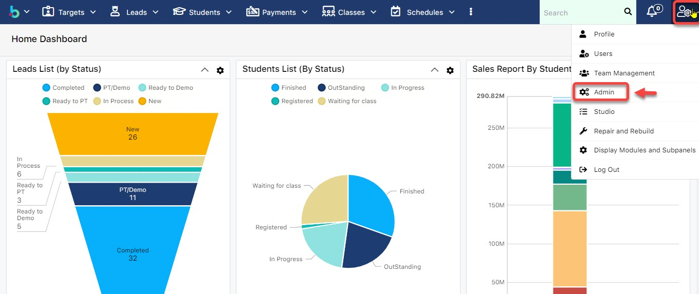
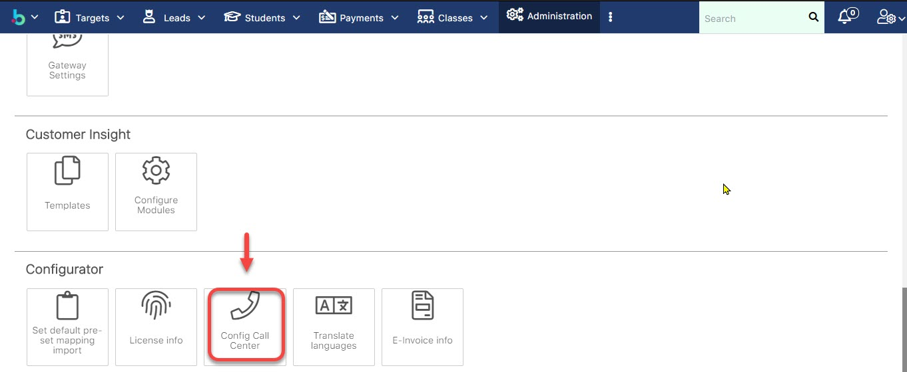
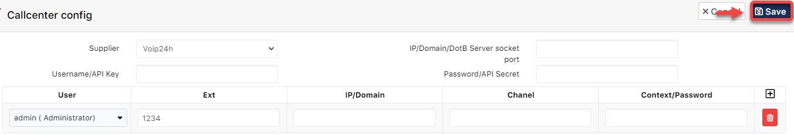

# Cấu hình Call Center

> Bước 1: Vào module Admin.

> Bước 2: Tại màn hình Admin chọn **Config Call Center**.

> Bước 3: Chọn nhà cung cấp Call Center, sau đó click vào dấu :heavy_plus_sign: và chọn User để set up thông số kĩ thuật Extension (3) cho users đó.


****:woman_gesturing_ok: **Lưu ý **:

(1) và (4) : Thông số kĩ thuật từ nhà cung cấp Call Center và thông số này sẽ do nhà cung cấp cấp phát.


> Bước 4: Cuối cùng click **Save**.

