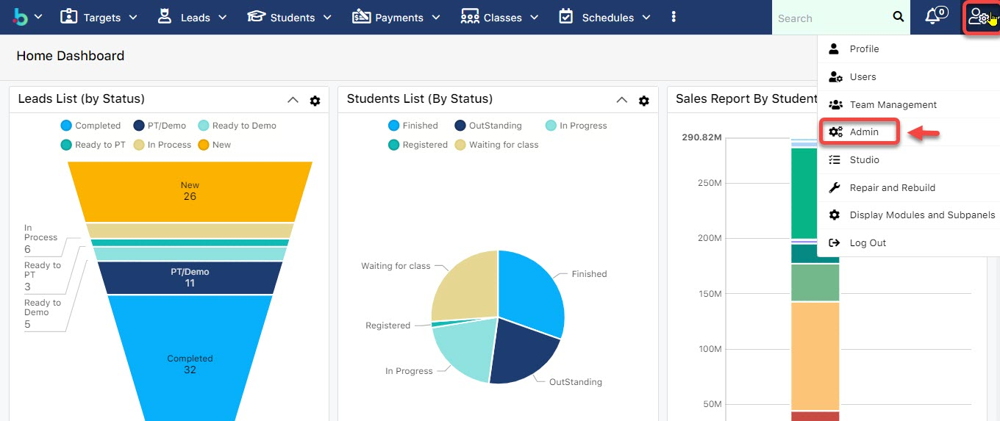

# Cấu hình HDDT

> **Bước 1:** Vào module Admin.

> **Bước 2:** Tại màn hình Admin chọn **Payment Setting**.

> **Bước 3:** Tại màn hình Payment Setting, tại tab **E-Invoice,** bấm vào chữ **Click here.**

> **Bước 4:** Màn hình cấu hình HDDT, bấm vào nút **Create** để tạo thông tin cấu hình.

> **Bước 5:** Tại màn hình cấu hình HDDT, chọn center cần cấu hình thông tin, thông số HDDT nhà cung cấp đã cấp nhập vào như hình bên dưới. Cuối cùng click **Save** để hoàn thành.


****:woman\_gesturing\_ok: **Lưu ý** :

Thông số kĩ thuật từ nhà cung cấp HDDT và thông số này sẽ do nhà cung cấp cấp phát.

