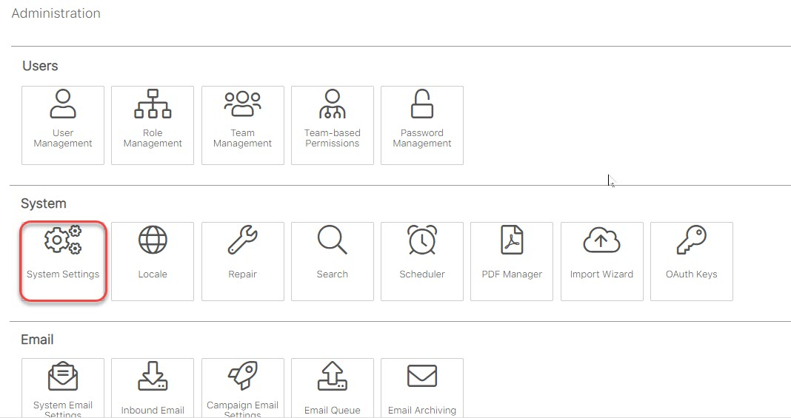

# Cấu hình logo trên EMS

> **Bước 1:** Đưa chuột vào profile, sau đó chọn **Admin.**

> **Bước 2:** Tại màn hình Admin, chọn **System Setting.**

> **Bước 3:** Tại màn hình cấu hình Logo, chọn ảnh cần upload, cuối cùng click **Save.**

.jpg>)
