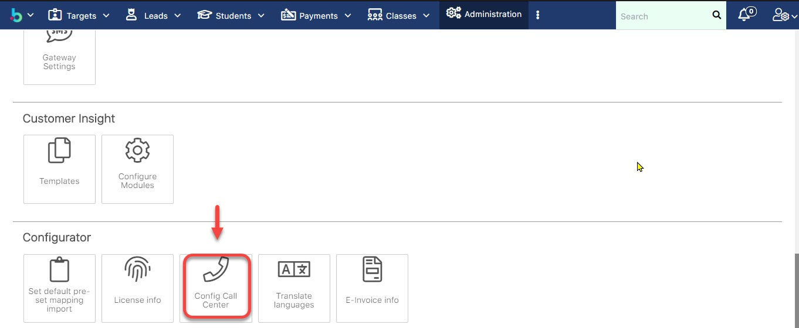
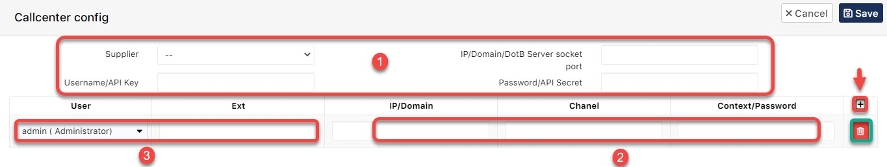
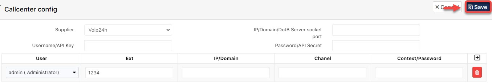

# Cấu hình SMS

> ước 1: Vào module Admin.

> Bước 2: Tại màn hình Admin chọn **Gateway SMS Setting.**

> Bước 3: Chọn Center và nhà cung cấp, sau đó nhâp các thông tin mà bên nhà mang cung cấp. 


****:woman_gesturing_ok: **Lưu ý **:

(1) và (4) : Thông số kĩ thuật từ nhà cung cấp Call Center và thông số này sẽ do nhà cung cấp cấp phát.


> Bước 4: Cuối cùng click **Save**.

