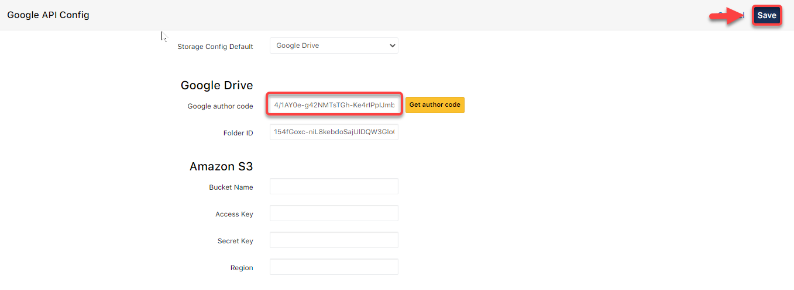
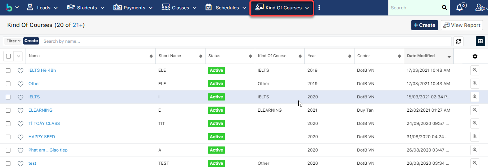

# Cấu hình thư viện ảnh, tài liệu trong KOC

## Cấu hình Thư viện ảnh - Google Drive

> Bước 1: Click vào Admin

.png>)

> Bươc 2: Tại màn hình quản trị viên, chọn Google API Config

.png>)

> Bước 3: Sau đó nhập Floder ID của thư mục mà bạn đã tạo trên Google Drive, tiếp theo click chọn **Get Author Code.**

.png>)

> Bước 4: Chọn tài khoản gmail chứa cài đặt thư mục hình ảnh.

.png>)

> Bước 5: Tiếp theo chọn Nâng cao, để cấp quyền truy cập

.png>)

> Bước 6: Chọn "Đi tới Google API Application"

.png>)

> Bước 7: Sau đó click chon Cho Phép để cấp quyền truy cập từ hệ thống 

.png>)

> Bước 8: Sau khi cấp quyề truy cập xong, hệ thống sẽ gửi về một mã code, copy mã code.

.png>)

> Bước 9: Sau khi copy mã code xong, dán vào ô và click **Save**.

## Cấu hình URL Document trong Kind of Courses

> Bước 1: Sau khi đã đưa file nghe, tài liệu lên Goolge Drive. Vào module Kind of Courses, chon khóa học mà bạn muốn cài đặt tài liệu trên **Drive**.

> Bước 2: Sau đó click Edit, tại trường URL Document, nhập Folder ID của thư mực đã tạo trên Dirve, dán vào Kind of courese trên hệ thống. Cuối cùng click **Save**.


Ghi Chú :

**URL Document** : sẽ được lấy bằng **Tên Thư Mục chứa các tệp đó.**

**Ví dụ: ** **DOTB**



**Hoặc **: ** DOTB/02. Pre-CleverKid** (nếu có thư mục con trong thư mục lớn).


## Cấu hình HotLine

> Bước 1: Click chuột vào module Admin chọn .

.png>)

> Bước 2: Tại màn hình Admin click vào chọn **Mobile App Config**.

> Bước 3: Nhập số HotLine và cuối cùng click **Save**.


**Ghi chú:**

1. Setup màu cho Mobile App, nếu không set thì mặc định app sẽ lấy theo màu mặc định của Brand.
2. Số HotLine của Center.
3. Cho phép người dùng Upload ảnh Profile hoặc ảnh bìa.
4. Hide/Unhide lượt view của News trên Mobile App.

