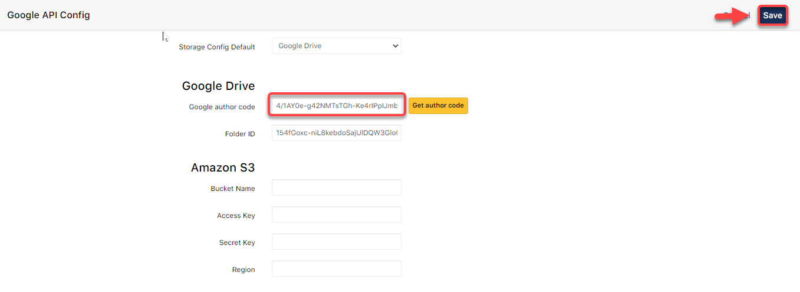

# Cấu hình Thư viện ảnh - Google Drive

> **Bước 1:** Click vào Admin

.png>)

> **Bước 2:** Tại màn hình quản trị viên, chọn Google API Config

.png>)

> **Bước 3:** Sau đó nhập Folder ID của thư mục mà bạn đã tạo trên Google Drive, tiếp theo click chọn **Get Author Code.**

.png>)

> **Bước 4:** Chọn tài khoản gmail chứa cài đặt thư mục hình ảnh.

.png>)

> **Bước 5:** Tiếp theo chọn Nâng cao, để cấp quyền truy cập

.png>)

> **Bước 6:** Chọn "Đi tới Google API Application"

.png>)

> **Bước 7:** Sau đó click chon Cho Phép để cấp quyền truy cập từ hệ thống&#x20;

.png>)

> **Bước 8:** Sau khi cấp quyề truy cập xong, hệ thống sẽ gửi về một mã code, copy mã code.

.png>)

> **Bước 9:** Sau khi copy mã code xong, dán vào ô và click **Save**.

