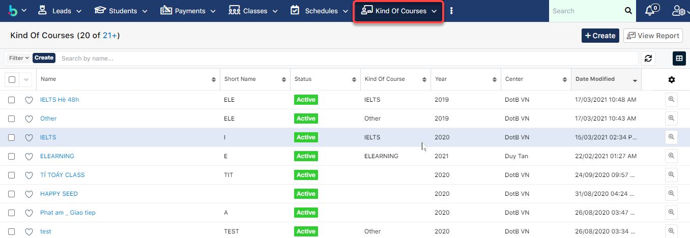
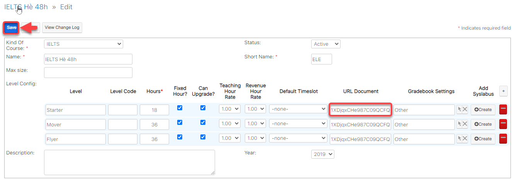
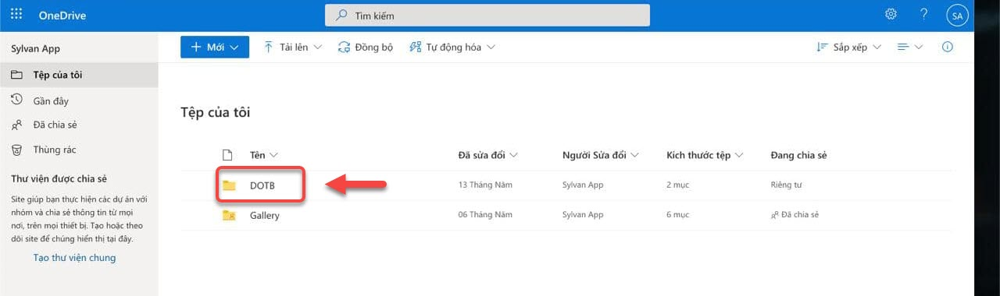
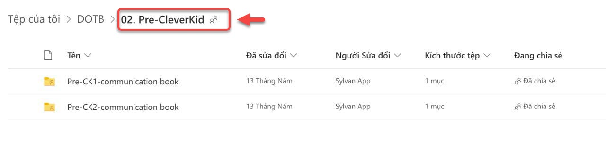

# Cấu hình URL Document trong Kind of Courses

> **Bước 1:** Sau khi đã đưa file nghe, tài liệu lên Goolge Drive. Vào module Kind of Courses, chon khóa học mà bạn muốn cài đặt tài liệu trên **Drive**.

> **Bước 2:** Sau đó click Edit, tại trường URL Document, nhập Folder ID của thư mực đã tạo trên Drive, dán vào Kind of courses trên hệ thống. Cuối cùng nhấn chọn **Save** để lưu lại.


Ghi Chú :

**URL Document**: sẽ được lấy bằng **Tên Thư Mục chứa các tệp đó.**

**Ví dụ:** **DOTB**



**Hoặc** : **DOTB/02. Pre-CleverKid** (nếu có thư mục con trong thư mục lớn).


