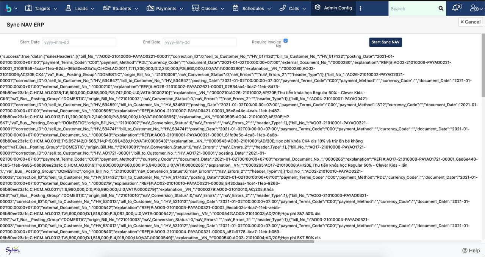

# Đồng bộ dữ liệu về NAV

> Bước 1: Click chuột vào module Admin chọn .

> Bước 2: Tại màn hình Admin click vào chọn Sync NAV ERP.

> Bước 3: Chọn thời gian muốn bắt đầu đồng bộ dữ liệu từ ems về NAV trung gian, sau đó click Start Sync NAV.


Ghi chú :

1: Chọn khoảng thời gian muốn đẩy dữ liệu từ EMS về.

2. Mặc định hệ thống sẽ tự động check Required Invoice No \(Những receipt đã được xuất hóa đơn\), nếu muốn lấy hết tất cả các Receipt đã thanh toán \(Paid\) thì có thể Uncheck trường này.


> Bước 4: Sau khi đẩy dữ liệu thành công về trung gian, hệ thống sẽ thông báo như hình bên dưới.

