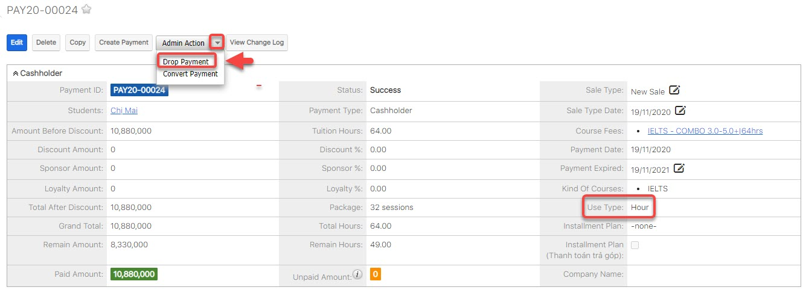

# Convert -Drop Payment

## Convert Payment


Tính năng này được sử dụng khi học viên _**đã mua một gói học mà chưa sử dụng hoặc Delay**_ số giờ cho lớp học , và họ muốn sử dụng gói học A này hoặc số giờ Delay để học gói học B hoặc mua gói học khác.


> Bước 1: Chọn payment mà học viên đã mua trước đó. Trong thông tin Payment chọn "**Admin Action**" ,lưu ý lúc nào use type là **Hour**, sau đó chọn **Convert Payment**.

.jpg>)

> Bước 2: Sau đó chọn use type là "**To Amount**" , và cuối cùng click **Submit**.

.jpg>)

> Bước 6: Màn hình hiển thị thông tin covert payment thành công khi đã chuyển sang **Amount** . Lưu ý use type khi chuyển thành công sẽ là **Amount**.

.jpg>)

## Drop Payment


Tính năng này được sử dụng khi học viên _**đã mua và đã sử dụng được một khoản**_ với KOC là A nhưng lại muốn sử dụng phần remain của gói đã mua này để học KOC B, thì người dùng sẽ phải convert qua số tiền ,sau đó tạo lại payment sử dụng số tiền đó để mua gói KOC B.

Nếu như gói học A mà học viên _**đã mua mà chưa sử dụng**_ số giờ nào cho lớp học , và họ muốn sử dụng gói học A này để học gói học B thì lúc này chỉ cần thao tác các _**bước 4,5**_ bên dưới.


> Bước 1: Chọn payment mà học viên đã mua trước đó. Trong thông tin payment chọn "**Admin Action**" ,lưu ý lúc nào use type à Hour, sau đó chọn **Drop Payment**.

> Bước 2: Tại màn hình Drop Payment, chọn button **"Drop to Payment Delay"** và nhập lí do Drop.

.jpg>)

> Bước 3: Sau khi drop payment thành công, trong profile của học viên sẽ sinh ra một payment delay như hình bên dưới, lúc này người dùng sẽ click vào ID của payment delay này.

.jpg>)

> Bước 4: Tại màn hình Payment Delay, chọn action "**Convert Payment**". Lúc này use type vẫn là Hour.

.jpg>)

> Bước 5: Sau đó chọn use type là "**To Amount**" , và cuối cùng click **Submit**.

.jpg>)

> Bước 6: Màn hình hiển thị thông tin covert payment thành công khi đã chuyển sang **Amount** . Lưu ý use type khi chuyển thành công sẽ là **Amount**.

.jpg>)
