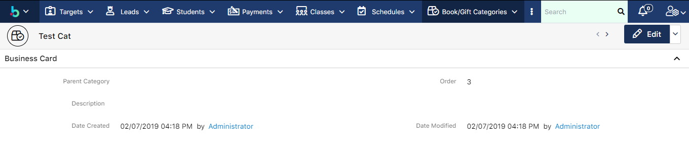
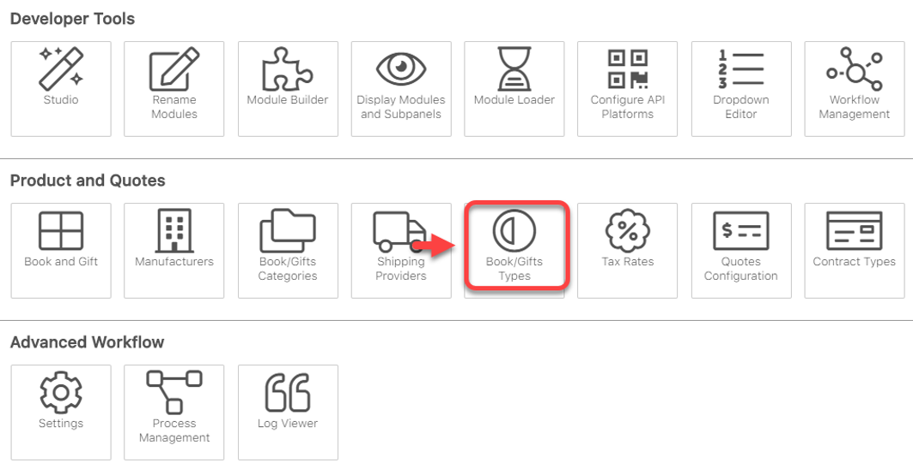
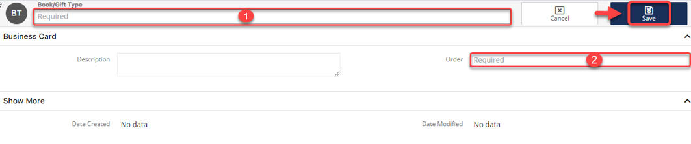
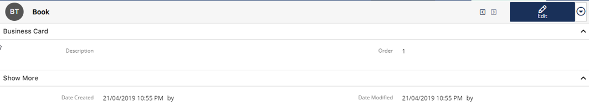
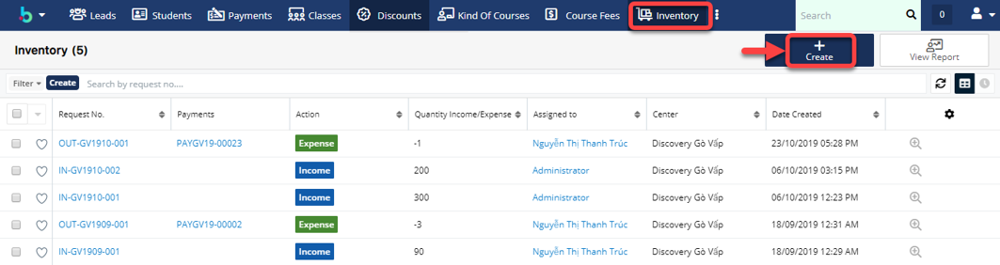
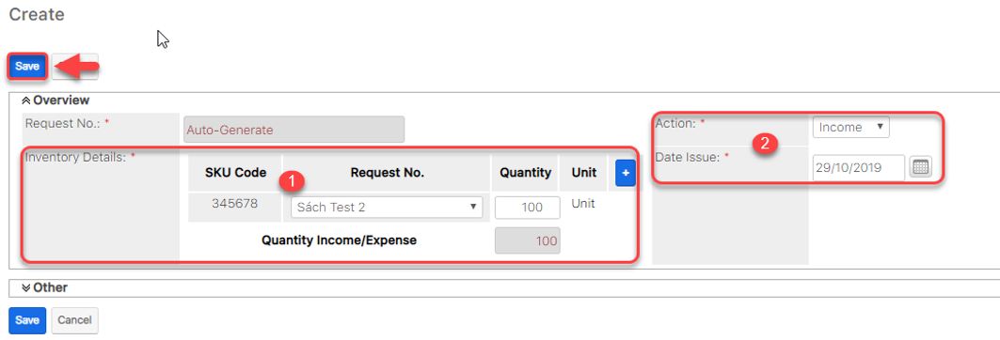

# Inventory

## Book/Gift Types

> Bước 1: Đưa chuột vào Menu chọn Admin.Tại màn hình Admin click vào chọn Book/Gift Types.

.png>)

> Bước 2: Tại màn hình Admin click vào chọn Book/Gift Types.

> Bước 3: Tại màn hình Book/Gift Types, click chọn Create Book/Gift Types.

> Bước 4: Tại màn hình Book/Gift Types, nhập đầy đủ thông tin .Sau đó click Save.


:woman\_gesturing\_ok: Ghi chú:

1::Tên loại Book/Gift&#x20;

2:Order : Độ ưu tiên (Loại hay sử dụng hoặc quan trọng để số1)


> Bước 5: Hệ thống hiển thị thông tin Book/Gift Types khi Save thành công.

## Inventory

> Bước 1: Click chuột vào module Inventory. Chọn Create.

> Bước 2: Tại màn hình tao mới, nhập đầy đủ thông tin .Sau đó click Save.


:woman\_gesturing\_ok: Ghi chú:

1:Thông tin sản phẩm (mã,tên,số lượng,đơn vị)

2:Ngày nhập sản phẩm và thông tin (Income : nhập sản phẩm vào, Expense : xuất sản phẩm ra bên ngoài).


> Bước 3: Hệ thống hiển thị thông tin sau khi Save thành công.

.png>)
