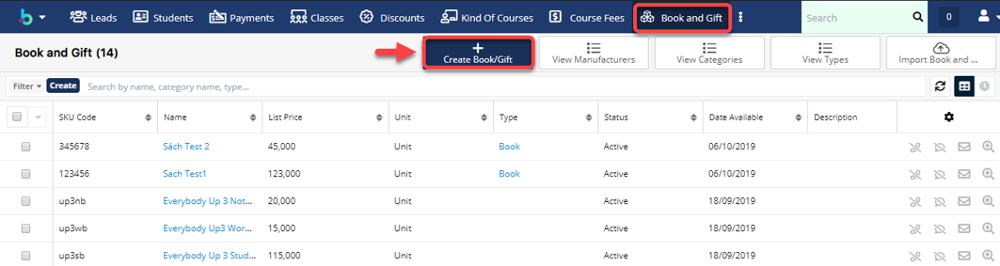
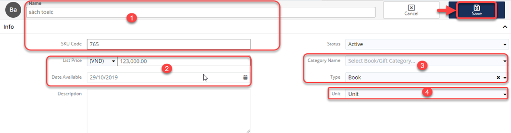
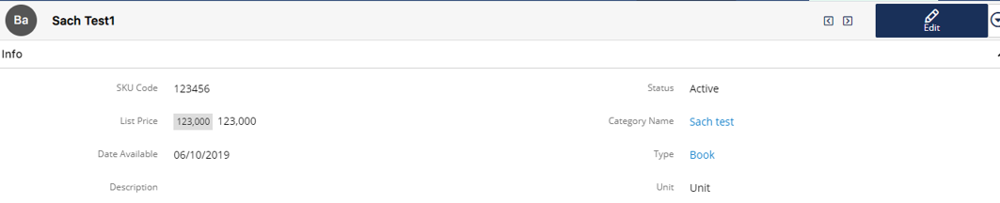

# Product Catalog

> Bước 1: Ở module Admin, nhấn chuột vào Admin để mở ra màn hình Admin.

.png>)

> Bước 2: Tại màn hình admin, chọn Book and Gift.

.png>)

> Bước 3: Tại màn hình Book and Gift, chọn Create Book/Gift để mở ra màn hình thêm mới Book/Gift.

> Bước 3: Tại màn hình tạo mới Book and Gift, nhập đầy đủ thông tin. Sau đó nhấn Save để hoàn tất việc tạo mới một Book/Gift.


****:woman\_gesturing\_ok: **Ghi chú:**

1. Tên sách và mã sách.
2. Đơn giá và ngày sách nhập/xuất về kho.
3. Thể loại và tên danh mục.
4. Đơn vị (Unit hoặc set).


> Bước 4: Hệ thống hiển thị thông tin Book/Gift khi tạo thành công.

##
