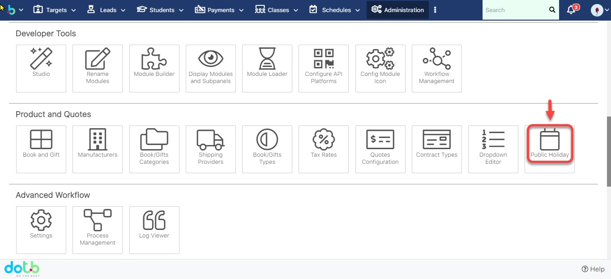

# 📅 Quản lí lịch nghỉ lễ trong năm

> **Bước 1:** Đưa chuột vào proflie, sau đó click chọn **Admin.**

> **Bước 2:** Tại màn hình Admin, click chọn **Public Holiday.**

> **Bước 3:** Tại màn hình Holidays, click chọn **Add Holiday.**

> **Bước 4:** Sau đó chọn ngày cần set up Holiday, click **Save** để hoàn tất.

