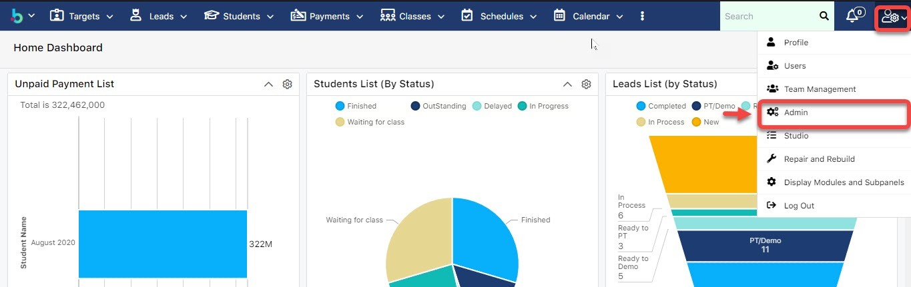
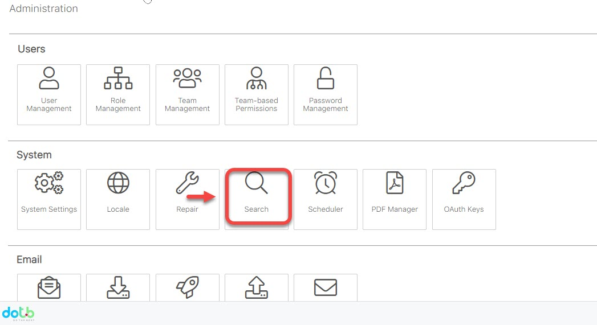
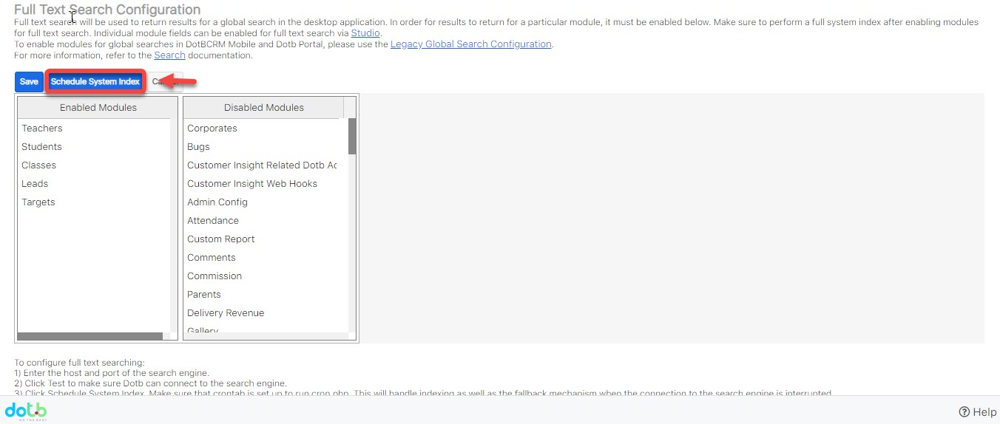
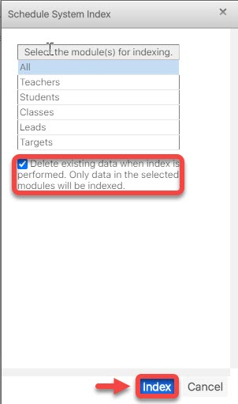

# Search

> Bước 1: Click chọn action "Admin".

> Bước 2 : Tại màn hình Admin, click chọn "**Search**".

> Bước 3: Sau đó chọn "**Schedule System Index**", hệ thống sẽ show ra popup thông báo, click chọn "**OK**".

> Bước 4: Cuối cùng, tick chọn check box như hình bên dưới và click "Index" , đợi 7 phút. Hệ thống sẽ cho ra kết quả search bình thường.

