# Tạo và phân quyền cho users

## Tạo Role

> Bước 1: Click chuột vào module Admin chọn Admin.Tại màn hình Admin click vào chọn Role Management

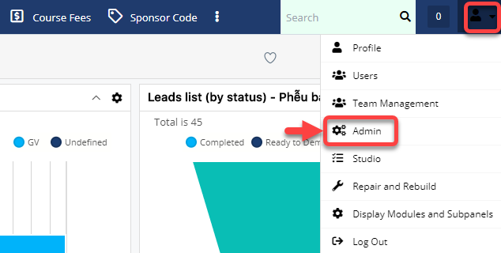

> Bước 2: Tại màn hình Roles,Click vào Menu chọn Create Role.

> Bước 3: Tại màn hình tạo mới Role,nhập đầy đủ thông tin .Sau đó click Save.


**Ghi chú: \(\*\)**

1:Tên Role 

2:Thông tin về role : có tính năng gì,truy cập module nào,…


> Bước 4: Hệ thống hiển thị thông tin set quyền truy cập các module của Role.

> Bước 5: Double click vào từng module để Disable/Enable/Not Set/… cấp quyền truy cập/Edit/Import,… cho Role vừa tạo. Sau khi set quyền cho các module ,click Save để lưu lại.

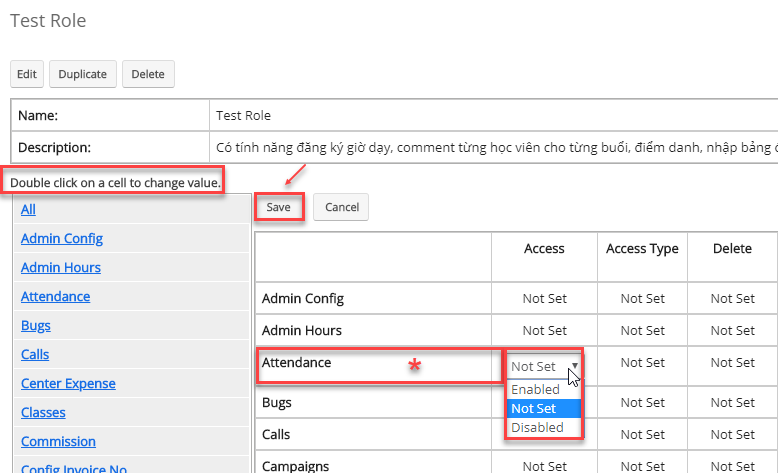


\*\*\*\*🙆♀ **Ghi chú:**

**Quyền truy cập các Module :**

-Access: Disable/Enable/Not Set

·        Enable = Not set : bật quyền truy cập cho module

·        Disable : không có quyền truy cập module

-Access type: Normal/Not set/Admin

·        Normal = Not set : truy cập bình thường,chỉ nhìn thấy Center mà bạn đang quản lý

·        Admin:nhìn thấy tất cả Center mà bạn đang quản lý.Ví dụ :bạn ở Center A bạn củng có quyền nhìn thấy dữ liệu ở Center B.

-Delete:All/Owner/Not Set/None

·        All = Not set: bật quyền truy cập cho module

·        Owner : chỉ có người được Assign mới đc nhìn thấy module đó và có quyền thao tác

·        None: không có quyền truy cập module

-Edit: All/Owner/Not Set/None

·        All = Not set: bật quyền truy cập cho module

·        Owner : chỉ có người được Assign mới đc nhìn thấy module đó và có quyền thao tác

·        None: không có quyền truy cập module

-Export: All/Owner/Not Set/None

·        All = Not set: bật quyền truy cập cho module

·        Owner : chỉ có người được Assign mới đc nhìn thấy module đó và có quyền thao tác

·        None: không có quyền truy cập module

-Import:All/Not set/None

·        All = Not set: bật quyền truy cập cho module

·        None: không có quyền truy cập module

-List : All/Owner/Not Set/None

·        All = Not set: bật quyền truy cập cho module

·        Owner : chỉ có người được Assign mới đc nhìn thấy module đó và có quyền thao tác

·        None: không có quyền truy cập module

-Mass Update:All/Not set/None

·        All = Not set: bật quyền truy cập cho module

·        None: không có quyền truy cập module

-View: All/Owner/Not Set/None

·        All = Not set: bật quyền truy cập cho module

·        Owner : chỉ có người được Assign mới đc nhìn thấy module đó và có quyền thao tác

·        None: không có quyền truy cập module


> Bước 6: Click vào Module để set quyền truy cập cho từng Field \(Nếu bạn muốn thay đổi quyền cho từng Field,nếu không thì mặc định quyền của Field là Not set\).Double click vào từng Field để thay đổi quyền Not set/Read/…. Sau khi set quyền cho các Field ,click Save để lưu lại.


**+Quyền truy cập các File trrong Module:**

-    Not set :đc quyền truy cập đọc và viết

-    Read/Write : đọc và viết

-    Read/Owner Write : đọc / chính ng được assign mới đc viết

-    Read Only :chỉ đọc

-    Owner Read/Owner Write :chính ng được assign mới đc viết/đọc None :không có quyền truy cập


> Bước 7:Hệ thống hiển thị thông tin chi tiết của Role vừa được tạo và quyền truy cập cho các module thành công.

## Tạo Center

> Bước 1: Đưa chuột vào Menu Admin.Tại Action Menu click vào chọn Team Management.

> Bước 2: Tại màn hình Team management,Click vào \(+\) để thêm Center cho trung tâm.

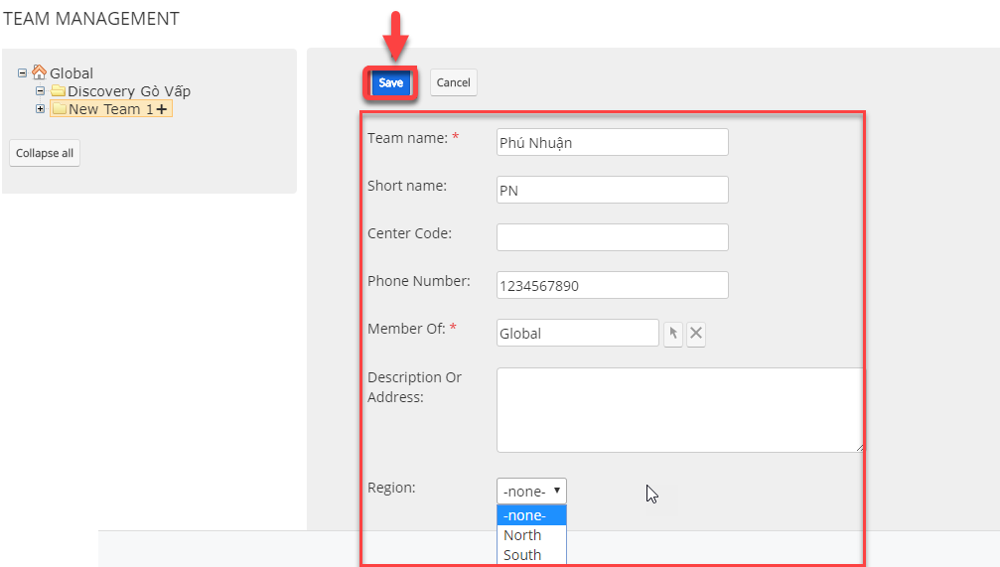

> Bước 3: Tại màn hình tao mới Center, nhập đầy đủ thông tin .Sau đó click Save.

> Bước 4: Hệ thống hiển thị thông tin Center mới được tạo sau khi Save thành công.Bạn có thể click vào \(+\) để tạo Center mới tiếp theo.

## Tạo Users

> Bước 1: Đưa chuột vào Menu Admin.Tại Action Menu click vào chọn Users.

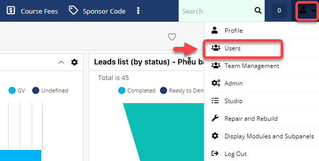

> Bước 2: Tại màn hình Users,Click vào Menu chọn Create New User.

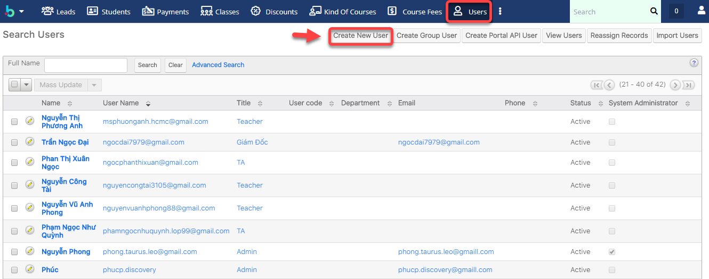

> Bước 3: Tại màn hình tao mới Users,nhập đầy đủ thông tin ở tab User Profile.

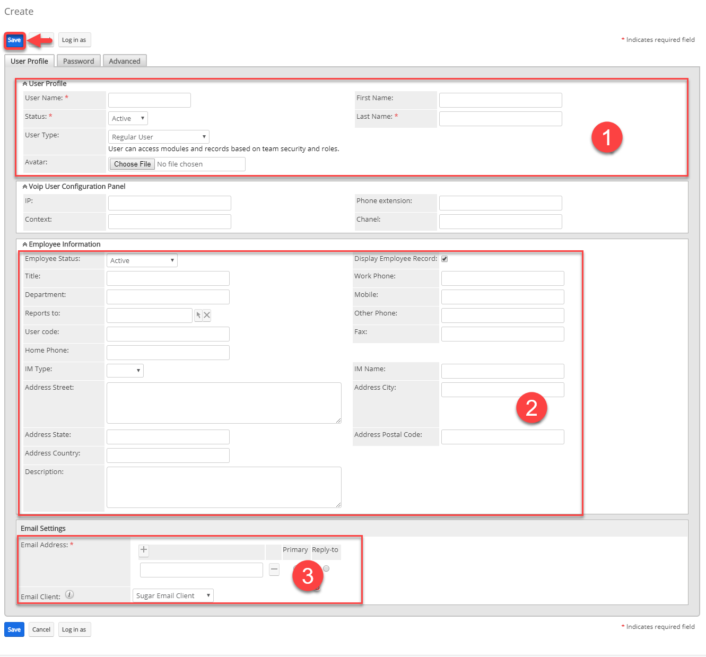


\*\*\*\*🙆♀ **Ghi chú:**

1:Thông tin đăng nhập của Users \(Usersname,Họ,Tên\)

2:Thông tin của User 3:Email


> Bước 4: Nhập Password cho users ở tab Password.

> Bước 5: Set ngày nghỉ,ẩn module,bật popup,… cho uses \(nếu muốn\).Sau đó click Save.Hệ thống hiển thị thông tin của Users sau khi tạo thành công.

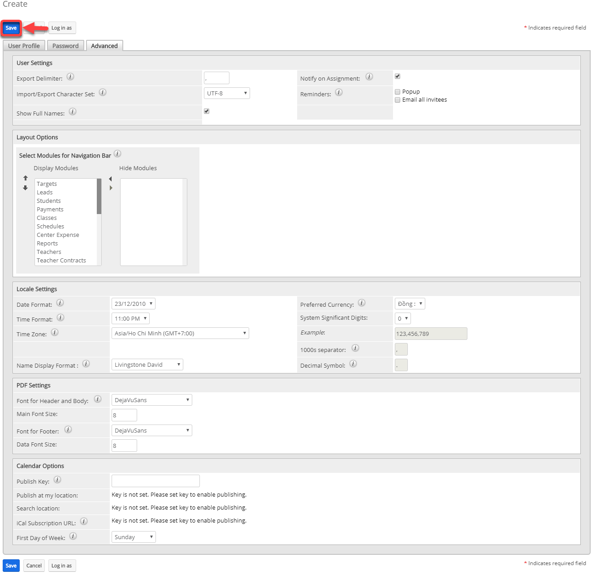

## Phân Quyền cho Users

### Set Center mặc định, Phân quyền cho Users \(cách 1\)

> Bước 1: Đưa chuột vào Menu Admin.Tại Action Menu click vào chọn Team Management.Sau đó chọn Center mặc định để set cho Users

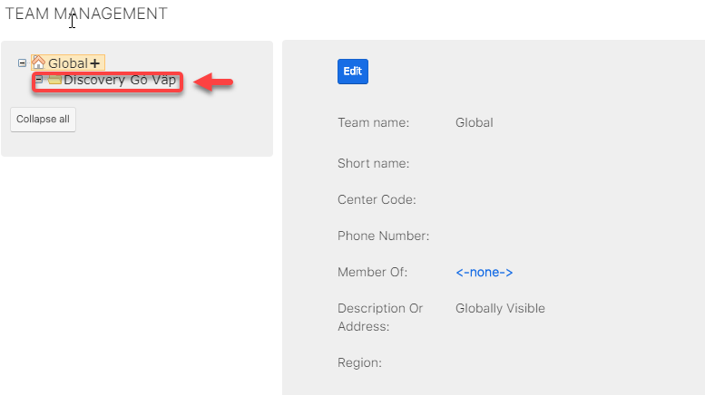

> Bước 2: Tại màn hình của Center set cho Users,Click vào Add Users,sau đó chọn người dùng Set vào trung tâm.

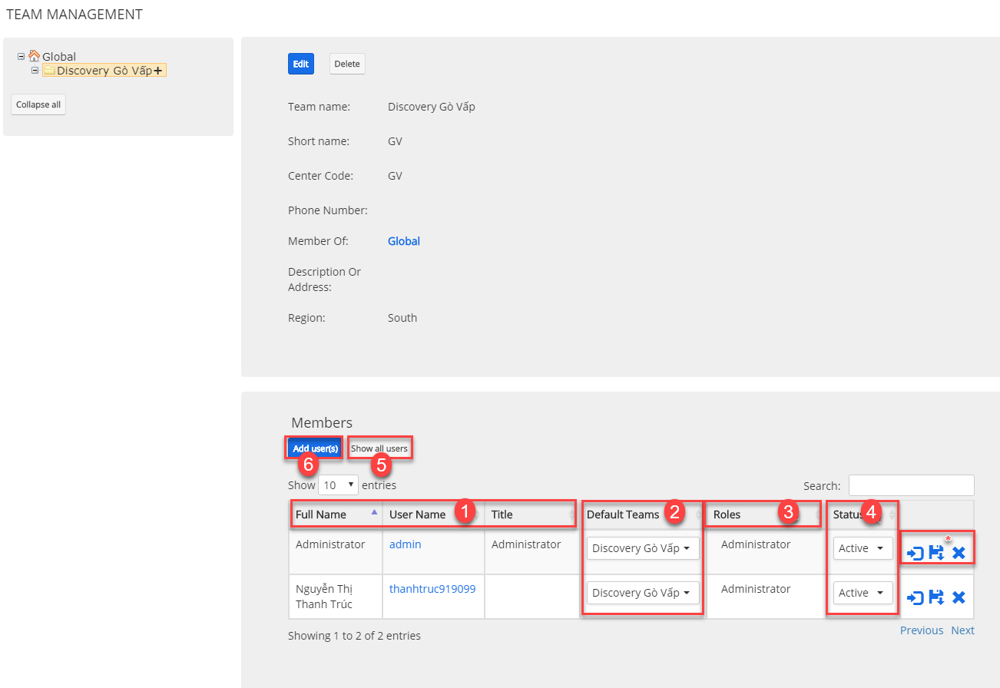


\*\*\*\*🙆♀ **Ghi chú:**

1:Thông tin Users

2:Center mặc định \(chọn cho Users\)

3:Chọn phân quyền cho Users \(Users có quyền truy cập nào\)

4:Trạng thái của Users \(Active/InActive\)

5:Hiển thị tất cả Users của Center.

6:Thêm Users vào Center \(click chọn Users hoặc bạn có thể tích vào ô vuông,sau đó click Select \(nếu set cho nhiều người\) \).

+1:Thông tin tìm kiếm

+2:Danh sách Users


> Bước 3: Sau khi set người dùng vào trung tâm.bạn có thể set quyền truy cập cho Users .Sau đó click Save.


\*\*\*\*🙆♀ **Ghi chú**:

1:Center mặc định

2:Phân Quyền cho Users

3: 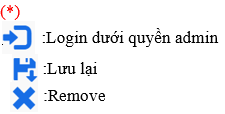 


### Phân quyền cho Users \(Cách 2\)

> Bước 1: Đưa chuột vào Menu Admin.Tại Action Menu click vào chọn Users.Sau đó Users cần set quyền.

> Bước 2: Tại màn hình Users,Click vào tab Access chọn Roles.

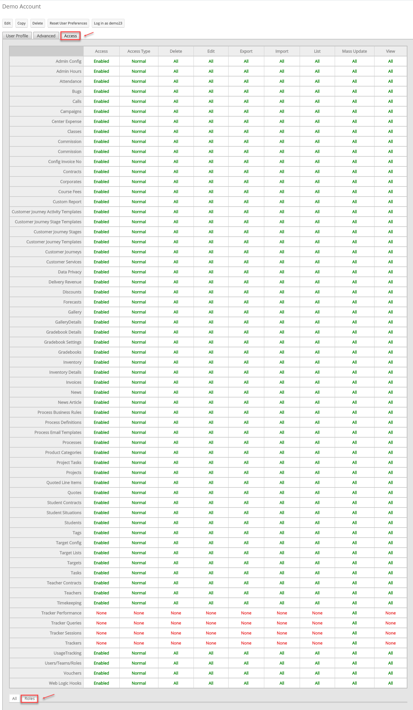

> Bước 3: Tại màn hình Roles.Click vào select để chọn quyền bạn cần set cho Users.

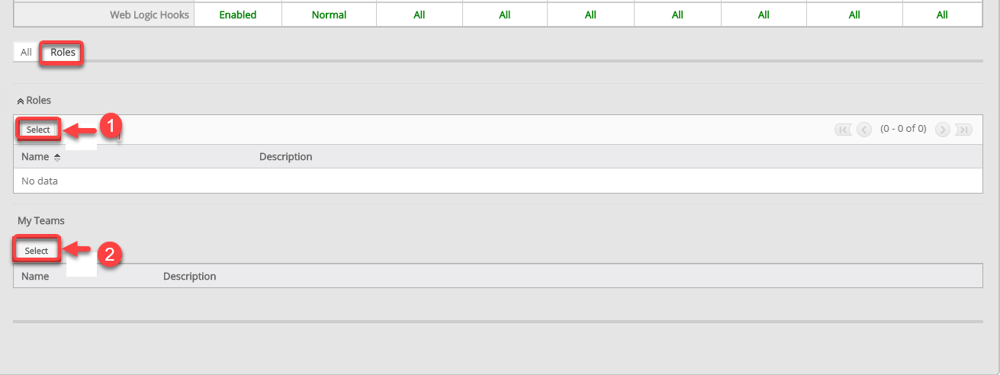


\*\*\*\*🙆♀ **Ghi chú:**

1:Chọn quyền cho Users 

2:Chọn Center cho Users


> Bước 4: Tại màn hình set Roles cho Users,bạn cho role cần Set \(Có thể set cho nhiều users bằng cách click vào ô vuông,sau đó click Select\),nếu set cho 1 người bạn click vào Users đó.

> Bước 5: Hê thống hiển thị thông tin set quyền cho users thành công.

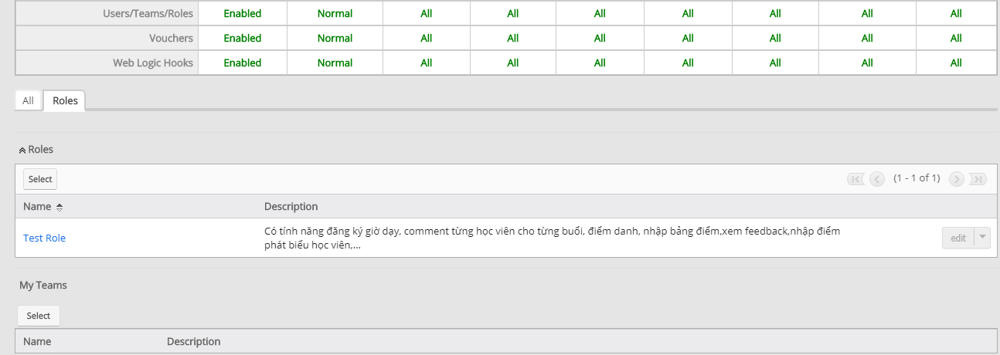

