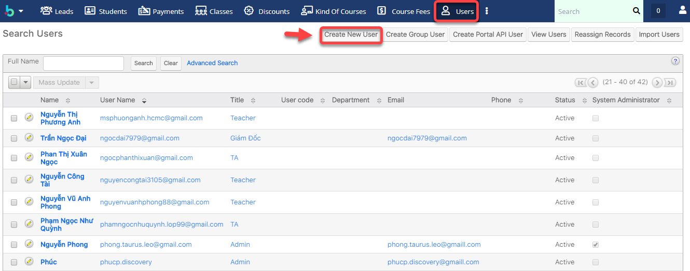
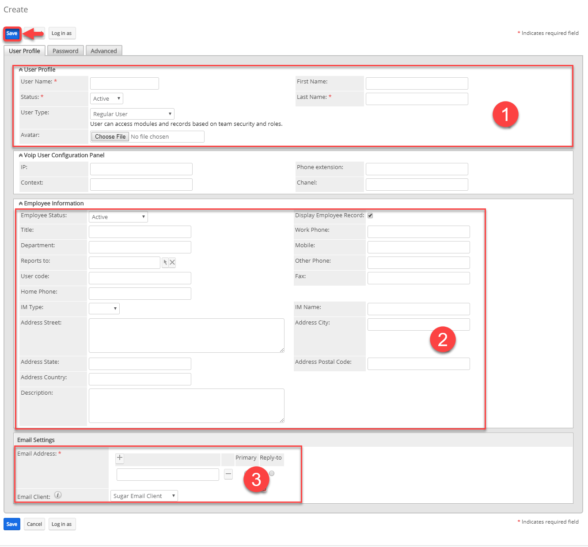
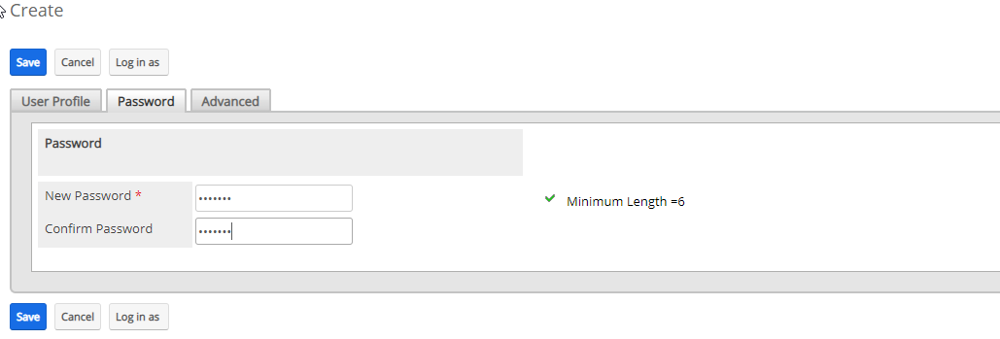
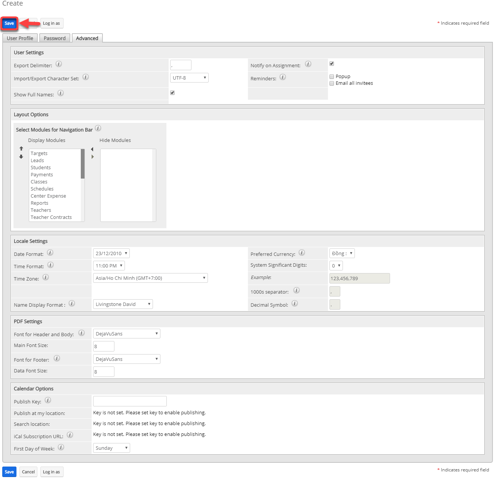

# Người dùng và Inactive người dùng

## Tạo người dùng

> **Bước 1:** Tại avatar người dùng, bấm chuột vào **Users** để mở ra màn hình **Users.**&#x20;

<figure><figcaption></figcaption></figure>

> **Bước 2:** Tại màn hình Users, nhấn vào Menu chọn Create New User.

> **Bước 3:** Tại màn hình tao mới Users, nhập đầy đủ thông tin ở tab User Profile.


****:woman\_gesturing\_ok: **Ghi chú:**

1. Thông tin đăng nhập của Users (Username, Họ, Tên)
2. Thông tin của User&#x20;
3. Email


> **Bước 4:** Nhập Password cho users ở tab Password.

> **Bước 5:** Set ngày nghỉ, ẩn module, bật popup,… cho uses (nếu muốn). Sau đó chọn Save. Hệ thống hiển thị thông tin của Users sau khi tạo thành công.

## Người dùng - Status Inactive

> **Bước 1:** Tại avatar người dùng, bấm chuột vào **Users** để mở ra màn hình **Users.**&#x20;

<figure><figcaption></figcaption></figure>

> **Bước 2:** Chọn bất kì người dùng mà bạn muốn **Inactive**.

<figure><figcaption></figcaption></figure>

> **Bước 3:** Tại màn hình thông tin của người dùng, chúng ta nhấn vào thông tin nút "Edit" để cập nhật thông tin của người dùng. Ở đây chúng ta cập nhật trạng thái lại là "Không hoạt động - Inactive"_,_ sau đó tiến hành nhấn **Save** để lưu lại.

<figure><figcaption></figcaption></figure>

<figure><figcaption></figcaption></figure>

<figure><figcaption></figcaption></figure>


Sau khi tiến hành lưu lại, hệ thống có hỏi "Bạn có muốn gán lại tất cả hồ sơ lại cho người dùng hay không?"&#x20;

Thì chúng ta sẽ chọn "Không", tại vì nếu chúng ta reassign data hay nói cách khác là gán dữ liệu trước đó cho người dùng khác thì những lịch sử bao gồm thông tin thanh toán, lịch sử học viên sẽ bị trống các thông tin cũng như khó có thể kiểm soát về sau.


> **Bước 4:** Hệ thống hiển thị thông tin chi tiết chi tiết.

<figure><figcaption></figcaption></figure>

> _Video hướng dẫn Inactive User_


