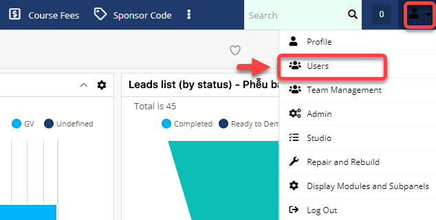
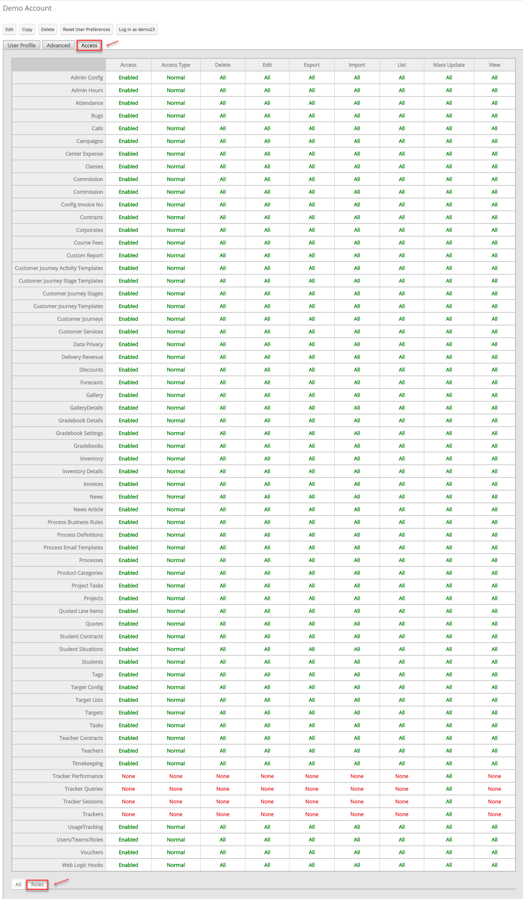
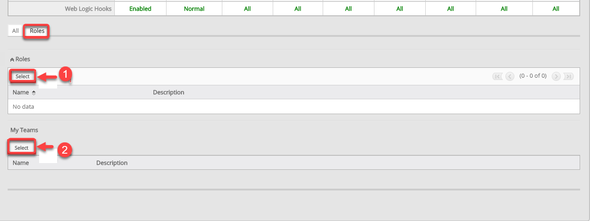
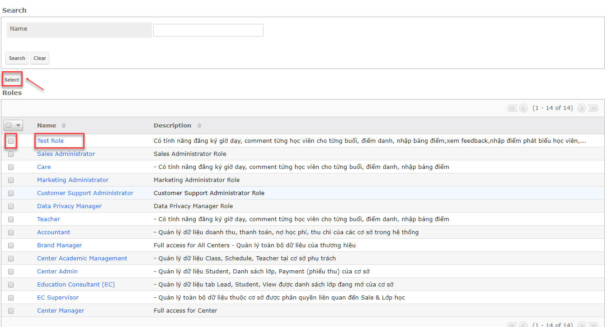
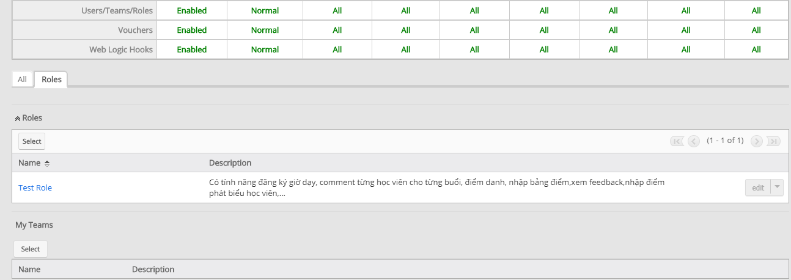

# Phân quyền cho Users (Cách 2)

> **Bước 1:** Đưa chuột vào Menu Admin. Tại Action Menu click vào chọn Users. Sau đó Users cần set quyền.

> **Bước 2:** Tại màn hình Users, chọn vào tab Access chọn Roles.

> **Bước 3:** Tại màn hình Roles. Chọn vào select để chọn quyền bạn cần set cho Users.


****:woman\_gesturing\_ok: **Ghi chú:**

1. Chọn quyền cho Users&#x20;
2. Chọn Center cho Users


> **Bước 4:** Tại màn hình set Roles cho Users, bạn cho role cần Set (Có thể set cho nhiều users bằng cách chọn vào ô vuông, sau đó click Select), nếu set cho 1 người bạn chọn vào Users đó.

> **Bước 5:** Hệ thống hiển thị thông tin set quyền cho users thành công.

