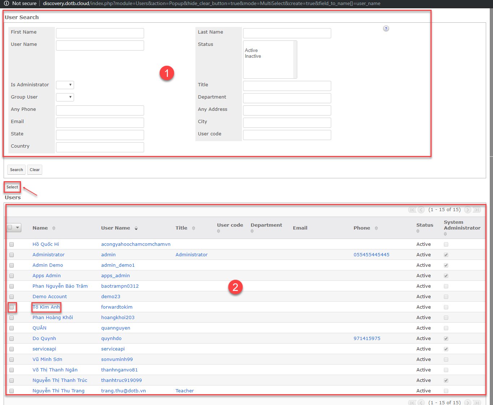
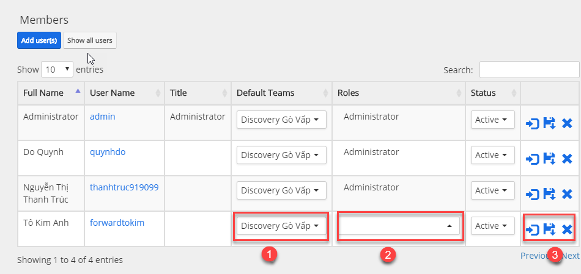

# Set Center mặc định, (cách 1)

> **Bước 1:** Đưa chuột vào Menu Admin. Tại Action Menu, nhấn vào chọn Team Management. Sau đó chọn Center mặc định để set cho Users.

> **Bước 2:** Tại màn hình của Center set cho Users, chọn vào Add Users, sau đó chọn người dùng Set vào trung tâm.


****:woman\_gesturing\_ok: **Ghi chú:**

1. Thông tin Users.
2. Center mặc định (chọn cho Users).
3. Chọn phân quyền cho Users (Users có quyền truy cập nào).
4. Trạng thái của Users (Active/InActive).
5. Hiển thị tất cả Users của Center.
6. Thêm Users vào Center (click chọn Users hoặc bạn có thể tích vào ô vuông, sau đó chọn Select (nếu set cho nhiều người)).

&#x20;                 1.Thông tin tìm kiếm

&#x20;                 2.Danh sách Users


> **Bước 3:** Sau khi set người dùng vào trung tâm. Bạn có thể set quyền truy cập cho Users. Sau đó chọn Save.


****:woman\_gesturing\_ok: **Ghi chú**:

1. Center mặc định
2. Phân Quyền cho Users
3. &#x20;&#x20;

