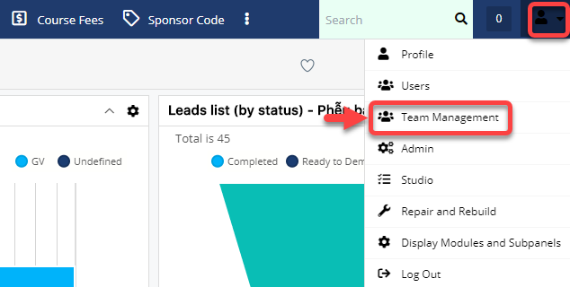
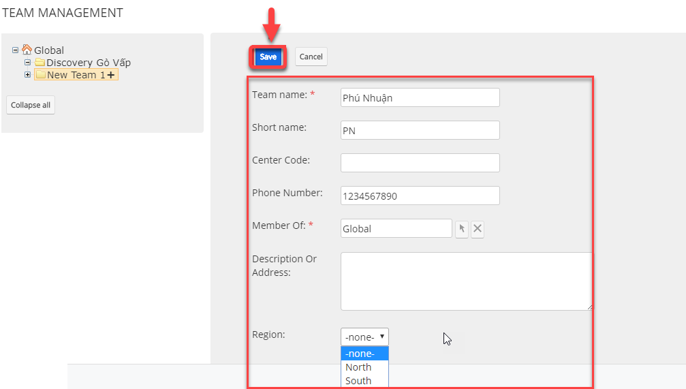
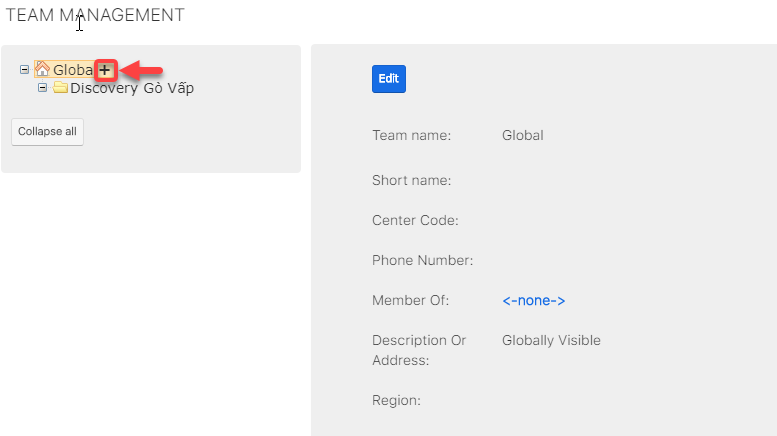

# Tạo Center

> **Bước 1:** Tại avatar người dùng, bấm chuột vào **Team Management** để mở ra màn hình **Team Management**.

> **Bước 2:** Tại màn hình Team Management, chọn vào (+) để thêm Center cho trung tâm.

> **Bước 3:** Tại màn hình tạo mới Center, nhập đầy đủ thông tin. Sau đó click Save.

> **Bước 4:** Hệ thống hiển thị thông tin Center mới được tạo sau khi Save thành công. Bạn có thể click vào (+) để tạo Center mới tiếp theo.

