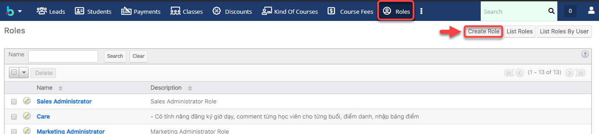

# Tạo Role

> **Bước 1:** Nhấn chuột vào module Admin chọn Admin. Tại màn hình Admin click vào chọn Role Management

> **Bước 2:** Tại màn hình Roles, chọn vào Menu chọn Create Role.

> **Bước 3:** Tại màn hình tạo mới Role, nhập đầy đủ thông tin .Sau đó click Save.


**Ghi chú: (\*)**

1. Tên Role&#x20;
2. Thông tin về role: có tính năng gì, truy cập module nào,…


> **Bước 4:** Hệ thống hiển thị thông tin set quyền truy cập các module của Role.

> **Bước 5:** Double click vào từng module để Disable/Enable/Not Set/… cấp quyền truy cập/Edit/Import,… cho Role vừa tạo. Sau khi set quyền cho các module, nhấn Save để lưu lại.


****:woman\_gesturing\_ok: **Ghi chú:**

**Quyền truy cập các Module :**

\-Access: Disable/Enable/Not Set

·        Enable = Not set : bật quyền truy cập cho module

·        Disable : không có quyền truy cập module

\-Access type: Normal/Not set/Admin

·        Normal = Not set : truy cập bình thường,chỉ nhìn thấy Center mà bạn đang quản lý

·        Admin:nhìn thấy tất cả Center mà bạn đang quản lý.Ví dụ :bạn ở Center A bạn củng có quyền nhìn thấy dữ liệu ở Center B.

\-Delete: All/Owner/Not Set/None

·        All = Not set: bật quyền truy cập cho module

·        Owner : chỉ có người được Assign mới đc nhìn thấy module đó và có quyền thao tác

·        None: không có quyền truy cập module

\-Edit: All/Owner/Not Set/None

·        All = Not set: bật quyền truy cập cho module

·        Owner : chỉ có người được Assign mới đc nhìn thấy module đó và có quyền thao tác

·        None: không có quyền truy cập module

\-Export: All/Owner/Not Set/None

·        All = Not set: bật quyền truy cập cho module

·        Owner : chỉ có người được Assign mới đc nhìn thấy module đó và có quyền thao tác

·        None: không có quyền truy cập module

\-Import: All/Not set/None

·        All = Not set: bật quyền truy cập cho module

·        None: không có quyền truy cập module

\-List : All/Owner/Not Set/None

·        All = Not set: bật quyền truy cập cho module

·        Owner : chỉ có người được Assign mới đc nhìn thấy module đó và có quyền thao tác

·        None: không có quyền truy cập module

\-Mass Update: All/Not set/None

·        All = Not set: bật quyền truy cập cho module

·        None: không có quyền truy cập module

\-View: All/Owner/Not Set/None

·        All = Not set: bật quyền truy cập cho module

·        Owner : chỉ có người được Assign mới đc nhìn thấy module đó và có quyền thao tác

·        None: không có quyền truy cập module


> **Bước 6:** Nhấn vào Module để set quyền truy cập cho từng Field (Nếu bạn muốn thay đổi quyền cho từng Field, nếu không thì mặc định quyền của Field là Not set). Double click vào từng Field để thay đổi quyền Not set/Read/…. Sau khi set quyền cho các Field, click Save để lưu lại.


**+Quyền truy cập các File trrong Module:**

\-    Not set :đc quyền truy cập đọc và viết

\-    Read/Write : đọc và viết

\-    Read/Owner Write : đọc / chính ng được assign mới đc viết

\-    Read Only :chỉ đọc

\-    Owner Read/Owner Write :chính ng được assign mới đc viết/đọc None :không có quyền truy cập


> **Bước 7:** Hệ thống hiển thị thông tin chi tiết của Role vừa được tạo và quyền truy cập cho các module thành công.

