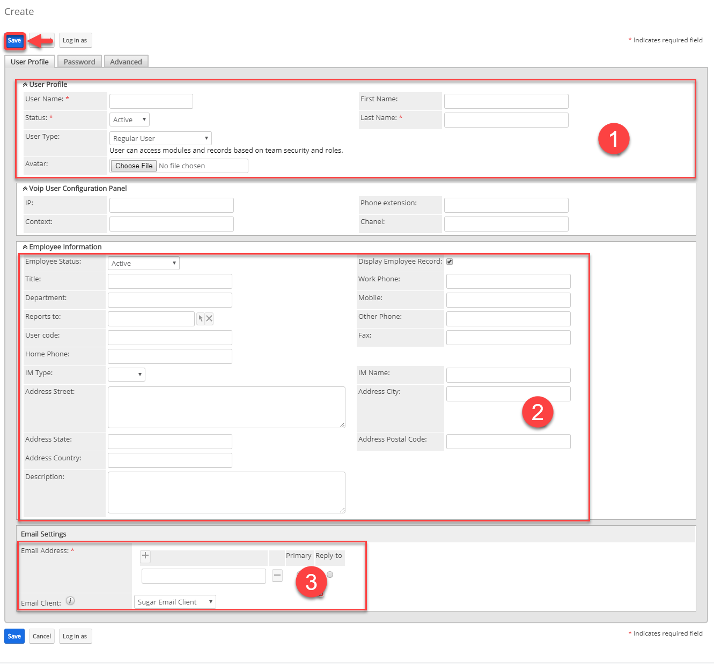
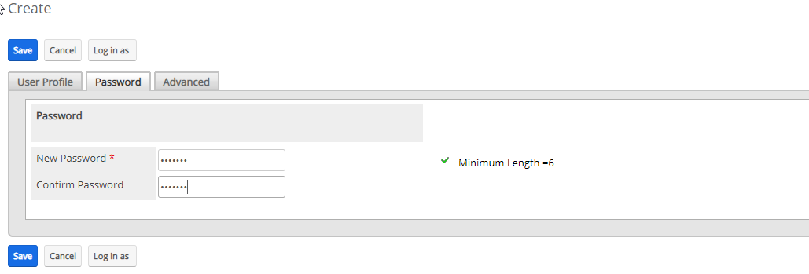
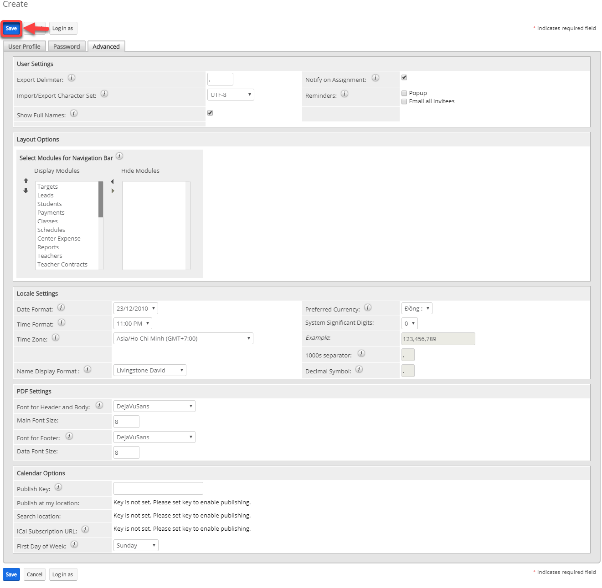

# Tạo Users

> **Bước 1:** Đưa chuột vào Menu Admin. Tại Action Menu nhấn vào chọn Users.

<figure><figcaption></figcaption></figure>

> **Bước 2:** Tại màn hình Users, nhấn vào Menu chọn Create New User.

> **Bước 3:** Tại màn hình tao mới Users, nhập đầy đủ thông tin ở tab User Profile.


****:woman\_gesturing\_ok: **Ghi chú:**

1. Thông tin đăng nhập của Users (Username, Họ, Tên)
2. Thông tin của User 3:Email


> Bước 4: Nhập Password cho users ở tab Password.

> **Bước 5:** Set ngày nghỉ, ẩn module, bật popup,… cho uses (nếu muốn). Sau đó chọn Save. Hệ thống hiển thị thông tin của Users sau khi tạo thành công.

