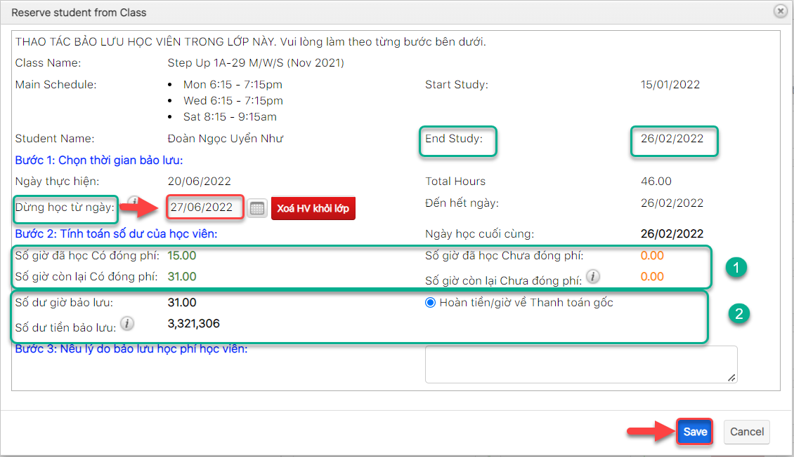

# ℹ Thông tin số dư khi đổi giờ

> **Bước 1:** Ở màn hình danh sách của module **Classes**, nhấn chọn lớp mà học viên muốn delay.

> **Bước 2:** Tại màn hình chi tiết **Classes**, chọn vào subpanel chọn tab “**Student Situations**” sau đó nhấn vào button <mark style="color:red;">**Delay**</mark>.

> Bước 3: Tại màn hình Delay , chọn thời gian Delay sau thời gian Kết thúc Lớp
>
> &#x20;:warning: Lưu ý : **Ngày dừng học > Ngày Kết Thúc** học của **Lớp**, sau đó nhập lí do. Cuối cùng click **Save** để hoàn tất.


**Ghi chú:**

1. Thông tin số giờ đã học /Số phi học viên đã học có đóng phí / chưa đóng phí trong Lớp.
2. Thông tin số giờ học viên/Số tiền còn lại sau khi thực hiện đổi giờ.

****:tada:Mặc định số tiền/số giờ học viên sẽ hoàn về thanh toán gốc (Payment học viên sử dụng Enroll trong lớp).

