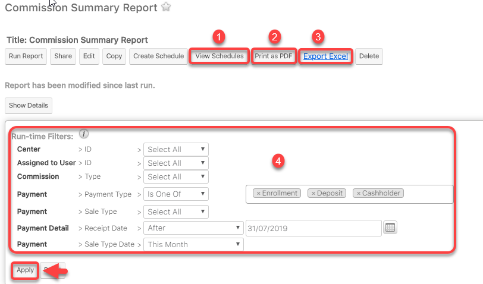

# Báo cáo-Báo biểu BOD

## Báo cáo Doanh thu theo Center trong tháng

> Bước 1: Đưa chuột vào Menu Report chọn View Report.Tại màn hình View Report trên thanh công cụ search nhập báo cáo cần tìm.Sau đó click vào báo cáo cần xem.Ví dụ xem báo cáo tổng doanh thu search ‘%total

> Bước 2: Tại màn hình báo cáo Filters theo Field , sau đó click Apply để xuất báo cáo cần xem.


**Ghi chú:**

1: Đặt lịch gửi tự động

2:Xuất/In report dạng PDF

3:Xuất report dạng Excel

4:Thông tin Filter để xuất báo cáo


> Bước 3: Sau khi click Apply,hệ thống sẽ show ra báo cáo theo Filters,nếu muốn xuất file excel hoặc PDF,..bạn có thể click vào button tương ứng.

## Báo cáo Commission theo Center trong tháng

> Bước 1: Đưa chuột vào Menu Report chọn View Report.Tại màn hình View Report trên thanh công cụ search nhập báo cáo cần tìm.Sau đó click vào báo cáo cần xem.Ví dụ xem báo cáo tổng doanh thu search ‘%commission’.

> Bước 2: Tại màn hình báo cáo Filters theo Field , sau đó click Apply để xuất báo cáo cần xem.


**Ghi chú:**

1: Đặt lịch gửi tự động

2:Xuất/In report dạng PDF

3:Xuất report dạng Excel

4:Thông tin Filter để xuất báo cáo


> Bước 3: Sau khi click Apply,hệ thống sẽ show ra báo cáo theo Filters,nếu muốn xuất file excel hoặc PDF,..bạn có thể click vào button tương ứng.

## Báo Cáo Tổng Commission theo Users trong tháng

> Bước 1: Đưa chuột vào Menu Report chọn View Report.Tại màn hình View Report trên thanh công cụ search nhập báo cáo cần tìm.Sau đó click vào báo cáo cần xem.Ví dụ xem báo cáo tổng doanh thu search ‘%commission’.

> Bước 2: Tại màn hình báo cáo Filters theo Field , sau đó click Apply để xuất báo cáo cần xem.


**Ghi chú:**

1: Đặt lịch gửi tự động

2:Xuất/In report dạng PDF

3:Xuất report dạng Excel

4:Thông tin Filter để xuất báo cáo


> Bước 3: Sau khi click Apply,hệ thống sẽ show ra báo cáo theo Filters,nếu muốn xuất file excel hoặc PDF,..bạn có thể click vào button tương ứng.

## Báo cáo tỉ lệ Pass/Fail của học viên theo Lớp trong tháng

> Bước 1: Đưa chuột vào Menu Report chọn View Report.Tại màn hình View Report trên thanh công cụ search nhập báo cáo cần tìm.Sau đó click vào báo cáo cần xem.Ví dụ xem báo cáo tổng doanh thu search ‘%Pass’’.

> Bước 2: Tại màn hình báo cáo Filters theo Field , sau đó click Apply để xuất báo cáo cần xem.


**Ghi chú:**

1: Đặt lịch gửi tự động

2:Xuất/In report dạng PDF

3:Xuất report dạng Excel

4:Thông tin Filter để xuất báo cáo


> Bước 3: Sau khi click Apply,hệ thống sẽ show ra báo cáo theo Filters,nếu muốn xuất file excel hoặc PDF,..bạn có thể click vào button tương ứng.

## Báo cáo Attendence theo Center/Lớp trong tháng

> Bước 1: Đưa chuột vào Menu Report chọn View Report.Tại màn hình View Report trên thanh công cụ search nhập báo cáo cần tìm.Sau đó click vào báo cáo cần xem.Ví dụ xem báo cáo tổng doanh thu search ‘%attendence’’’.

> Bước 2: Tại màn hình báo cáo Filters theo Field , sau đó click Apply để xuất báo cáo cần xem.


**Ghi chú:**

1: Đặt lịch gửi tự động

2:Xuất/In report dạng PDF

3:Xuất report dạng Excel

4:Thông tin Filter để xuất báo cáo


> Bước 3: Sau khi click Apply,hệ thống sẽ show ra báo cáo theo Filters,nếu muốn xuất file excel hoặc PDF,..bạn có thể click vào button tương ứng.

