# Quản lí chương trình học

## Danh mục khóa học, chương trình học

> Bước 1: Click chuột vào module Kind of Courses chọn Create.

> Bước 2: Tại màn hình tạo mới Khóa học, nhập đầy đủ các thông tin cần thiết, sau đó click Save để hoàn tất việc tạo ra 1 Khóa học mới.

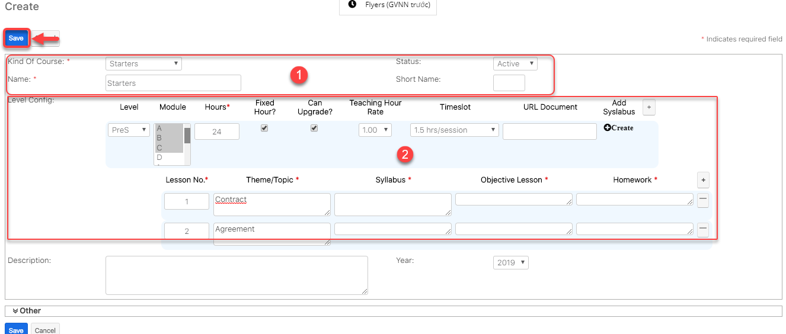


**Ghi chú:**

1:Tên chương trình học. 

2:Cấu hình chương trình học và tạo giáo án theo từng buổi học \(Phần 2 của giáo án theo từng buổi hoc\).


## Giáo án theo từng buổi học

> Bước 1: Đưa chuột vào module Class chọn Create .

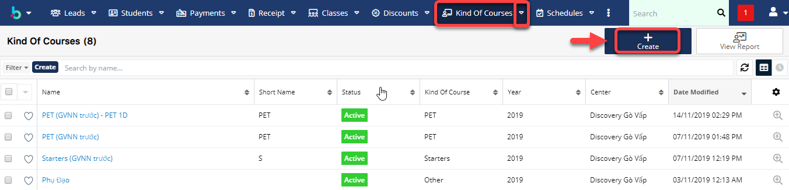

> Bước 2: Tại màn hình tạo mới chương trình học, nhập đầy đủ các thông tin cần thiết, Sau đó Click Add Syllabus để tạo giáo án cho 1 chương trình học mới.

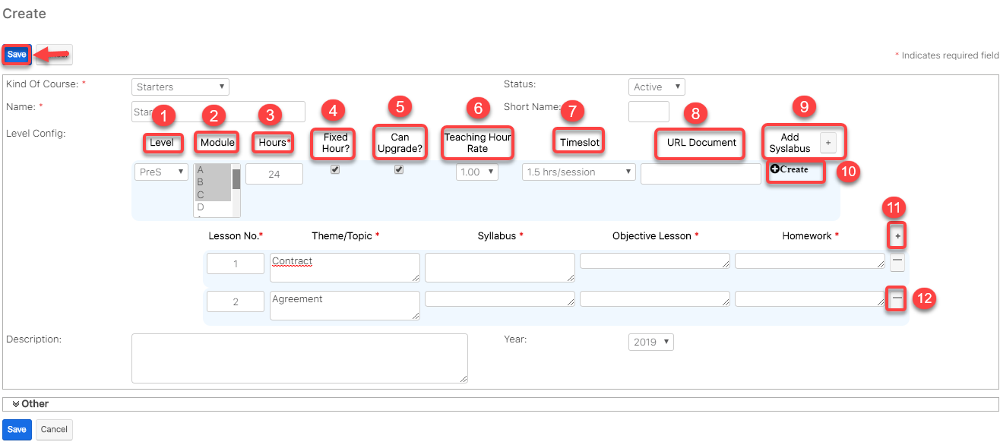


**Ghi chú:**

1: Cấp độ của chương trình học

2: Module áp dụng cho chương trình hoc

3: Số giờ của chương trình học theo giáo án

4: Giờ cố định \(Không được thay đổi số giờ học cho lớp này\(nếu tích vào\)\)

5: Có thể Upgrade lên lớp mới.

6: Tỉ lệ giờ giáo viên \(chấm công theo hệ số giáo viên\)

7: Timeslot

8: URL document

9: Add Syslabus: thêm giáo án cho chương trình hoc

10: Double Click vào Create để lên giáo án cho lớp theo từng buổi học

11: Thêm bài học cho giáo án

12: Remove bài học cho giáo án


> Bước 3: Hệ thống hiển thị thông tin chi tiết giáo án theo chương trình học được tạo

## Định nghĩa cấu trúc bảng điểm

> Bước 1**:** 
Click chuột vào module Gradebook Setting chọn **Create Gradebook Setting.**

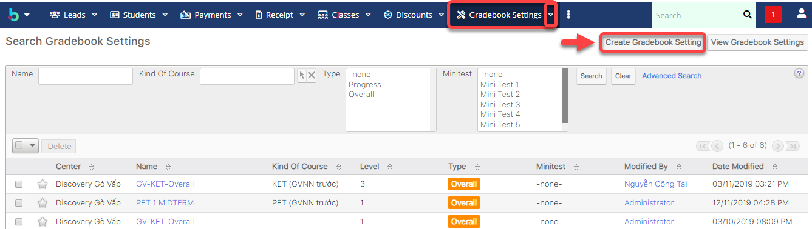

> Bước 2: Tại màn hình tạo cấu trúc bảng điểm, nhập đầy đủ thông tin trung tâm, chương trình học, loại bảng điểm. Tiếp theo click **Load config.**

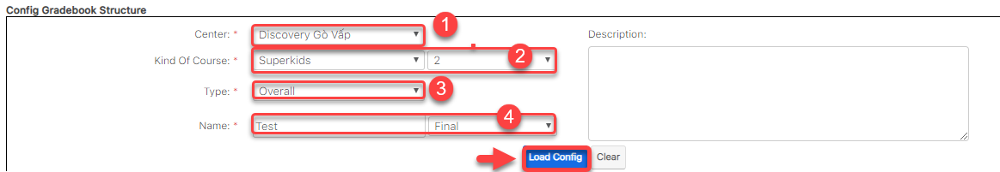


**Ghi chú:**

1: Trung tâm anh văn

2: Chương trình học

3: Loại cấu trúc bảng điểm \(Overall : bảng điểm cuối kì hay giữa kì , Progress: bảng điểm mini test\)

4: Tên cấu trúc bảng điểm \(có thể không nhập,hệ thống sẽ tự tạo tên\).


> Bước 3: Tại màn hình định nghĩa cấu trúc bảng điểm,định nghĩa cấu trúc chương trình học theo trung tâm của bạn, sau đó click Save Config.

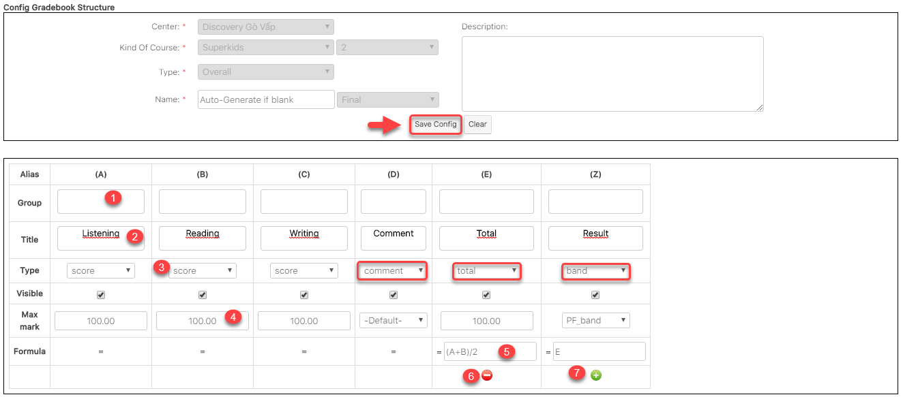


**Ghi chú:**

1: Đặt tên nhóm cột điểm để gom nhóm các cột điểm có chức năng giống nhau hoặc chung một tên. \(Có thể bỏ trống\)

2: Tên cột điểm

3: Loại cột điểm \(Score: Điểm; Formula: Điểm dựa trên công thức; Band: Xếp loại; Total: Điểm tổng kết; Comment: Nhận xét\)

4: Visible: Tick cho phép hiển thị cột hoặc không

5: Nhập điểm, loại kết quả,... phụ thuộc theo loại của cột điểm

6: Công thức định nghĩa cấu trúc bảng điểm\(chỉ xuất hiện khi loại điểm là formula, band, total\)

7: Bỏ cột

8: Thêm cột


## Cấu hình số giờ/lớp và quản lí Upgrade lớp

### Quản lí Upgrade Lớp

> Bước 1: Click chuột vào module Classes sau đó click chọn lớp muốn Upgrade.

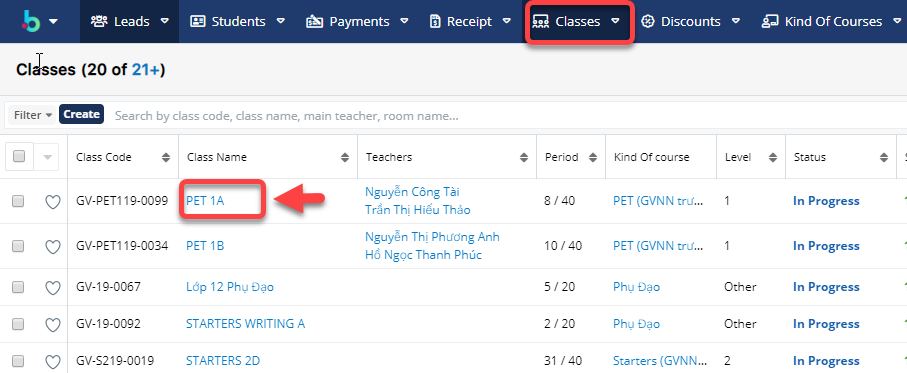

> Bước 2: Tại màn hình lớp , click vào Upgrade.

> Bước 3: 
Tại màn hình Upgrade lớp học, nhập đầy đủ các thông tin cần thiết sau đó click **Save** để hoàn  tất việc Upgrade lớp học.

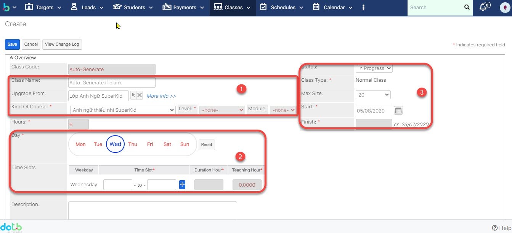


**Ghi chú:**

1:Thông tin lớp học mới Upgrade

2:Cấu hình thời gian mới cho lớp học được Upgrade , chương trình học

3:Thông tin,sỉ số,ngày bắt đầu và kết thúc của lớp được Upgrade.


> Bước 4: Hệ thống hiển thị thông tin chi tiết của Lớp học sau khi Upgrade thành công.

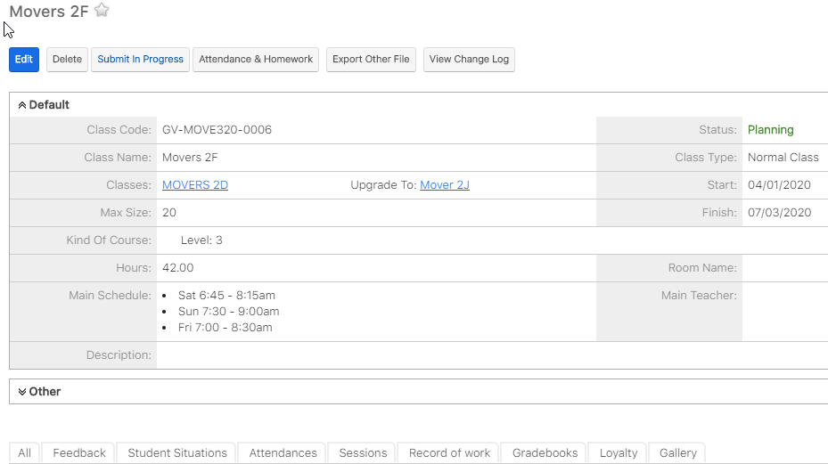

> Bước 5: Khi upgarde lớp mới xong, ngay supanel click vào tab students situation,sau đó click vào button "**Add Student**".

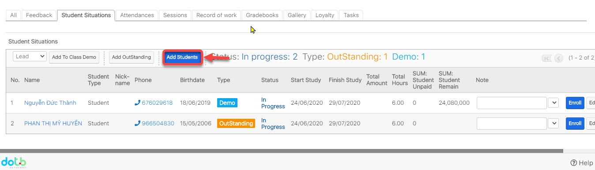

> Bước 6: Danh sách học viên từ lớp củ sẽ được hiện lên hoặc nếu bạn muốn chọn danh sách học viên từ lớp khác bạn muốn Move không phải lớp củ thì bạn chỉ cần lick vào chọn lớp \(3\) là được.

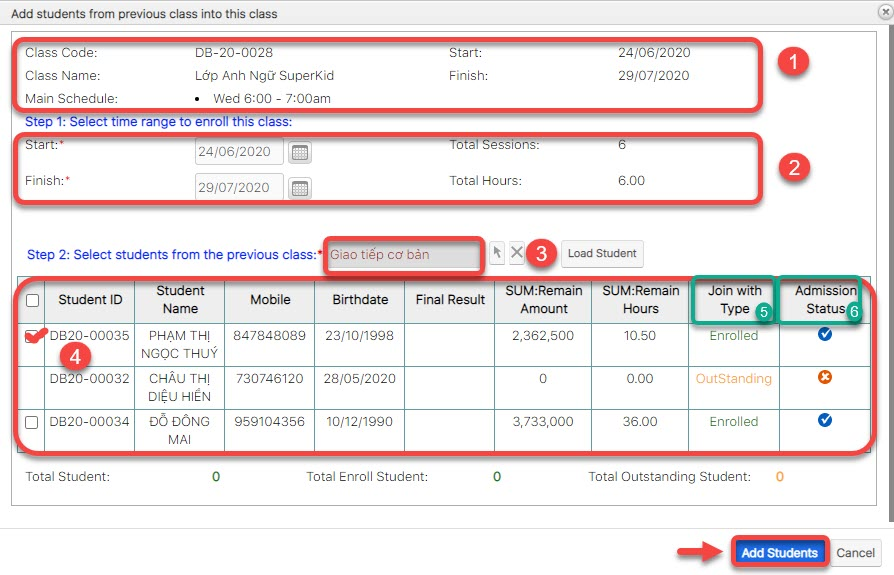


Ghi chú : 

1: Thông tin lớp học mới \(lớp đc upgrade\)

2:  Lựa chọn khoảng thời gian move học viên qua lớp mới.

3: Chọn lớp học mà bạn muốn đưa danh sách học viên vào lớp Upgrade.

4: Danh sách học viên, check vòa để chọn học viên.

5:  Thông tin học phí của học viên khi đăng kí lên lớp mới

6: **Addmission Status :**Những học viên nào học lớp củ mà được chuyển sang lớp mới và đã có tên trong danh sách lớp mới thì trong danh sách sẽ đánh dấu X và ngược lại.


> Bước 7 Click Ok để xác nhận

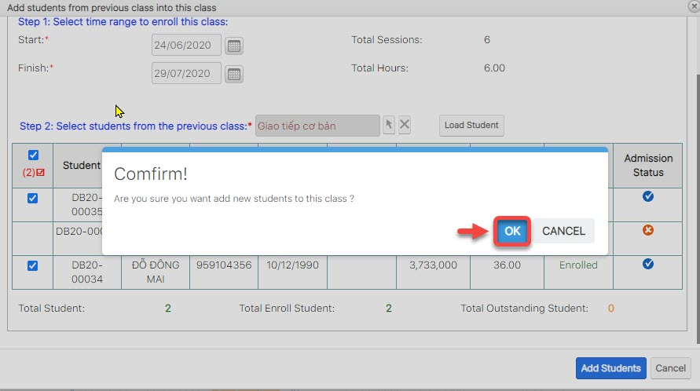

> Bước 8 : Màn hình hiên thị danh sách học viên khi add học viên vào lớp thành công.

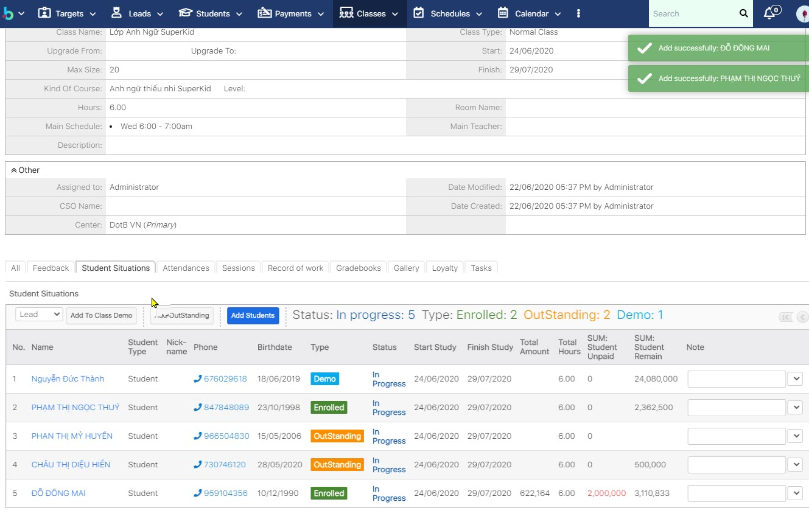

### Cấu hình số giờ/lớp

> Bước 1: Đưa chuột vào module Kind of Courses , chọn khóa học cần cấu hình số giờ/lớp.

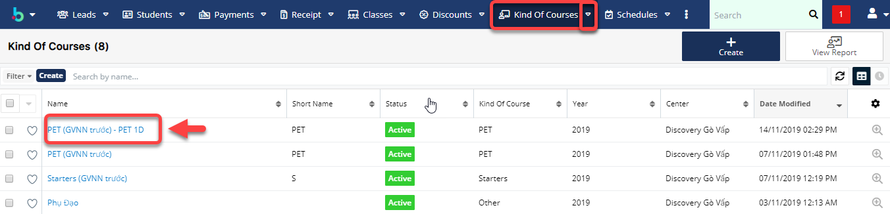

> Bước 2: Tại màn hình tạo chương trình học View Kind of Courses, Click chọn khóa học cần cấu hình số giờ/lớp.

> Bước 3: Tại màn hình xem chương trình học,click Edit,nhập cấu hình số giờ/lớp.Sau đó click Save để hoàn tất.


**Ghi chú**:

1:Số giờ/lớp

2:Giờ cố định \(Không được thay đổi số giờ học cho lớp này\(nếu tích vào\)\)

3:Có thể Upgrade lên lớp mới.

4:Tỉ lệ giờ giáo viên \(chấm công theo hệ số giáo viên\)

5:Timeslot

6:URL document


> Bước 3: Hệ thống hiển thị thông tin chi tiết số giờ/lớp và chương trình học.

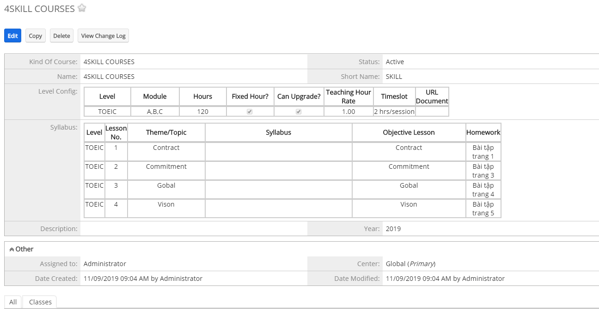

