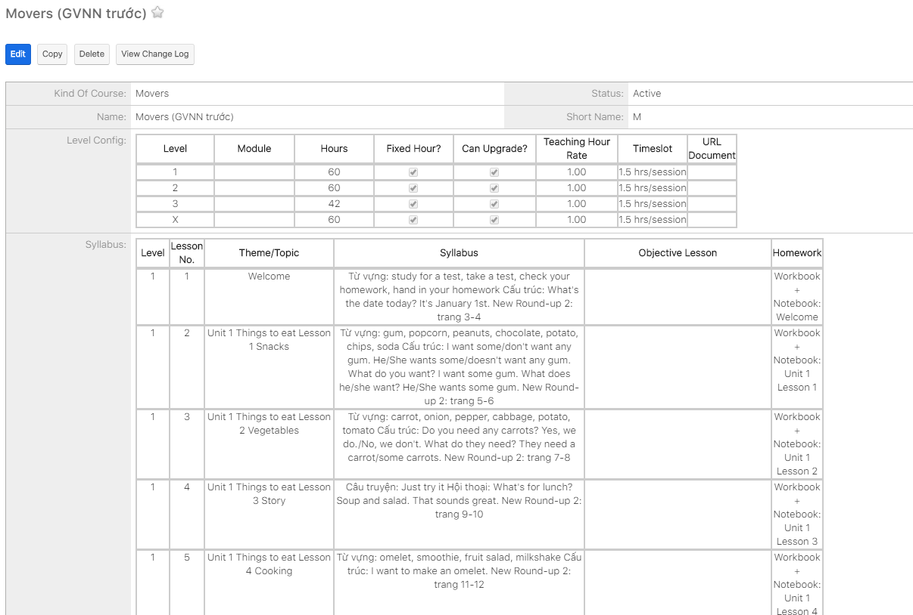
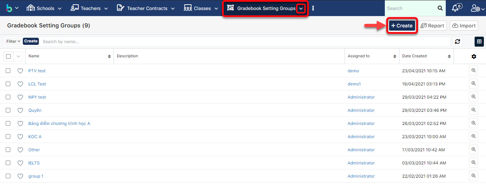
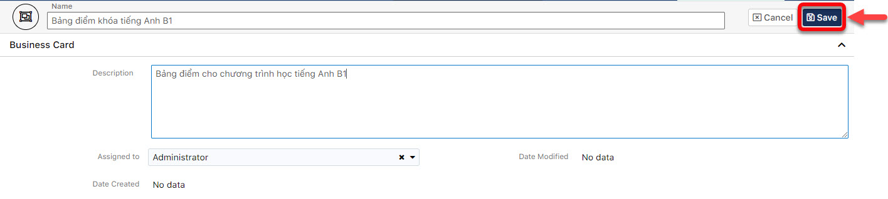
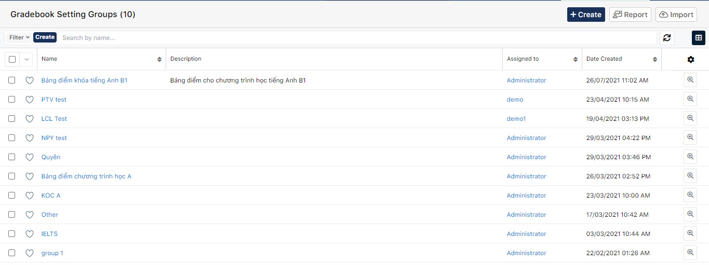
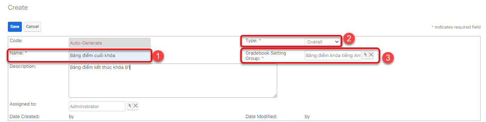
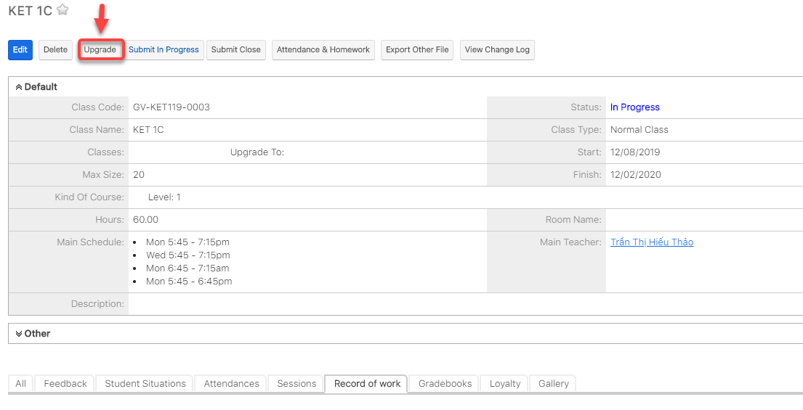

# Quản lí chương trình học

## :wave: Danh mục khóa học, chương trình học

> Bước 1: Click chuột vào module Kind of Courses chọn Create.

> Bước 2: Tại màn hình tạo mới Khóa học, nhập đầy đủ các thông tin cần thiết, sau đó click Save để hoàn tất việc tạo ra 1 Khóa học mới.


****:woman\_gesturing\_ok: **Ghi chú:**

1:Tên chương trình học.&#x20;

2:Cấu hình chương trình học và tạo giáo án theo từng buổi học (Phần 2 của giáo án theo từng buổi hoc).


## :writing\_hand: Tạo giáo án theo từng buổi học

> Bước 1: Đưa chuột vào module **Kind of courses** chọn **Create**.

> Bước 2: Tại màn hình tạo mới/Chỉnh sữa chương trình học, nhập đầy đủ các thông tin cần thiết, Sau đó Click **Add Syllabus** để tạo giáo án cho 1 chương trình học mới.


****:woman\_gesturing\_ok: **Ghi chú:**

1: Cấp độ của chương trình học

2: Module áp dụng cho chương trình hoc

3: Số giờ của chương trình học theo giáo án

4: Giờ cố định (Không được thay đổi số giờ học cho lớp này(nếu tích vào))

5: Có thể Upgrade lên lớp mới.

6: Tỉ lệ giờ giáo viên (chấm công theo hệ số giáo viên)

7: Timeslot

8: URL document

9: Add Syslabus: thêm giáo án cho chương trình hoc

10: Double Click vào Create để lên giáo án cho lớp theo từng buổi học

11: Thêm bài học cho giáo án

12: Remove bài học cho giáo án


> Bước 3: Hệ thống hiển thị thông tin chi tiết giáo án theo chương trình học được tạo

## Chỉnh sửa giáo án theo từng buổi học

> Bước 1: Đưa chuột vào module **Kind of courses, click** chọn một chương trình học cần update giáo án, sau đó chọn **Edit**.

> Bước 2: Tại màn hình chỉnh sữa chương trình học, nhập đầy đủ các thông tin cần thiết. Sau đó click **Create** để edit giáo án cho 1 chương trình học.

> Bước 3:Sau đó nhập thông tin giáo án cần chỉnh sửa, có thể import lại file mới (1) hoặc nhập  trực tiếp lên hẹ thống (2). Cuối cùng click **Save**.

## :pencil: Định nghĩa cấu trúc bảng điểm

### Phần 1: Tạo nhóm cấu trúc bảng điểm

> Bước 1**:**
> Click chuột vào module **Gradebook Setting Groups**, sau đó click **Create** để tạo 1 nhóm cấu trúc bảng điểm mới.

> Bước 2: Tại màn hình tạo nhóm cấu trúc bảng điểm, nhập tên nhóm cấu trúc bảng điểm (bắt buộc) và mô tả thêm (nếu có). Sau đó click **Save** để lưu lại.

> Bước 3: Hệ thống hiển thị nhóm cấu trúc bảng điểm đã được tạo thành công. Sau đó, tiến hành tạo cấu trúc các bảng điểm cụ thể cho nhóm này (Phần 2).

### Phần 2: Tạo cấu trúc bảng điểm&#x20;

> Bước 1: Click chuột vào module **Gradebook Settings,** sau đó click **Create** để tạo mới 1 cấu trúc bảng điểm.

> Bước 2: Tại màn hình tạo cấu trúc bảng điểm, điền đầy đủ các thông tin cần thiết. Sau đó click **Save** để tạo.


****:person\_gesturing\_ok\_tone1: **Ghi chú:**

1. Tên bảng điểm\*
2. Loại bảng điểm: Progress 1, Progress 2, Progress 3... Overall. Đây là cách để hệ thống tính toán ra được bảng điểm cuối cùng (nếu có nhiều các điểm thành phần)
3. Chọn nhóm cấu trúc bảng điểm của bảng điểm này.


> Bước 3: Sau khi tạo 1 cấu trúc bảng điểm, màn hình sẽ chuyển sang phần cấu hình chi tiết cho các cột điểm của bảng điểm. Tại đây, tiến hành định nghĩa bảng điểm theo chương trình học của trung tâm. Cuối cùng click **Save Setting.**


****:woman\_gesturing\_ok: **Ghi chú:**

1: Hướng dẫn cách sử dụng công thức để cấu hình bảng điểm.

2: Đặt tên nhóm cột điểm để gom nhóm các cột điểm có chức năng giống nhau hoặc chung một tên. (Có thể bỏ trống)

3: Tên cột điểm

4: Loại cột điểm (Score: Điểm; Formula: Điểm dựa trên công thức; Band: Xếp loại; Total: Điểm tổng kết; Comment: Nhận xét)

5: Visible: Tick cho phép hiển thị cột hoặc ẩn cột

6: Nhập điểm tối đa, loại kết quả,... phụ thuộc theo loại của cột điểm

7: Công thức định nghĩa cấu trúc bảng điểm (chỉ xuất hiện khi loại cột điểm là formula, band, total)

8: Bỏ cột

9: Thêm cột


## :bone: Cấu hình số giờ/lớp và quản lí Upgrade lớp

### Quản lí Upgrade Lớp

> Bước 1: Click chuột vào module Classes sau đó click chọn lớp muốn Upgrade.

> Bước 2: Tại màn hình lớp , click vào Upgrade.

> Bước 3:&#x20;
> Tại màn hình Upgrade lớp học, nhập đầy đủ các thông tin cần thiết sau đó click **Save** để hoàn  tất việc Upgrade lớp học.


****:woman\_gesturing\_ok: **Ghi chú:**

1:Thông tin lớp học mới Upgrade

2:Cấu hình thời gian mới cho lớp học được Upgrade , chương trình học

3:Thông tin,sỉ số,ngày bắt đầu và kết thúc của lớp được Upgrade.


> Bước 4: Hệ thống hiển thị thông tin chi tiết của Lớp học sau khi Upgrade thành công.

> Bước 5: Khi upgarde lớp mới xong, ngay supanel click vào tab **Students Situation** ,sau đó click vào button "**Add Student**".

> Bước 6: Danh sách học viên từ lớp củ sẽ được hiện lên hoặc nếu bạn muốn chọn danh sách học viên từ lớp khác bạn muốn move không phải lớp củ thì bạn chỉ cần lick vào chọn lớp (**3**) là được hoặc nếu muốn thêm nhiều học viên mới khác vào thì bạn click chọn số (4**)** : **Select Students**.

.jpg>)


****:woman\_gesturing\_ok: **Ghi chú** :&#x20;

1: Thông tin lớp học mới (lớp đc upgrade, hoặc lớp New)

2:  Lựa chọn khoảng thời gian move học viên qua lớp mới.

3: Chọn lớp học mà bạn muốn đưa danh sách học viên vào lớp Upgrade.

4: Add thêm học viên hàng loạt, bạn có thể chọn 1 hay nhiều học viên cùng 1 lúc.

5: Chọn Payment để Enroll học viên (Mặc định hệ thống sẽ tự chọn Payment nếu như KOC của lớp học và KOC của payment cùng chung 1 Chương trình học )

6 : :stop\_button: Có thể chọn hàng loạt hoặc chọn từng học viên.

7:  Join with type :Thông tin học phí của học viên khi đăng kí lên lớp mới .

:point\_right: **Enrolled**: Học viên còn khoảng học phí&#x20;

:point\_right: **Outstanding** : Học viên không đủ phí để join lớp mới nên add vào học nợ

8: **Addmission Status :**&#x20;

&#x20;:heavy\_multiplication\_x: : Học viên đã có trong lớp, không thể add vào

:heavy\_check\_mark: : Học viên chưa có trong lớp, có thể add vào



> Bước 7 Click Ok để xác nhận

> Bước 8 : Màn hình hiên thị danh sách học viên khi add học viên vào lớp thành công.

### Cấu hình số giờ/lớp

> Bước 1: Đưa chuột vào module Kind of Courses , chọn khóa học cần cấu hình số giờ/lớp.

> Bước 2: Tại màn hình tạo chương trình học View Kind of Courses, Click chọn khóa học cần cấu hình số giờ/lớp.

> Bước 3: Tại màn hình xem chương trình học,click Edit,nhập cấu hình số giờ/lớp.Sau đó click Save để hoàn tất.

.png>)


****:woman\_gesturing\_ok: **Ghi chú**:

1:Số giờ/lớp

2:Giờ cố định (Không được thay đổi số giờ học cho lớp này(nếu tích vào))

3:Có thể Upgrade lên lớp mới.

4:Tỉ lệ giờ giáo viên (chấm công theo hệ số giáo viên)

5:Timeslot

6:URL document


> Bước 3: Hệ thống hiển thị thông tin chi tiết số giờ/lớp và chương trình học.

