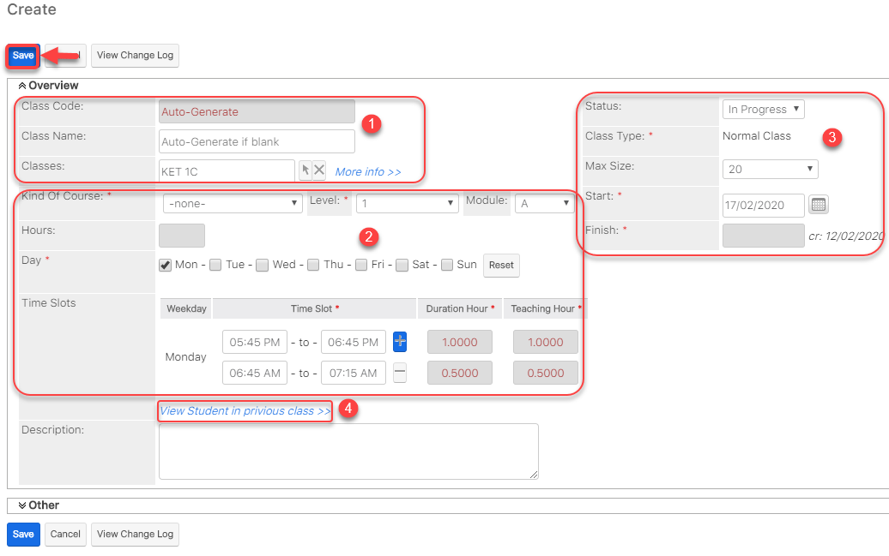
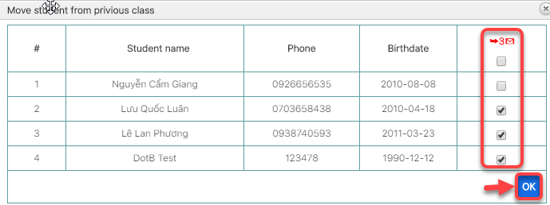
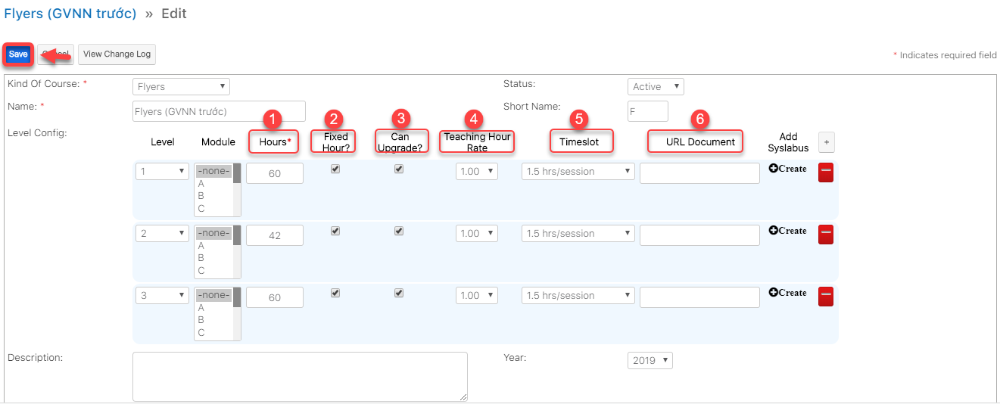

# Quản lí chương trình học

## Danh mục khóa học, chương trình học

> Bước 1: Click chuột vào module Kind of Courses chọn Create.

> Bước 2: Tại màn hình tạo mới Khóa học, nhập đầy đủ các thông tin cần thiết, sau đó click Save để hoàn tất việc tạo ra 1 Khóa học mới.


**Ghi chú:**

1:Tên chương trình học. 

2:Cấu hình chương trình học và tạo giáo án theo từng buổi học \(Phần 2 của giáo án theo từng buổi hoc\).


## Giáo án theo từng buổi học

> Bước 1: Đưa chuột vào module Class chọn Create .

> Bước 2: Tại màn hình tạo mới chương trình học, nhập đầy đủ các thông tin cần thiết, Sau đó Click Add Syllabus để tạo giáo án cho 1 chương trình học mới.


**Ghi chú:**

1: Cấp độ của chương trình học

2: Module áp dụng cho chương trình hoc

3: Số giờ của chương trình học theo giáo án

4: Giờ cố định \(Không được thay đổi số giờ học cho lớp này\(nếu tích vào\)\)

5: Có thể Upgrade lên lớp mới.

6: Tỉ lệ giờ giáo viên \(chấm công theo hệ số giáo viên\)

7: Timeslot

8: URL document

9: Add Syslabus: thêm giáo án cho chương trình hoc

10: Double Click vào Create để lên giáo án cho lớp theo từng buổi học

11: Thêm bài học cho giáo án

12: Remove bài học cho giáo án


> Bước 3: Hệ thống hiển thị thông tin chi tiết giáo án theo chương trình học được tạo

## Định nghĩa cấu trúc bảng điểm

> Bước 1**:** 
Click chuột vào module Gradebook Setting chọn **Create Gradebook Setting.**

> Bước 2: Tại màn hình tạo cấu trúc bảng điểm, nhập đầy đủ thông tin trung tâm,chương trình học,loại bảng điểm. Tiếp theo cick **Load config.**


**Ghi chú:**

1:Trung tâm anh văn

2:Chương trình học

3:Loại cấu trúc bảng điểm \(Overall : bảng điểm cuối kì hay giữa kì , Process: bảng điểm minitest\)

4:Tên cấu trúc bảng điểm \(có thể không nhập,hệ thống sẽ tự tạo tên\).


> Bước 3: Tại màn hình định nghĩa cấu trúc bảng điểm,định nghĩa cấu trúc chương trình học theo trung tâm của bạn, sau đó click Save Config.


**Ghi chú:**

1:Đặt tên giống nhau đối với những cột điểm giống nhau\(Có thể không đặt tên\)

2:Tên cột điểm

3:Loại cột điểm \(cột đánh giá, comment của giáo viên,…\)

4:Tich cho phép hiển thị cột hoặc không

5:Nhập điểm,loại kết quả,..

6:Công thức định nghĩa cấu trúc bảng điểm

7:Bỏ cột

8:Thêm cột


## Cấu hình số giờ/lớp và quản lí Upgrade lớp

### Quản lí Upgrade Lớp

> Bước 1: Click chuột vào module Classes sau đó click chọn lớp muốn Upgrade.

> Bước 2: Tại màn hình lớp , click vào Upgrade.

> Bước 3: 
Tại màn hình Upgrade lớp học, nhập đầy đủ các thông tin cần thiết \(thông tin chương trình học, sanh sách học viên,lớp Upgrade\), sau đó click **Save** để hoàn  tất việc Upgrade lớp học.


**Ghi chú:**

1:Thông tin lớp học mới Upgrade

2:Cấu hình thời gian mới cho lớp học được Upgrade , chương trình học

3:Thông tin,sỉ số,ngày bắt đầu và kết thúc của lớp được Upgrade.

4. Danh sách học viên từ lớp củ.Người dung có thể chọn hết danh sách học viên từ lớp củ hoặc 1 vài học viên, sau đó click **Ok.**


> Bước 4: Hệ thống hiển thị thông tin chi tiết của Lớp học sau khi Upgrade thành công.

### Cấu hình số giờ/lớp

> Bước 1: Đưa chuột vào module Kind of Courses , chọn khóa học cần cấu hình số giờ/lớp.

> Bước 2: Tại màn hình tạo chương trình học View Kind of Courses, Click chọn khóa học cần cấu hình số giờ/lớp.

> Bước 3: Tại màn hình xem chương trình học,click Edit,nhập cấu hình số giờ/lớp.Sau đó click Save để hoàn tất.


**Ghi chú**:

1:Số giờ/lớp

2:Giờ cố định \(Không được thay đổi số giờ học cho lớp này\(nếu tích vào\)\)

3:Có thể Upgrade lên lớp mới.

4:Tỉ lệ giờ giáo viên \(chấm công theo hệ số giáo viên\)

5:Timeslot

6:URL document


> Bước 3: Hệ thống hiển thị thông tin chi tiết số giờ/lớp và chương trình học.

