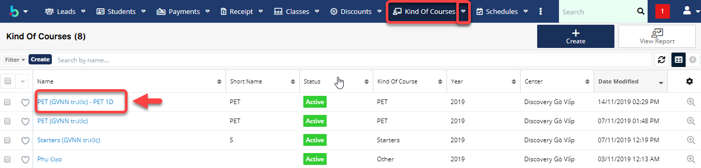

# Cấu hình số giờ/lớp

> **Bước 1:** Đưa chuột vào module Kind of Courses, chọn khóa học cần cấu hình số giờ/lớp.

> **Bước 2:** Tại màn hình tạo chương trình học View Kind of Courses, Click chọn khóa học cần cấu hình số giờ/lớp.

> **Bước 3:** Tại màn hình xem chương trình học,click Edit,nhập cấu hình số giờ/lớp.Sau đó click Save để hoàn tất.

.png>)


****:woman\_gesturing\_ok: **Ghi chú**:

1. Số giờ/lớp
2. Giờ cố định (Không được thay đổi số giờ học cho lớp này(nếu tích vào))
3. Có thể Upgrade lên lớp mới.
4. Tỉ lệ giờ giáo viên (chấm công theo hệ số giáo viên)
5. Timeslot
6. URL document


> **Bước 4:** Hệ thống hiển thị thông tin chi tiết số giờ/lớp và chương trình học.

