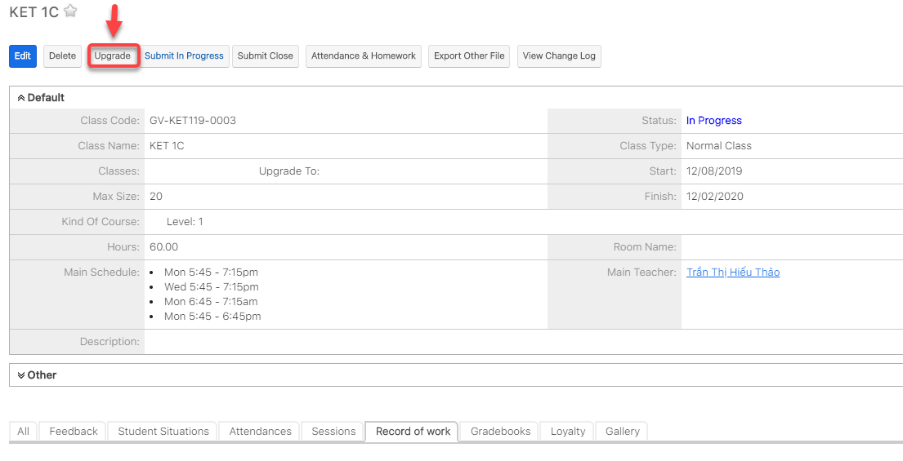
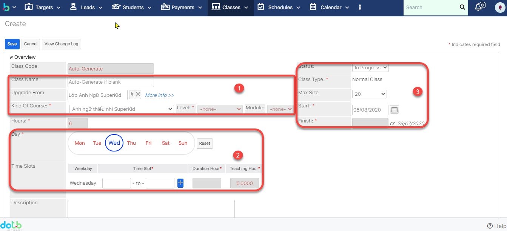
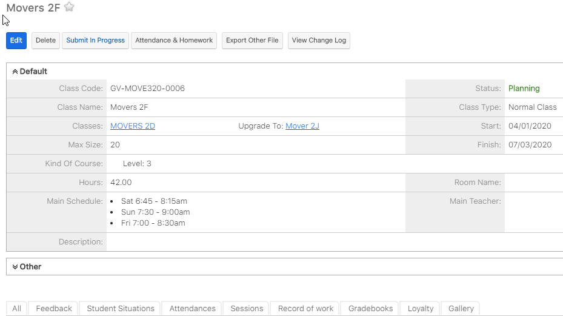
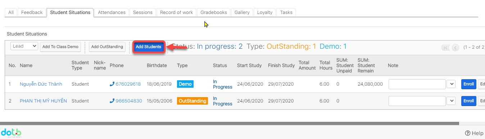

# Quản lí Upgrade Lớp

> **Bước 1:** Click chuột vào module Classes sau đó click chọn lớp muốn Upgrade.

> **Bước 2:** Tại màn hình lớp, click vào Upgrade.

> **Bước 3:**&#x20;
> Tại màn hình Upgrade lớp học, nhập đầy đủ các thông tin cần thiết sau đó click **Save** để hoàn  tất việc Upgrade lớp học.


****:woman\_gesturing\_ok: **Ghi chú:**

1. Thông tin lớp học mới Upgrade
2. Cấu hình thời gian mới cho lớp học được Upgrade, chương trình học
3. Thông tin,sỉ số,ngày bắt đầu và kết thúc của lớp được Upgrade.


> **Bước 4:** Hệ thống hiển thị thông tin chi tiết của Lớp học sau khi Upgrade thành công.

> **Bước 5:** Khi upgrade lớp mới xong, ngay supannel click vào tab **Students Situation**, sau đó click vào button "**Add Student**".

> **Bước 6:** Danh sách học viên từ lớp cũ sẽ được hiện lên hoặc nếu bạn muốn chọn danh sách học viên từ lớp khác bạn muốn move không phải lớp củ thì bạn chỉ cần lick vào chọn lớp (**3**) là được hoặc nếu muốn thêm nhiều học viên mới khác vào thì bạn click chọn số (4**)** : **Select Students**.

.jpg>)


****:woman\_gesturing\_ok: **Ghi chú** :&#x20;

1. Thông tin lớp học mới (lớp đc upgrade, hoặc lớp New)
2. Lựa chọn khoảng thời gian move học viên qua lớp mới.
3. Chọn lớp học mà bạn muốn đưa danh sách học viên vào lớp Upgrade.
4. Add thêm học viên hàng loạt, bạn có thể chọn 1 hay nhiều học viên cùng 1 lúc.
5. Chọn Payment để Enroll học viên (Mặc định hệ thống sẽ tự chọn Payment nếu như KOC của lớp học và KOC của payment cùng chung 1 Chương trình học )
6. :stop\_button: Có thể chọn hàng loạt hoặc chọn từng học viên.
7. Join with type :Thông tin học phí của học viên khi đăng kí lên lớp mới .

:point\_right: **Enrolled**: Học viên còn khoảng học phí&#x20;

:point\_right: **Outstanding** : Học viên không đủ phí để join lớp mới nên add vào học nợ

**8. Addmission Status :**&#x20;

&#x20;:heavy\_multiplication\_x: : Học viên đã có trong lớp, không thể add vào

:heavy\_check\_mark: : Học viên chưa có trong lớp, có thể add vào



> **Bước 7:** Click Ok để xác nhận

> **Bước 8:** Màn hình hiển thị danh sách học viên khi add học viên vào lớp thành công.

