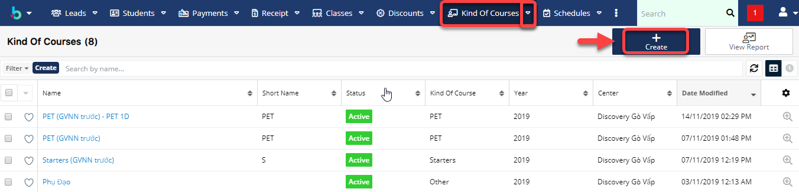
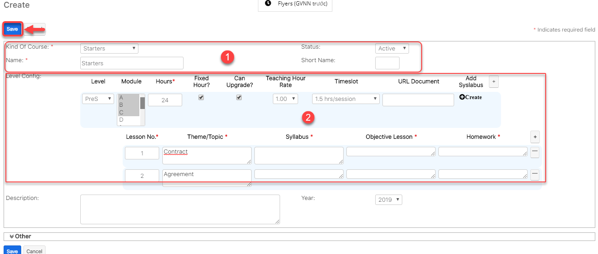

# Danh mục khóa học, chương trình học

> **Bước 1:** Ở màn hình danh sách của module **Kind of Courses,** chọn **Create** để mở ra màn hình tạo mới.

> **Bước 2:** Tại màn hình tạo mới khóa học học, nhập đầy đủ các thông tin cần thiết, sau đó nhấn chọn Save để hoàn tất việc tạo ra một khóa học mới.


****:woman\_gesturing\_ok: **Ghi chú:**

1. Tên chương trình học.&#x20;
2. Cấu hình chương trình học và tạo giáo án theo từng buổi học (Phần 2 của giáo án theo từng buổi hoc).

