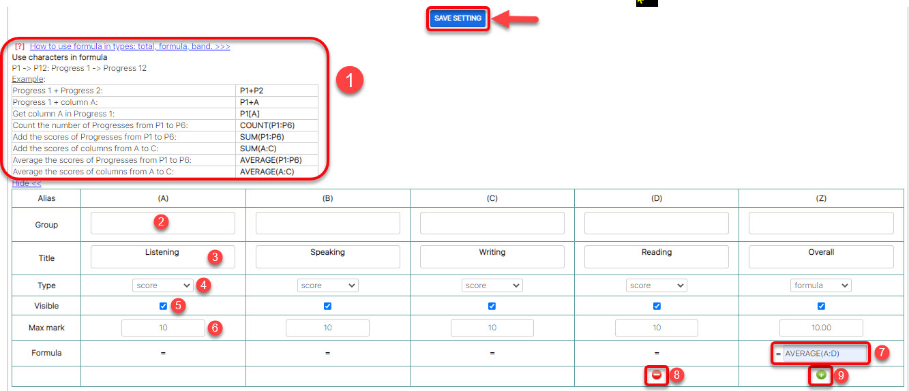

# Tạo cấu trúc bảng điểm

> **Bước 1:** Ở màn hình danh sách của module **Gradebook Settings,** ta nhấn vào button **Create** để mở ra màn hình thêm mới một cấu trúc bảng điểm.

> **Bước 2:** Tại màn hình tạo cấu trúc bảng điểm, điền đầy đủ các thông tin cần thiết. Sau đó nhấn chọn **Save** hoàn thành việc tạo ra một cấu trúc bảng điểm mới.


****:person\_gesturing\_ok\_tone1: **Ghi chú:**

1. Tên bảng điểm\*
2. Loại bảng điểm: Progress 1, Progress 2, Progress 3... Overall. Đây là cách để hệ thống tính toán ra được bảng điểm cuối cùng (nếu có nhiều các điểm thành phần)
3. Chọn nhóm cấu trúc bảng điểm của bảng điểm này.


> Bước 3: Sau khi tạo 1 cấu trúc bảng điểm, màn hình sẽ chuyển sang phần cấu hình chi tiết cho các cột điểm của bảng điểm. Tại đây, tiến hành định nghĩa bảng điểm theo chương trình học của trung tâm. Cuối cùng nhấn chọn **Save Setting.**


****:woman\_gesturing\_ok: **Ghi chú:**

1. Hướng dẫn cách sử dụng công thức để cấu hình bảng điểm.
2. Đặt tên nhóm cột điểm để gom nhóm các cột điểm có chức năng giống nhau hoặc chung một tên. (Có thể bỏ trống)
3. Tên cột điểm
4. Loại cột điểm (Score: Điểm; Formula: Điểm dựa trên công thức; Band: Xếp loại; Total: Điểm tổng kết; Comment: Nhận xét)
5. Visible: Tick cho phép hiển thị cột hoặc ẩn cột
6. Nhập điểm tối đa, loại kết quả,... phụ thuộc theo loại của cột điểm
7. Công thức định nghĩa cấu trúc bảng điểm (chỉ xuất hiện khi loại cột điểm là formula, band, total)
8. Bỏ cột
9. Thêm cột

