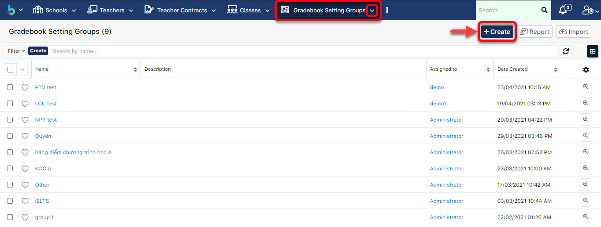

# Tạo nhóm cấu trúc bảng điểm

> **Bước 1:**
> Ở màn hình danh sách của module **Gradebook Setting Groups**, ta nhấn vào button **Create** để mở ra màn hình thêm mới một nhóm cấu trúc bảng điểm mới.

> **Bước 2:** Tại màn hình tạo mới nhóm cấu trúc bảng điểm, nhập đầy đủ các thông tin cần thiết, người dùng lưu ý rằng các trường (field) có chữ **Required** bắt buộc phải nhập thông tin vào, những field khác có thể bỏ qua, sau đó nhấn chọn button **Save** để hoàn tất việc tạo ra một nhóm cấu trúc bảng điểm mới.

<figure><figcaption></figcaption></figure>

> **Bước 3:** Hệ thống hiển thị nhóm cấu trúc bảng điểm đã được tạo thành công. Sau đó, tiến hành tạo cấu trúc các bảng điểm cụ thể cho nhóm này.

<figure><figcaption></figcaption></figure>
