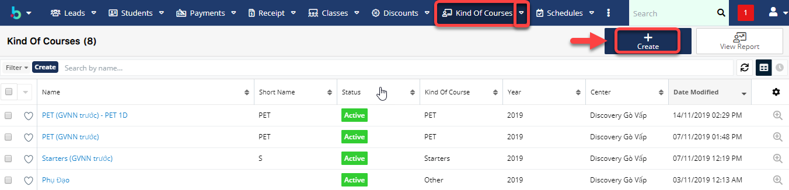

# Tạo giáo án theo từng buổi học

> **Bước 1:** Đưa chuột vào module **Kind of courses** chọn **Create**.

> **Bước 2:** Tại màn hình tạo mới/Chỉnh sửa chương trình học, nhập đầy đủ các thông tin cần thiết. Sau đó nhấn **Add Syllabus** để tạo giáo án cho 1 chương trình học mới.


****:woman\_gesturing\_ok: **Ghi chú:**

1. Cấp độ của chương trình học
2. Module áp dụng cho chương trình học
3. Số giờ của chương trình học theo giáo án
4. Giờ cố định (Không được thay đổi số giờ học cho lớp này(nếu tích vào))
5. Có thể Upgrade lên lớp mới.
6. Tỉ lệ giờ giáo viên (chấm công theo hệ số giáo viên)
7. Timeslot
8. URL document
9. Add Syslabus: thêm giáo án cho chương trình học
10. Double Click vào Create để lên giáo án cho lớp theo từng buổi học
11. Thêm bài học cho giáo án
12. Remove bài học cho giáo án


> **Bước 3:** Hệ thống hiển thị thông tin chi tiết giáo án theo chương trình học được tạo

> _Video hướng dẫn Cài đặt Giáo Án theo chương trình học_


