# Quản lí giáo viên và TA

## Quản lí thông tin giáo viên, hợp đồng

### Tạo giáo viên

> Bước 1: Đưa chuột vào Menu Teacher chọn Create Teacher.

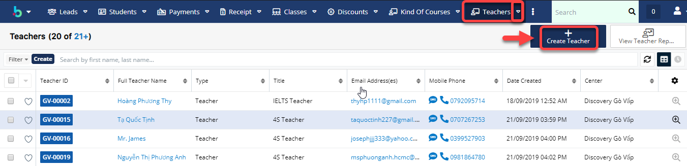

> Bước 2: Tại màn hình tạo mới Giáo viên, nhập đầy đủ các thông tin cần thiết, Sau đó Click Save để hoàn tất việc tạo Giáo viên.

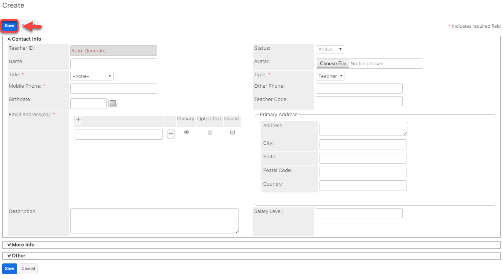

> Bước 3: Hệ thống hiển thị thông tin chi tiết của Giáo viên sau khi tạo thành công

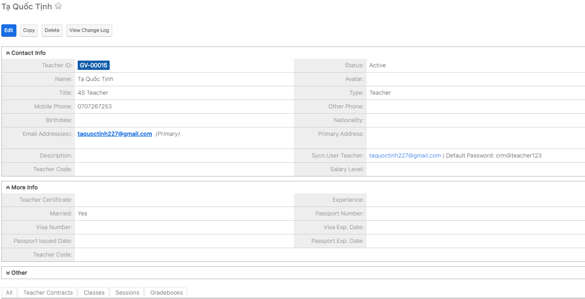

### Tạo hợp đồng

> Bước 1: 
Tại màn hình chi tiết của Giáo viên, Click vào Subpanel Teacher Contract, sau đó click **Create.**

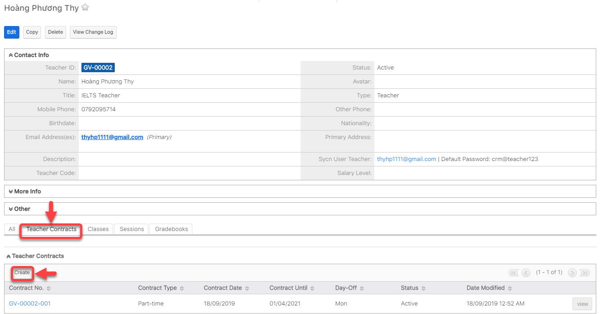

> Bước 2: Tại màn hình tạo mới Hợp đồng, nhập đầy đủ các thông tin cần thiết, Click Save để hoàn tất việc tạo Hợp đồng.

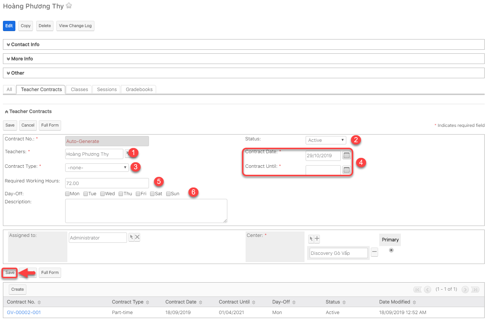


\*\*\*\*🙆♀ **Ghi chú:**

1: Giáo viên trong Hợp đồng

2: Trạng thái của Hợp đồng

3: Loại Hợp đồng

4: Ngày bắt đầu và ngày kết thúc Hợp đồng

5: Số giờ dạy bắt buộc trong tháng 

6: Ngày nghỉ của Giáo viên


> Bước 3: Hệ thống hiển thị thông tin chi tiết sau khi tạo thành công Hợp đồng cho Giáo viên.

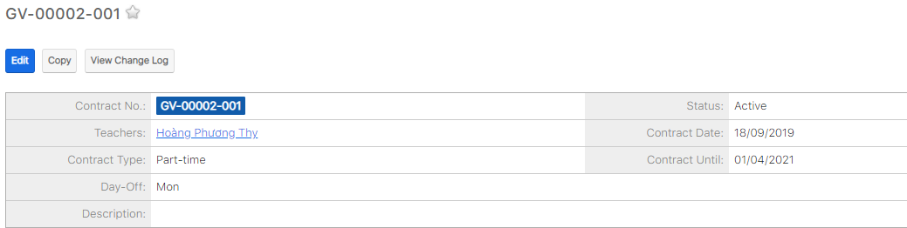

## Xếp lịch giảng dạy

> Bước 1: Click chuột vào module Class, sau đó chọn lớp mà muốn xếp lịch giảng dạy cho Giáo viên.

> Bước 2: 
Tại màn hình chi tiết của Lớp học, Click vào tab **Sessions,** sau đó click vào **Schedule Teacher/TA.**

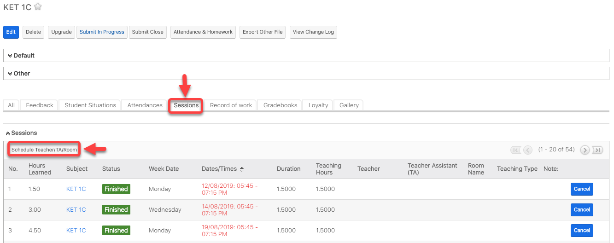

> Bước 3: 
Tại màn hình lựa chọn các tiêu chí để xếp lịch cho Giáo viên, sau đó Click vào button **Check**.

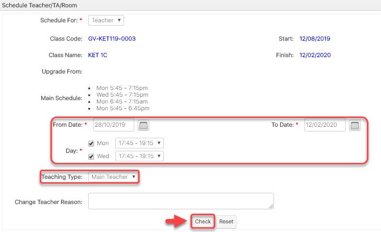

> Bước 4: 
 Hệ thống hiển thị danh sách Giáo viên phù hợp, click chọn Giáo viên muốn xếp, click **Save** để hoàn  tất.

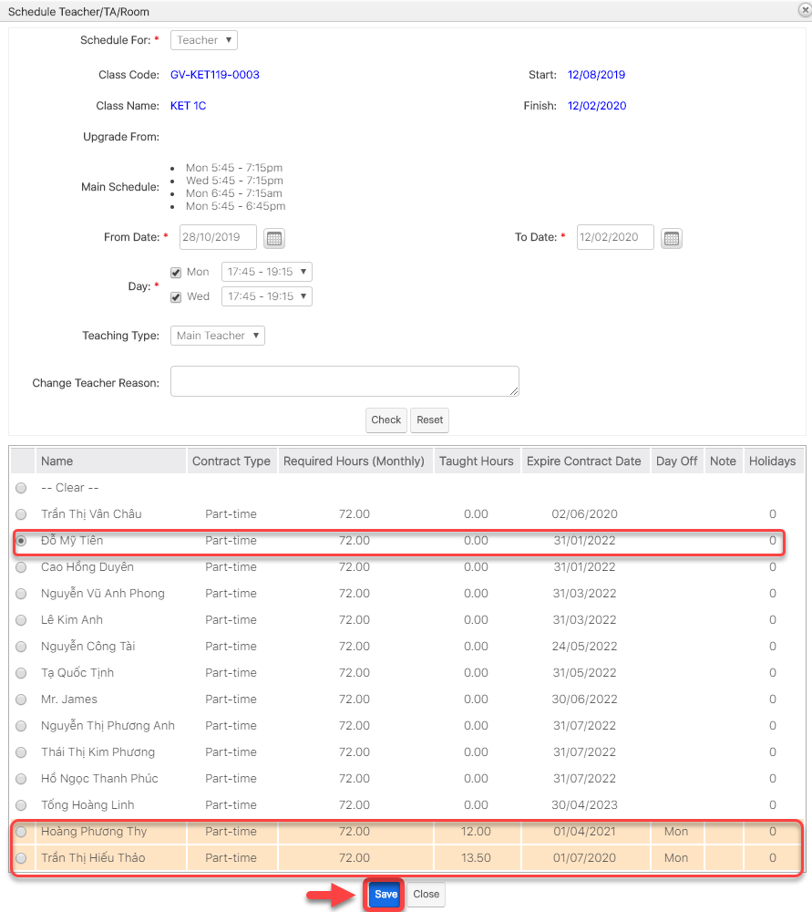


\*\*\*\*🙆♀ **Ghi chú:**

Màu hồng là do Day Off của giáo viên trùng với 1 số ngày trong xếp lịch giảng dạy nên có ưu tiên thấp hơn.


> Bước 5: Click OK để xác nhận việc xếp lịch cho Giáo viên.

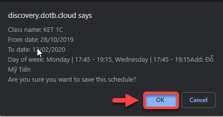

## Quản lí giờ phụ đạo, event, admin

> Bước 1: click chuột vào module **Admin Hours,** sau đó chọn ngày cần xếp cho giáo viên và nhập thông tin giáo viên cần xếp, thời gian, task,... tiếp theo click **Add.**


\*\*\*\*🙆♀ **Ghi chú**:

1: Giáo viên cần xếp buổi phụ đạo

2: Task giáo viên

3: Thời gian giáo viên tham gia

4: Mô tả thêm thông tin \(nếu có\).


> Bước 2: sau khi click Add thành công, màn hình **Added entries** hiện thi thông tin giáo viên đã được xếp thời gian phụ đạo bên dưới. Cuối cùng click **Save**.

> Bước 3: Khi lưu thành công, màn hình lịch của tháng những ô được tô màu vàng là thời gian giáo viên đã được xếp lịch, ô màu xanh là ngày hiện tại.

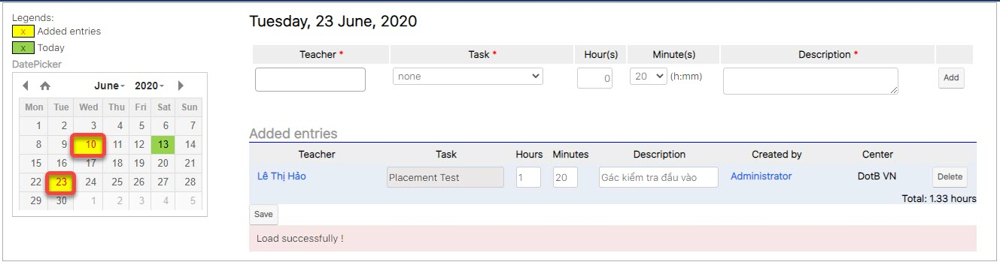

