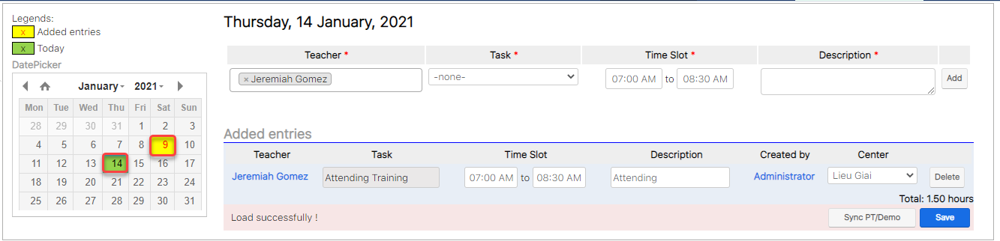
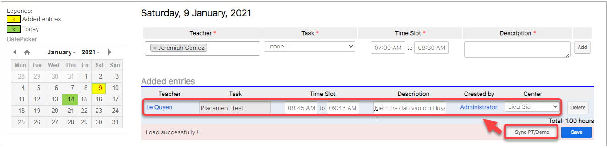

# Quản lí giờ phụ đạo, event, admin

> **Bước 1:** Nhấn chuột vào module **Admin Hours,** sau đó chọn ngày cần xếp cho giáo viên và nhập thông tin giáo viên cần xếp, thời gian, task,... tiếp theo click **Add.**


****:woman\_gesturing\_ok: **Ghi chú**:

1. Giáo viên cần xếp buổi phụ đạo.
2. Task giáo viên.
3. Thời gian giáo viên tham gia.
4. Mô tả thêm thông tin (nếu có).


> **Bước 2:** Sau khi click Add thành công, màn hình **Added entries** hiện thị thông tin giáo viên đã được xếp thời gian phụ đạo bên dưới. Cuối cùng click **Save**.

> **Bước 3:** Khi lưu thành công, màn hình lịch của tháng những ô được tô màu vàng là thời gian giáo viên đã được xếp lịch, ô màu xanh là ngày hiện tại.


**Ghi chú**:&#x20;

_**Tính năng Sync PT/Demo**_ sẽ đồng bộ các buổi PT/Demo lên Module Admin Hour khi giáo viên được book vào các buổi PT/Demo thông qua module Schedules

Khi tạo các buổi PT/Demo mà có thêm giáo viên vào các buổi đó.



Tính năng Sync PT/Demo sẽ hoạt động khi click vào button Sync PT/Demo, hệ thống sẽ thêm giáo viên vào lịch lên module Admin Hour tương ứng với buổi mà bạn đã setup trong module Schedules.


