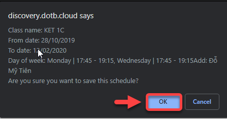

# Xếp lịch giảng dạy

> **Bước 1:** Chọn chuột vào phân hệ Classes, sau đó chọn lớp mà muốn xếp lịch giảng dạy cho Giáo viên.

> **Bước 2:**&#x20;
> Tại màn hình chi tiết của Lớp học, chọn vào tab **Sessions,** sau đó chọn vào **Schedule Teacher/TA.**

> **Bước 3:**&#x20;
> Tại màn hình lựa chọn các tiêu chí để xếp lịch cho Giáo viên, sau đó chọn vào button **Check**.

> **Bước 4:**
> Hệ thống hiển thị danh sách Giáo viên phù hợp, chọn Giáo viên muốn xếp, chọn **Save** để hoàn tất.


****:woman\_gesturing\_ok: **Ghi chú:**

Màu hồng là do Day Off của giáo viên trùng với 1 số ngày trong xếp lịch giảng dạy nên có ưu tiên thấp hơn.


> **Bước 5:** Nhấn OK để xác nhận việc xếp lịch cho Giáo viên.

> _Video hướng dẫn_ _Phân công giáo viên phụ trách giảng dạy_


