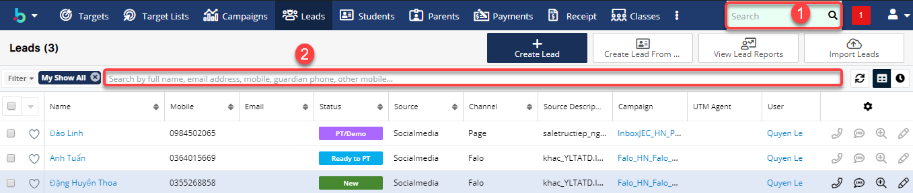
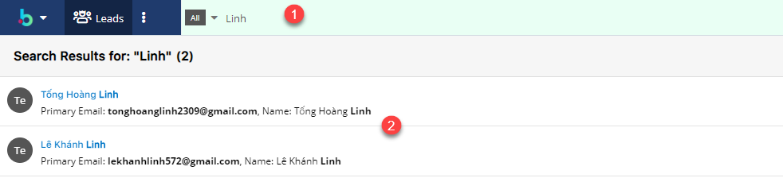
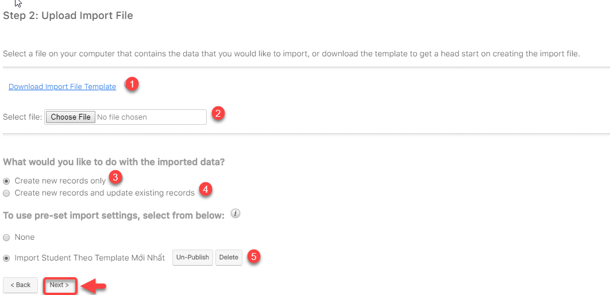

# Quản lí hồ sơ học viên

## Quản lí hồ sơ học viên, lịch sử thanh toán

> Bước 1: Click vào module **Students** , hệ thống sẽ hiển thị thông tin sơ lược hồ sơ học viên cho User

> Bước 2: Bạn có thể Click vào từng học viên để theo dõi thông tin học viên,lịch sử thanh toán,học nợ, học demo,lịch sử cuộc gọi,..

## Tìm kiếm và trích lọc học viên theo tiêu chí

### Trích lọc học viên theo tiêu chí

> Bước 1: Tại Menu Action Filter click chọn Create. Ví dụ module Leads.

> Bước 2: Tiếp theo chọn tiêu chí mà bạn muốn lọc,ví dụ chúng tôi lọc theo Status của học viên.

> Bước 3: Hệ thống hiển thị tiêu chí bạn chọc lọc theo Status.


\*\*\*\*🙆♀ **Ghi chú** :

+Is any of:Bất kì

+Is not any of:không bất kì

+Is empty: Trống 

+Is not empty: Không trống


> Bước 4: Hệ thống sẽ load trạng thái của học viên theo danh sách cho người dùng chọn, ví dụ chúng tôi chọn lọc học viên theo Status đang chờ lớp học “Ready to PT”. Hệ thống hiển thị danh sách học viên theo tiêu chí mà người dùng đã lọc.

### Tìm kiếm học viên 





 
 🙆♀ **Ghi chú:**

1:Gobal search : tìm kiếm toàn hệ thống 

2:Private search : tìm kiếm trong module.

Khi tìm kiếm trong Module , user phải lưu ý luôn có dấu _**%**_ phía trước kí tự search.


> Ví dụ chức năng tìm kiếm gobal search.



 
 🙆♀ **Ghi chú:**

1 :Tìm kiếm học viên,giáo viên,User ,… bất kì 

.2 : Thông tin kết quả bạn đã tìm kiếm ở global search


> Ví dụ tìm kiếm học viên trong Private search.


🙆♀ Ghi chú:

1: Tìm kiếm học viên trong module Student.Ví dụ muốn tim học viên có tên hoặc họ đệm là Phương thì bạn search %Phuong hoặc có thể nhập cả tên của học viên. 

2: Thông tin kết quả bạn đã tìm kiếm ở Module Student \(Private search\) .


## Import danh sách học viên chính thức

> Bước 1: Đưa chuột vào module Students chọn Import Students.

> Bước 2: Click **Next.**

​

> Bước 3: Tải mẫu File Import \(nếu chưa có\), sau đó đưa file lên hệ thống click vào Choose File.Sau đó click **Next**.


\*\*\*\*🙆♀ **Chú thích** :

1 : Dowload file Import mẫu \(nếu chưa có\)

2 : Lựa chọn file để Import dữ liệu

3 : Click chọn tạo leads mới từ dữ liệu được import

4 : Click chọn tạo và cập nhật leads.

5 : Chọn template import dữ liệu vào hệ thống \(bắt buộc chọn theo template đã cho\)

\*\*\*\*🙋♂ **Lưu ý** :

* File Template dùng để Import dữ liệu Leads vào hệ thống đã được đính kèm trên hệ hống.
* Các cột có tô màu là những cột bắt buộc phải nhập dữ liệu \( các cột còn lại có thể có hoặc không \) Dữ liệu phải chính xác thì hệ thống mới Import học viên vào đúng\).


> Bước 4: Xác nhận các thuộc tính, Pre-set Import Setting. Click Next

> Bước 5: Xác nhận việc ánh xạ các thuộc tính. Click **Next**.

> Bước 6: Xác nhận việc kiểm tra trùng. Sau đó Click Tiến hành nhập dữ liệu để bắt đầu Import dữ liệu vào hệ thống.

> Bước 7: Kết quả sau khi Import.


\*\*\*\*🙆♀ **Ghi chú**:

1 : Click vào để quay lại bước nhập trước đó.

2 : Click vào để tiến hành Import thêm dữ liệu .

3 : Click vào để hoàn tất việc Import hệ thống sẽ tự động chuyển về màn hình danh sách HVTN


## Quản lí phụ huynh học viên

> Bước 1: Click vào module Parents , hệ thống sẽ hiển thị thông tin sơ lược hồ sơ phụ huynh học viên cho User.

> Bước 2: Bạn có thể Click vào từng phụ huynh để theo dõi thông tin phụ huynh.



 
 🙆♀ **Ghi chú:**

1: Thông tin chi tiết của phụ huynh 

2:Thông tin học viên mà phụ phuynh đã đăng kí**.**


