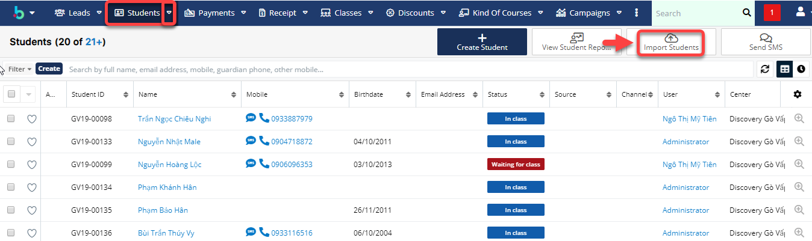
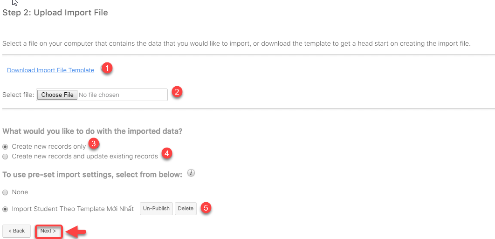

# Import danh sách học viên chính thức

> **Bước 1:** Ở màn hình danh sách của module **Students,** ta nhấn vào **** button **Import Student** để **** cho phép người dùng Import data từ local.

> **Bước 2:** Chọn **Next.**

​

<figure><figcaption></figcaption></figure>

> **Bước 3:** Tải mẫu File Import (nếu chưa có), sau đó đưa file lên hệ thống click vào Choose File. Sau đó chọn **Next**.


****:woman\_gesturing\_ok: **Chú thích** :

1. Download file Import mẫu (nếu chưa có)
2. Lựa chọn file để Import dữ liệu
3. Click chọn tạo leads mới từ dữ liệu được import
4. Click chọn tạo và cập nhật leads.
5. Chọn template import dữ liệu vào hệ thống (bắt buộc chọn theo template đã cho)

****:man\_raising\_hand: **Lưu ý** :

* File Template dùng để Import dữ liệu Leads vào hệ thống đã được đính kèm trên hệ hống.
* Các cột có tô màu là những cột bắt buộc phải nhập dữ liệu ( các cột còn lại có thể có hoặc không ) Dữ liệu phải chính xác thì hệ thống mới Import học viên vào đúng).


> **Bước 4:** Xác nhận các thuộc tính, Pre-set Import Setting. Click Next

> **Bước 5:** Xác nhận việc ánh xạ các thuộc tính. Sau đó chọn **Next**.

> **Bước 6:** Xác nhận việc kiểm tra trùng. Sau đó tiến hành nhập dữ liệu để bắt đầu Import dữ liệu vào hệ thống.

> **Bước 7:** Kết quả sau khi Import.


****:woman\_gesturing\_ok: **Ghi chú**:

1. Chọn vào để quay lại bước nhập trước đó.
2. Chọn vào để tiến hành Import thêm dữ liệu .
3. Chọn vào để hoàn tất việc Import hệ thống sẽ tự động chuyển về màn hình danh sách Student

