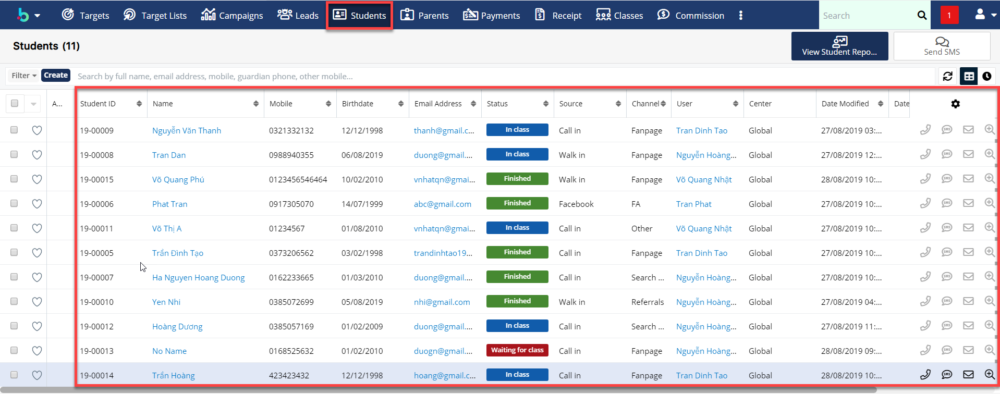
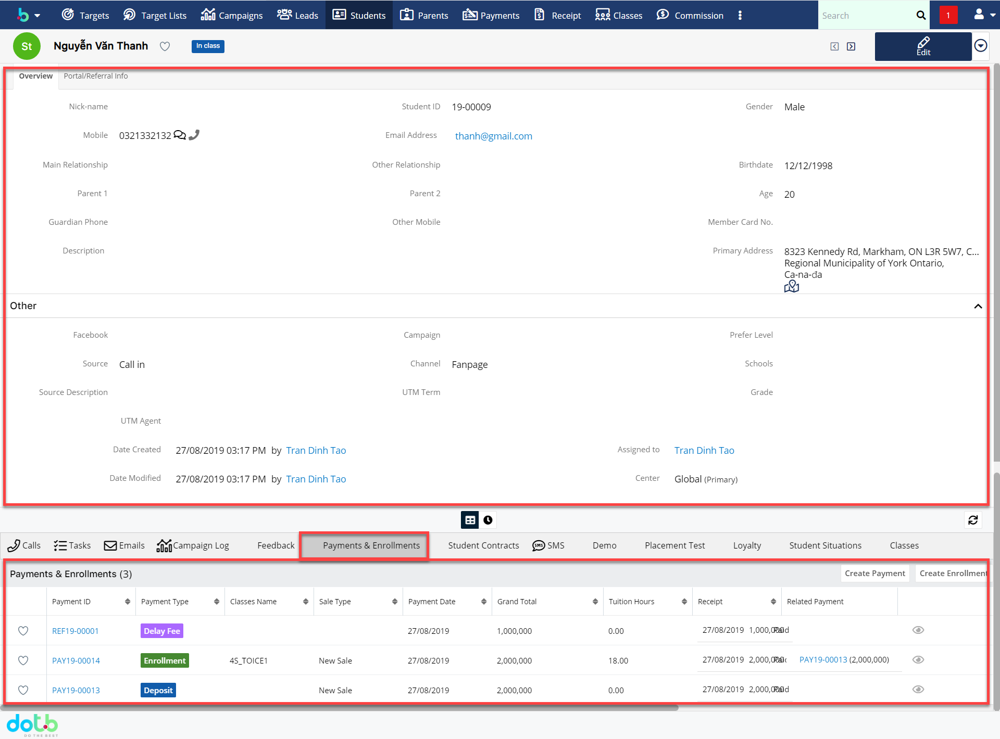

# Quản lí hồ sơ học viên, lịch sử thanh toán

> **Bước 1:** Nhấn chuột vào module **Students**, hệ thống sẽ hiển thị thông tin sơ lược hồ sơ học viên cho User.

> **Bước 2:** Bạn có thể chọn vào từng học viên để theo dõi thông tin học viên, lịch sử thanh toán, học nợ, học demo, lịch sử cuộc gọi,..

