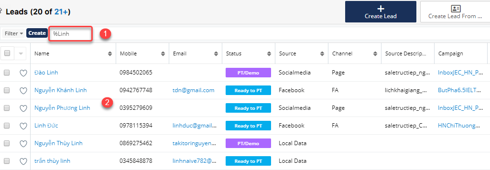

# Tìm kiếm và trích lọc học viên theo tiêu chí

### Tìm kiếm học viên&#x20;





&#x20;:woman\_gesturing\_ok: **Ghi chú:**

1:Gobal search : tìm kiếm toàn hệ thống&#x20;

2:Private search : tìm kiếm trong module.

Khi tìm kiếm trong Module , user phải lưu ý luôn có dấu _**%**_ phía trước kí tự search.


> Ví dụ chức năng tìm kiếm gobal search.



&#x20;:woman\_gesturing\_ok: **Ghi chú:**

1 :Tìm kiếm học viên,giáo viên,User ,… bất kì&#x20;

.2 : Thông tin kết quả bạn đã tìm kiếm ở global search


> Ví dụ tìm kiếm học viên trong Private search.


:woman\_gesturing\_ok: Ghi chú:

1: Tìm kiếm học viên trong module Student.Ví dụ muốn tim học viên có tên hoặc họ đệm là Phương thì bạn search %Phuong hoặc có thể nhập cả tên của học viên.&#x20;

2: Thông tin kết quả bạn đã tìm kiếm ở Module Student (Private search) .

