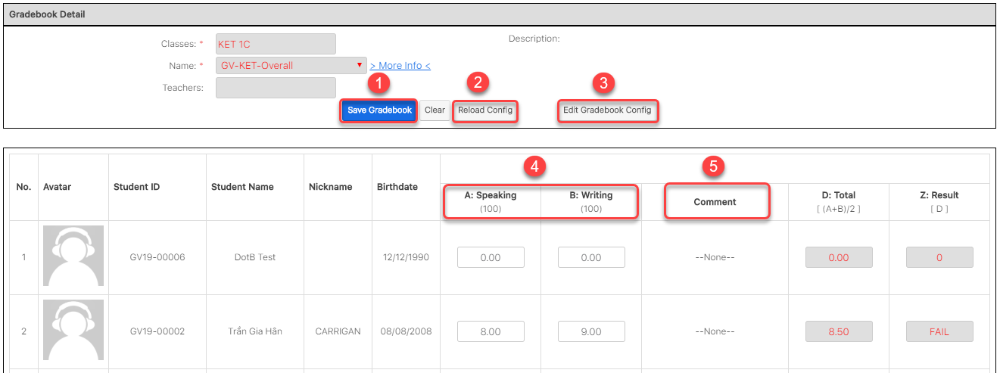

# Quản lí lớp học

## Danh sách học viên, thông tin đăng kí

> Bước 1: Đưa chuột vào menu Students, click chọn học viên mà bạn muốn xem thông tin.


> Bước 2: Hệ thống hiển thị thông tin thông tin của học viên như lịch sử thanh toán,lớp học,…


## Điểm danh/ SMS bài học sau mỗi buổi học

### Điểm Danh

> Bước 1: Click chuột vào module Classes sau đó click chọn lớp cần gửi điểm danh.


> Bước 2: Tại màn hình chi tiết của Lớp học, Click vào button Attendance & Homework.


> Bước 3: Tại màn hình Điểm danh, lựa chọn các tiêu chí sau đó tiến hành Điểm danh cho Học sinh



**Ghi chú:**

1: Lớp thực hiện việc Điểm danh

2: Ngày thực hiện Điểm danh

3: Danh sách Học viên

4: Điểm danh cho Học viên

5: Kiểm tra bài tập về nhà của Học viên\(nếu có\)

6: Đánh giá điểm chuyên cần cho Học viên

7: Gửi thông báo đến App về việc đi học trễ, làm bài tập về nhà, comment, điểm daily score của học viên

8: Gửi tin nhắn đến App về việc đi học trễ, làm bài tập về nhà, comment, điểm daily score của học viên

9: Gửi tin nhắn SMS về điện thoại  về việc đi học trễ, làm bài tập về nhà, comment, điểm daily score của học viên

10: Tải lại danh sách Học viên trong buổi học đó

11: Lựa chọn lại buổi học cần điểm danh

**Lưu ý**: Học viên có màu trong danh sách: Đây là Học viên không nằm trong buổi của ngày đó. Mục đích đưa nó lên để gửi SMS.


### SMS

> Bước 1: Click chuột vào module Classes sau đó click chọn lớp cần gửi SMS,nội dung bài học, điểm danh đến cho học viên.


> Bước 2: Tại màn hình chi tiết của Lớp học, Click vào button Attendance & Homework


> Bước 3: Tại màn hình Send SMS lựa chọn các tiêu chí sau đó nhấn Send.



**Ghi chú:**

1: Lớp thực hiện việc gửi SMS/Bài tập về nhà,điểm danh

2: Syllabus Custom:nội dung bài giảng của giáo viên \(không phải nội dung dạy theo giáo án\)

3: Nội dung của bài học theo Syllabus như: Lession, Topic, Homework và thông tin các buổi học gần nhất.

4: Ngày của buổi học

5: Daily score: điểm hàng ngày giáo viên chấm cho học viên

6: Loyalty point : Điểm tích lũy của học viên

7: **Send Attendance Report**: gửi thông báo về việc đi học,trể,làm bài tập về nhà,comment, điểm daily score của học viên đến app.

**Send App Messages** : Gửi tin nhắn đến App như lịch khai giảng, học bù,…

**Send SMS** : Gửi tin nhắn SMS đến học viên.


## Ghi nhận hoc viên làm bài tập

> Bước 1: Click chuột vào module Classes sau đó click chọn lớp cần gửi SMS,nội dung bài học, điểm danh đến cho học viên.


> Bước 2: Tại màn hình chi tiết của Lớp học, Click vào button Attendance & Homework.


> Bước 3: Tại màn hình Điểm danh, lựa chọn các tiêu chí sau đó tiến hành check homework cho Học sinh.



**Ghi chú**:

1: Lớp thực hiện việc check homework

2: Ngày thực hiện

3: Danh sách Học viên

4: Check homework cho học viên

5: Đánh giá điểm chuyên cần cho Học viên

6: Điểm tích lũy của học viên

7: Gửi thông báo đến App về việc đi học,trể,làm bài tập về nhà,comment, điểm daily score của học viên

**Lưu ý:** Học viên có màu hồng trong danh sách: Đây là Học viên ko nằm trong buổi của ngày đó Mục đích đưa nó lên để gửi SMS



## Ghi nhận nội dung buổi học

> Bước 1: Click chuột vào module Classes sau đó click chọn lớp cần ghi nhận nội dung buổi học.


> Bước 2: Tại màn hình Lớp, click vào Tab Record of work để ghi nhận nội dung buổi học.



**Ghi chú:**

1: Ghi chú nội dung bài học

2: Giáo viên note lại buổi học

3:TA note lại buổi học


> Bước 3: Hệ thống hiển thị nội dung buổi học sau khi lưu thành công.


## Quản lí học viên học nợ, học Trail Class

### Học viên học Trail Class

> Bước 1: Đưa chuột vào Menu Classes chọn View Classes, click chọn lớp cần thêm học viên vào lớp học Demo.


> Bước 2: Tại màn hình chi tiết Classes, Click tab Subpanel “**Student Situations**”. 
>
> Lựa chọn loại học viên Lead/Student.  Sau đó chọn **Add to Class Demo**


> Bước 3: Chọn học viên đưa vào lớp Trail, sau đó chọn ngày bắt dầu /kết thúc mà học viên học trail. Cuối cùng click **Add** để thêm học viên vào lớp.


```text
HOặc có thể vào Profile của Lead/Student để Add học viên vào Trail Class.
```


Với Leads : 




Với Studens :



### Học viên học nợ\(Outstanding\)

> Bước 1: Đưa chuột vào Menu Classes , click chọn lớp cần thêm học viên vào lớp học nợ.


> Bước 2: Tại màn hình chi tiết Classes, Click tab Subpanel “Student Situations”.


> Bước 3: Lựa chọn loại Học viên, click Select để tiến hành thêm Học viên vào lớp học Outstanding.



**Ghi chú:**

1: Lựa chọn loại học viên là Student.

 

 2: Click **Add  Outstanding** để chọn Học viên vào lớp


> Bước 4: Chọn ngày bắt đầu, ngày kết thúc để đưa học viên vào lớp, sau đó click **Save** để thêm học viên.


> Bước 5: Màn hình hiển thị thông báo add học viên vào lớp thành công.


## Quản lí bảng điểm

> Bước 1: Đưa chuột vào Menu Class chọn View Class,sau đó chọn lớp muốn xem bảng điểm/chấm điểm học viên.


> Bước 2: Tại màn hình Lớp học,click vào Tab “Gradebook” sau đó chọn bảng điểm mà bạn cần xem/chấm điểm hoặc thay đổi cấu trúc bảng điểm.


> Bước 3: Tại màn hình quản lý bảng điểm,click “Input Mark”.


> Bước 4: Tiếp theo nhập thông tin điểm số,comment học viên.Người dùng có thể thay đổi cấu trúc bảng điểm hoặc đưa về cấu trúc bảng điểm mặc định,… sau đó click “Save Gradebook” để hoàn tất bảng điểm.




**Ghi chú:**

1:Lưu bảng điểm

2:Đưa bảng điểm về phiên bản mới \(bảng điểm còn ở cấu trúc củ khi click vào \(2\) hệ thống sẽ đưa về cấu trúc bạn thay đổi mới\)

3:Sửa cấu trúc bảng điểm

4:Nhập điểm học viên \(Màu trắng bạn nhập, màu đậm hơn bạn không được nhập\) 

5:Click vào comment, giáo viên nhập comment cho học viên sau đó click Post để lưu lên hệ thống  



## Xuất báo cáo, điểm danh

### Xuất báo cáo, điểm danh

> **Bước 1:** Đưa chuột vào module Classes chọn lớp cần xuất báo cáo điểm danh.


> Bước 2: Tại màn hình Lớp, click chọn tab Attendance sau đó chọn Export Attendance List.


> Bước 3: Chọn thông tin buổi học cần xuất báo cáo điểm danh trên màn hình xuất báo cáo, sau đó Click Export.



**Ghi chú:**

1: Thông tin lớp xuất báo cáo điểm danh 

2: Chọn buổi cần xuất báo cáo điểm danh



### Xuất kết quả cuối kì, form kết quả theo mẫu

> Bước 1: Đưa chuột vào module Classes chọn lớp cần xuất báo cáo điểm danh.


> Bước 2: Tại màn hình chi tiết của Lớp học, Click vào button “Export Other File”.


> Bước 3: Chọn thông tin cần xuất file như Certificate ,. .trên màn hình, sau đó Click Export.



**Ghi chú:**

1: Chọn mẫu template cần xuất file

2: Thông tin học viên trong lớp,sau đó chọn học viên có yêu cầu xuất file \(có thể chọn hết lớp\)



## Ghi nhận Feedback/Complaint về lớp học

> Bước 1: Click chuột vào module Feedback chọn Create Feedback.


> Bước 2: Tại màn hình tạo Feedback,nhập đầy đủ thông tin mà học viên/giáo viên,.. feedback,Sau đó nhấn nút Save.



**Ghi chú:**

1: Tiêu đề Feedback

2: Feedback của học viên nào \(Ai là người Feedback\)

3: Liên quan đến lớp nào \(Lớp học viên đang học\)

4: Nội dung Học viên/Phụ huynh Feedback

5: Nguồn Feedback

**Status Feedback** :

New : Mới nhận/tạo Feedback từ phụ huynh/học viên

Assign : Đã tiếp nhận

Pending Input: Đang xử lí

Closed : Đã giải quyết.


```text
Hoặc có thể tạo Feedback của phụ huynh trong profile của học viên băng cách
Vào Module Students, chọn Student cần tạo Feedback.
Sau đó chọn Case.
```


> Bước 3: Hệ thống hiển thị nội dung feedback sau khi lưu thành công.


