# 🏰 Quản lí lớp học

## Danh sách học viên, thông tin đăng kí

> Bước 1: Đưa chuột vào menu Students, click chọn học viên mà bạn muốn xem thông tin.

.png>)

> Bước 2: Hệ thống hiển thị thông tin thông tin của học viên như lịch sử thanh toán,lớp học,…

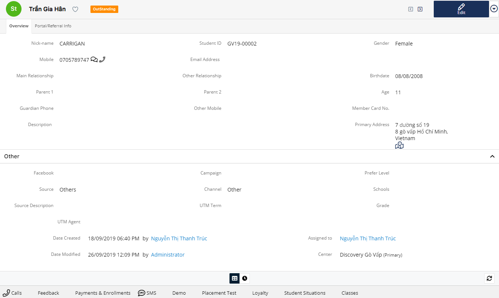


> Bước 2: Tại màn hình chi tiết của Lớp học, click vào button **Attendance & Homework.**

## Tính năng dành cho App Parents

### Gửi thông báo nghỉ học, học bù - Send App Message

> Bước 1: Click chuột vào module Classes sau đó click chọn lớp cần gửi thông báo đến App như lịch học bù lịch khai giảng,..đến cho học viên.


> Bước 2: Tại màn hình chi tiết của Lớp học, Click vào button **Attendance & Homework**


> Bước 3: Tại màn hình điểm danh, click chọn **Send App Mesage** nhập tin nhắn muốn gửi thông báo đến học viên qua app. Sau dó click **Send**

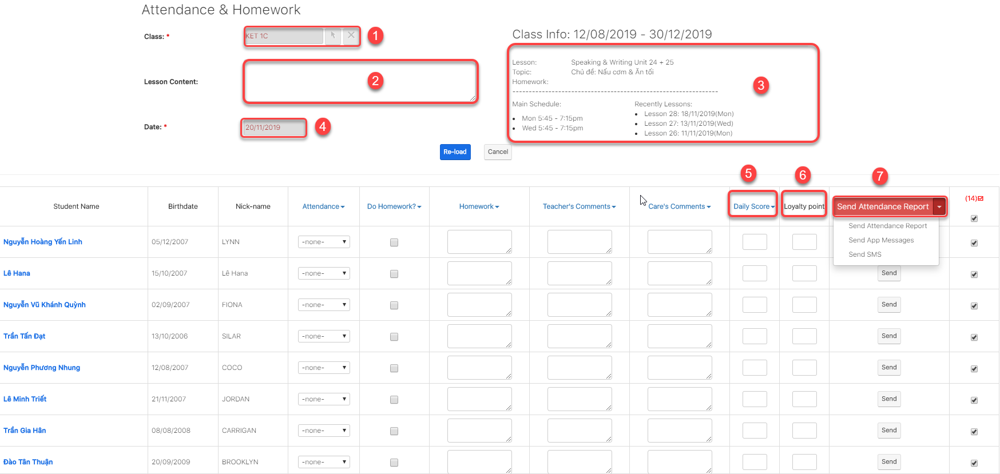


****:woman\_gesturing\_ok: **Ghi chú:**

1: Lớp thực hiện việc gửi SMS/Bài tập về nhà,điểm danh

2: Syllabus Custom: nội dung bài giảng của giáo viên (không phải nội dung dạy theo giáo án)

3: Nội dung của bài học theo Syllabus như: Lession, Topic, Homework và thông tin các buổi học gần nhất.

4: Ngày của buổi học

5: Daily score: điểm hàng ngày giáo viên chấm cho học viên

6: Loyalty point : Điểm tích lũy của học viên

7: **Send Attendance Report**: gửi thông báo về việc đi học,trể,làm bài tập về nhà,comment, điểm daily score của học viên đến app.

**Send App Messages** : Gửi tin nhắn đến App như lịch khai giảng, học bù, đăng kí học lớp mới...

**Send SMS** : Gửi tin nhắn SMS đến học viên.


> Sau khi gửi thành công , mobile app sẽ nhận được thông báo như hình mẫu bên dưới.


### Gửi thông báo điểm danh, Ghi nhận hoc viên làm bài tập

> Bước 1: Click chuột vào module Classes sau đó click chọn lớp cần gửi SMS,nội dung bài học, điểm danh đến cho học viên.


> Bước 2: Tại màn hình chi tiết của Lớp học, Click vào button **Attendance & Homework.**


> Bước 3: Tại màn hình Điểm danh, nhập thông tin bài học, điểm danh học viên, nhận xét sau mỗi buổi học, và cuối cùng click chọn **Send Attendance Report** để gửi thông báo đến phụ huynh về buổi học của bé.

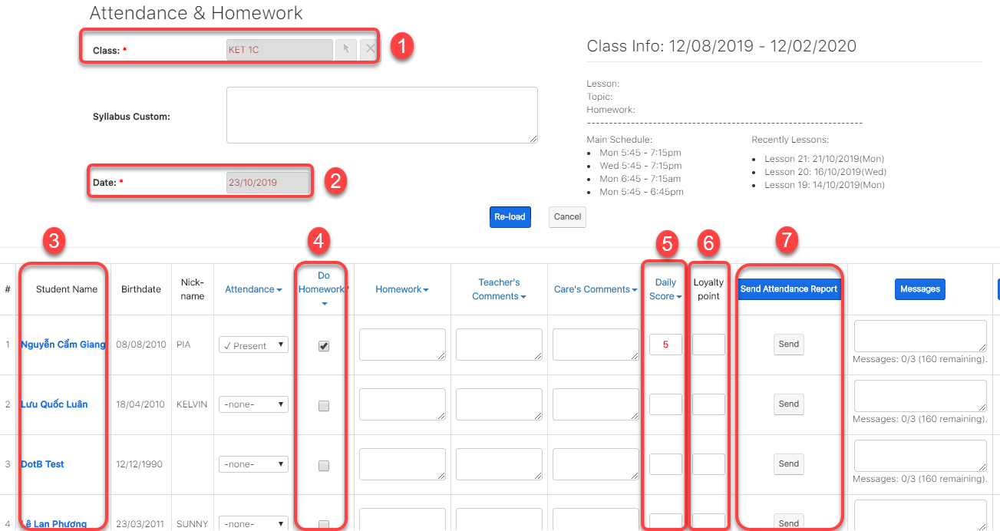


****:woman\_gesturing\_ok: **Ghi chú**:

1: Lớp thực hiện việc check homework

2: Ngày thực hiện

3: Danh sách Học viên

4: Check homework cho học viên

5: Đánh giá điểm chuyên cần cho Học viên

6: Điểm tích lũy của học viên

7: Gửi thông báo đến App về việc đi học,trể,làm bài tập về nhà,comment, điểm daily score của học viên

****:man\_raising\_hand: **Lưu ý:** Học viên có màu hồng trong danh sách: Đây là Học viên ko nằm trong buổi của ngày đó Mục đích đưa nó lên để gửi SMS


## &#x20;Quản lí bảng điểm và xuất kết quả ra Excel

### Nhập Điểm

> Bước 1: Đưa chuột vào Menu Class chọn View Class,sau đó chọn lớp muốn xem bảng điểm/chấm điểm học viên.


> Bước 2: Tại màn hình Lớp học,click vào Tab “Gradebook” sau đó chọn bảng điểm mà bạn cần xem/chấm điểm hoặc thay đổi cấu trúc bảng điểm.

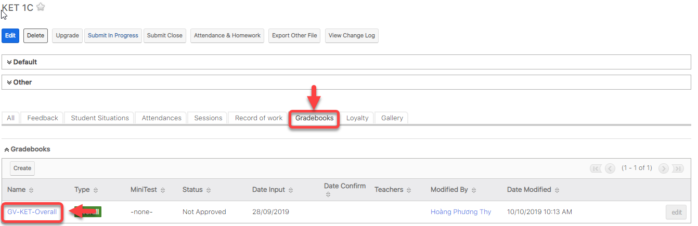

> Bước 3: Tại màn hình quản lý bảng điểm,click “Input Mark”.

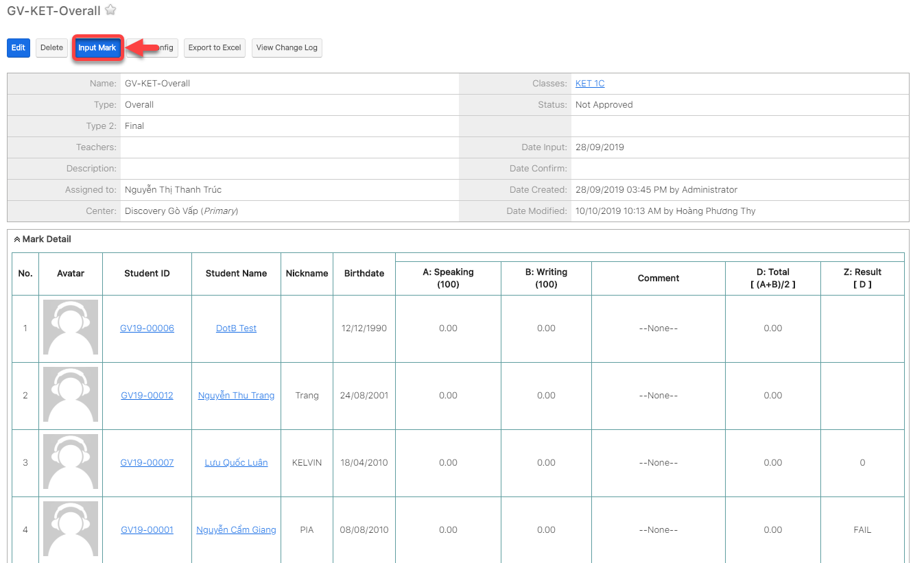

> Bước 4: Tiếp theo nhập thông tin điểm số,comment học viên.Người dùng có thể thay đổi cấu trúc bảng điểm hoặc đưa về cấu trúc bảng điểm mặc định,… sau đó click “Save Gradebook” để hoàn tất bảng điểm.

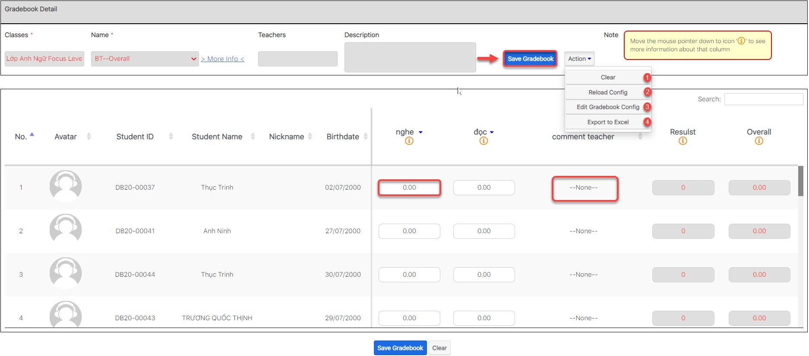


****:woman\_gesturing\_ok: **Ghi chú:**

1: Clear (chọn lại bảng điểm mới để nhập vào)

2:Đưa bảng điểm về phiên bản mới (bảng điểm còn ở cấu trúc củ khi click vào (2) hệ thống sẽ đưa về cấu trúc bạn thay đổi mới)

3: Sửa cấu trúc bảng điểm

4: Sau khi Lưu bảng điểm, bạn có thể Export bảng điểm ra Excel

Nhập điểm học viên (Màu trắng bạn nhập, màu đậm hơn bạn không được nhập)&#x20;

Click vào comment, giáo viên nhập comment cho học viên sau đó click Post để lưu lên hệ thống &#x20;

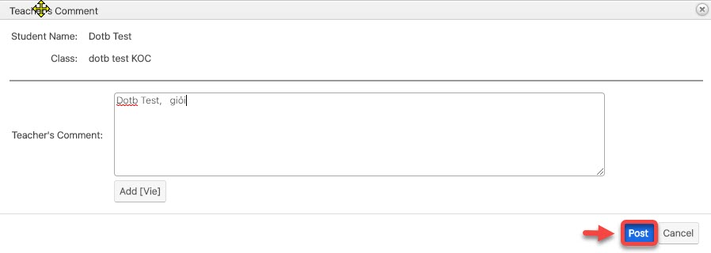&#x20;


> Bước 5: Sau khi input bảng điểm , click **Export to Exce**l để xuất kết quả cuối kì/giữa kì.

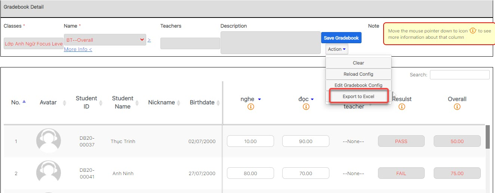

## Xuất báo cáo, điểm danh

### Xuất báo cáo, điểm danh

> **Bước 1:** Đưa chuột vào module Classes chọn lớp cần xuất báo cáo điểm danh.


> Bước 2: Tại màn hình Lớp, click chọn tab Attendance sau đó chọn Export Attendance List.

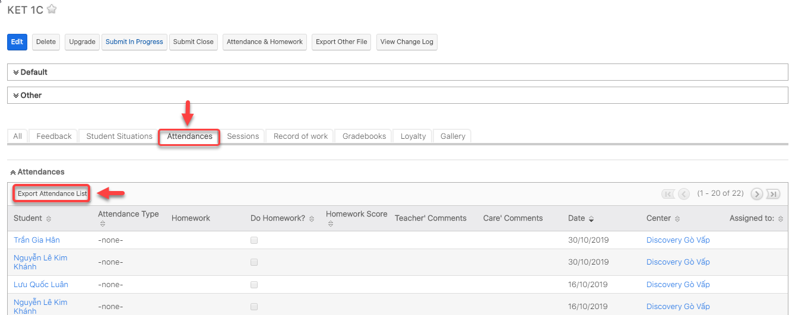

> Bước 3: Chọn thông tin buổi học cần xuất báo cáo điểm danh trên màn hình xuất báo cáo, sau đó Click Export.

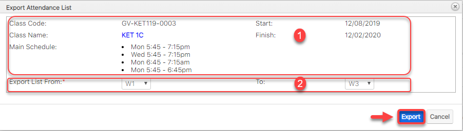


****:woman\_gesturing\_ok: **Ghi chú:**

1: Thông tin lớp xuất báo cáo điểm danh&#x20;

2: Chọn buổi cần xuất báo cáo điểm danh



### Xuất kết quả cuối kì theo form Certificate

> Bước 1: Đưa chuột vào module Classes chọn lớp cần xuất báo cáo điểm danh.


> Bước 2: Tại màn hình chi tiết của Lớp học, Click vào button “Export Other File”.

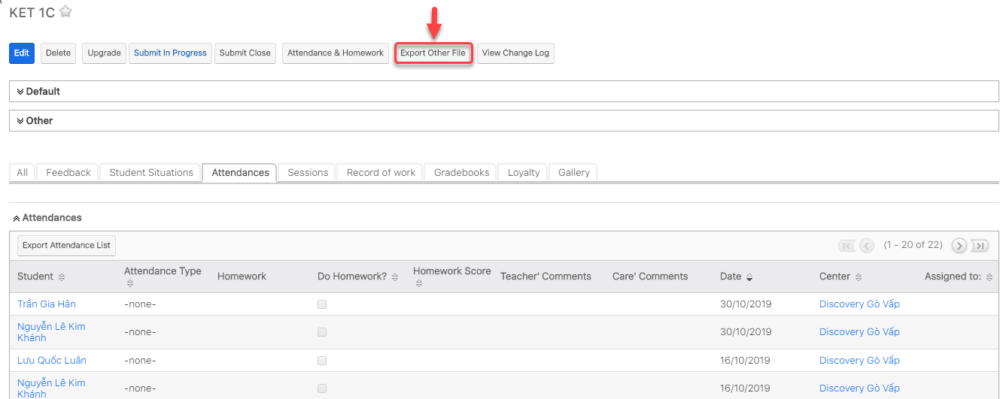

> Bước 3: Chọn thông tin cần xuất file như Certificate ,. .trên màn hình, sau đó Click Export.

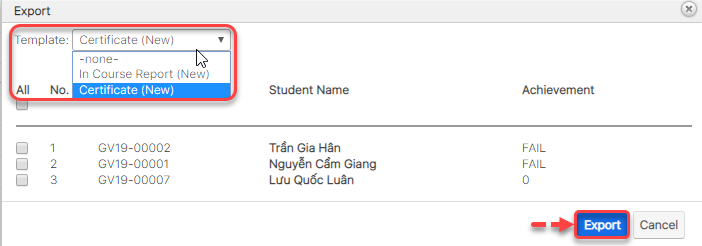


****:woman\_gesturing\_ok: **Ghi chú:**

1: Chọn mẫu template cần xuất file

2: Thông tin học viên trong lớp,sau đó chọn học viên có yêu cầu xuất file (có thể chọn hết lớp)


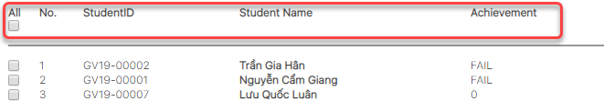

## Ghi nhận Feedback/Complaint về lớp học

> Bước 1: Click chuột vào module Feedback chọn Create Feedback.

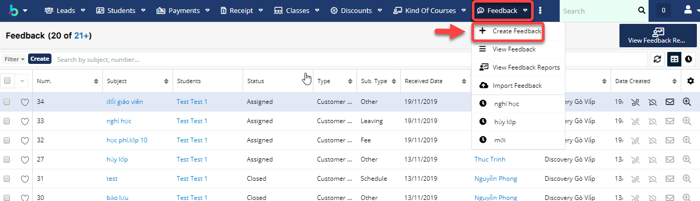

> Bước 2: Tại màn hình tạo Feedback,nhập đầy đủ thông tin mà học viên/giáo viên,.. feedback,Sau đó nhấn nút Save.



****:woman\_gesturing\_ok: **Ghi chú:**

1: Tiêu đề Feedback

2: Feedback của học viên nào (Ai là người Feedback)

3: Liên quan đến lớp nào (Lớp học viên đang học)

4: Nội dung Học viên/Phụ huynh Feedback

5: Nguồn Feedback

****:point\_right: **Status Feedback** :

**New** : Mới nhận/tạo Feedback từ phụ huynh/học viên

**Assign** : Đã tiếp nhận

**Pending Input**: Đang xử lí

**Closed** : Đã giải quyết.


```
Hoặc có thể tạo Feedback của phụ huynh trong profile của học viên băng cách
Vào Module Students, chọn Student cần tạo Feedback.
Sau đó chọn Case.
```

.png>)

> Bước 3: Hệ thống hiển thị nội dung feedback sau khi lưu thành công.

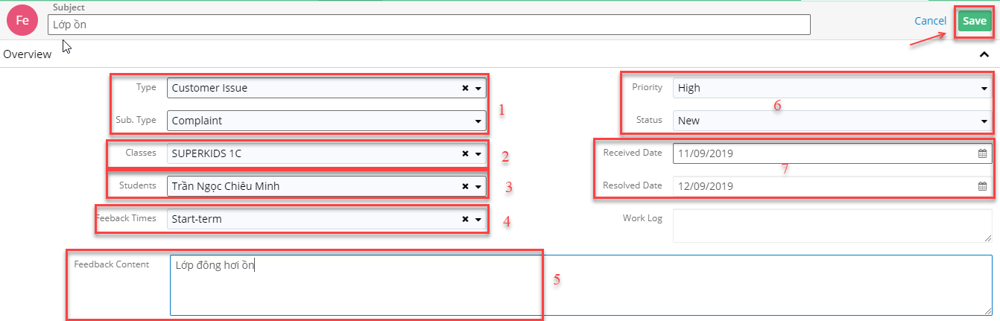

