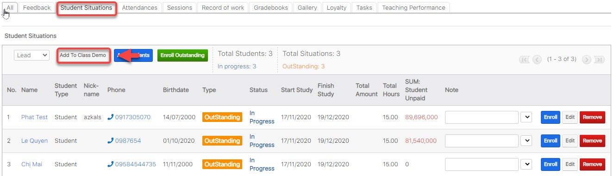
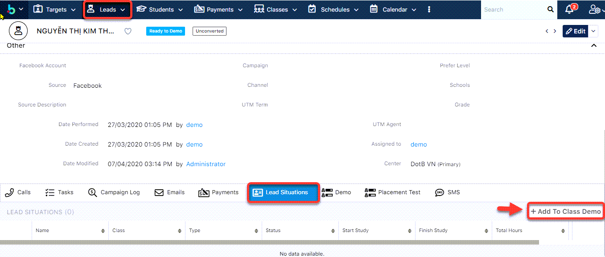
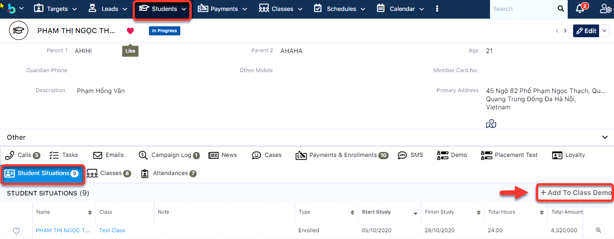

# Add học viên Trail Class

> **Bước 1:** Ở màn hình danh sách của module Classes chọn View Classes, click chọn lớp cần thêm học viên vào lớp học Demo.


> **Bước 2:** Tại màn hình chi tiết Classes, chọn tab Subpanel “**Student Situations**”.&#x20;
>
> Lựa chọn loại học viên Lead/Student. Sau đó chọn **Add to Class Demo**



> **Bước 3:** Chọn học viên đưa vào lớp Trail, sau đó chọn ngày bắt đầu /kết thúc mà học viên học trail. Cuối cùng click **Add** để thêm học viên vào lớp.


```
HOặc có thể vào Profile của Lead/Student để Add học viên vào Trail Class.
```


Với Leads :&#x20;





Với Studens :



