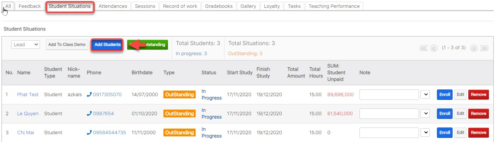
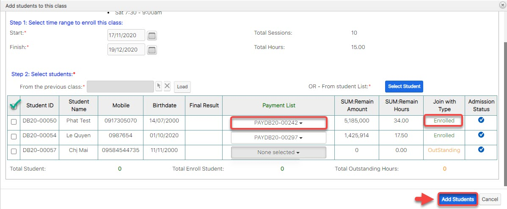
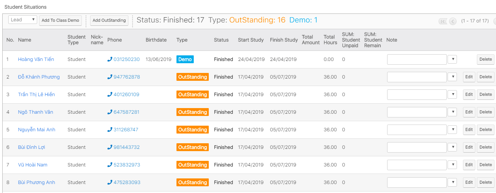

# Add học viên vào Lớp

> ước 1: Đưa chuột vào Menu Classes , click chọn lớp cần thêm học viên vào lớp học nợ.

> Bước 2: Tại màn hình chi tiết Classes, Click tab Subpanel “Student Situations”. Sau đó click chọn "**Add Students**"

> Bước 3: click **Select Student** (4) hoặc chọn học viên từ lớp khác (3) để chọn học viên add vào lớp (có thể chọn 1 hoặc nhiều học viên),chọn ngày bắt đầu, ngày kết thúc để đưa học viên vào lớp, tiếp theo chọn payment mà học viên đã mua để enroll vòa lớp (mặc định hẹ thống sẽ tự lấy payment nếu cùng KOC).

.jpg>)


****:woman\_gesturing\_ok: **Ghi Chú** :

1: Thông tin lớp học mới (lớp đc upgrade, hoặc lớp New)

2:  Lựa chọn khoảng thời gian move học viên qua lớp mới.

3: Chọn lớp học mà bạn muốn đưa danh sách học viên vào lớp.

4: Add thêm học viên hàng loạt, bạn có thể chọn 1 hay nhiều học viên cùng 1 lúc.

5: Chọn Payment để Enroll học viên (Mặc định hệ thống sẽ tự chọn Payment nếu như KOC của lớp học và KOC của payment cùng chung 1 Chương trình học )


.jpg>)


:point\_right: Nếu như Payment có KOC khác với KOC của lớp học , hệ thống sẽ hiện thị thông báo như bên dưới. Nếu chúng ta vẫn sử dụng gói học này để tiếp tục enroll cho học viên, click "**Đồng Ý**".


.jpg>)


6 : :stop\_button: Có thể chọn hàng loạt hoặc chọn từng học viên.

7:  **Join with type** :Thông tin học phí của học viên khi đăng kí lên lớp mới .

:point\_right: **Enrolled**: Học viên đủ điều kiện add vào lớp (đã đóng đủ hoặc dư học phí).

:point\_right: **Outstanding** : Học viên chưa đủ học phí cho khóa học hoặc add vào lớp cho học nợ.

8: **Addmission Status :**&#x20;

&#x20;:heavy\_multiplication\_x: : Học viên đã có trong lớp, không thể add vào

:heavy\_check\_mark: : Học viên chưa có trong lớp, có thể add vào

6 : :stop\_button: Có thể chọn hàng loạt hoặc chọn từng học viên.


> Bước 5: Sau khi chọn xong học viên củng như Payment enroll học viên vào lớp, click "Add Student" để hoàn tất đưa học viên vào lớp.

> Bước 6: Màn hình hiển thị thông tin học viên sau khi add vào lớp thành công.

