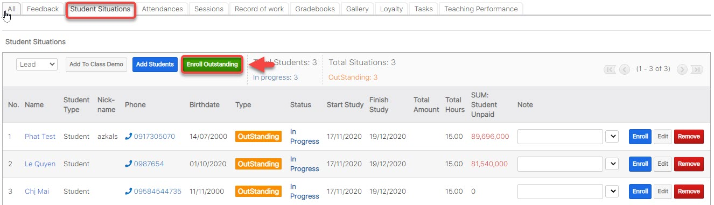

# Enroll OutStanding


_Tính năng này được sử dụng khi  remain hour của học viên đáp ứng đủ hoặc dư so với thời gian của lớp học và cho phép update lại trạng thái của học viên trong lớp (Outstanding -> Enrolled) và remain hour của học viên._&#x20;


> Bước 1: Đưa chuột vào Menu Class chọn View Class, sau đó chọn lớp muốn Enroll OutStanding.

.png>)

> Bước 2: Tại màn hình chi tiết Classes, Click tab Subpanel “Student Situations”. Sau đó, click Enroll OutStanding.

> Bước 3:Chọn Payment để Enroll học viên (Mặc định hệ thống sẽ tự chọn Payment nếu như KOC của lớp học và KOC của payment cùng chung 1 Chương trình học ) , ngược lại nếu khác KOC người dùng vẫn muốn sử dụng để enroll học viên thì click chọn payment tương ứng.


Nếu như Payment có KOC khác với KOC của lớp học , hệ thống sẽ hiện thị thông báo như bên dưới. Nếu chúng ta vẫn sử dụng gói học này để tiếp tục enroll cho học viên, click "**Đồng Ý**" để enroll học viên.



****:woman\_gesturing\_ok: **Ghi chú**:

1::stop\_button: Có thể chọn hàng loạt hoặc chọn từng học viên.

2**: Join with type** :Thông tin học phí của học viên khi đăng kí lên lớp mới .

:point\_right: **Enrolled**: Học viên đủ điều kiện add vào lớp (đã đóng đủ hoặc dư học phí).

:point\_right: **Outstanding** : Học viên chưa đủ học phí cho khóa học hoặc add vào lớp cho học nợ.

3: **Addmission Status :**&#x20;

&#x20;:heavy\_multiplication\_x: : Học viên đã có trong lớp, không thể add vào

:heavy\_check\_mark: : Học viên chưa có trong lớp, có thể add vào.

