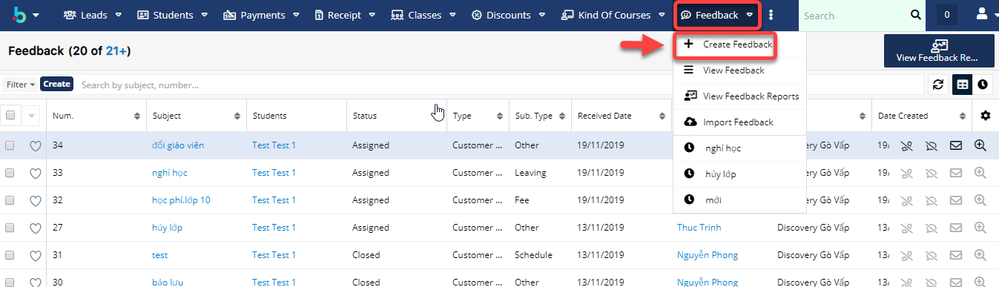

# Ghi nhận Feedback/Complaint về lớp học

> **Bước 1:** Ở màn hình danh sách của module **Feedback,** chọn **Create Feedback** để mở ra màn hình thêm mới **Feedback**.



> **Bước 2:** Tại màn hình tạo Feedback, nhập đầy đủ thông tin mà học viên/giáo viên,.. feedback. Sau đó nhấn nút Save.



****:woman\_gesturing\_ok: **Ghi chú:**

1. Tiêu đề Feedback
2. Feedback của học viên nào (Ai là người Feedback)
3. Liên quan đến lớp nào (Lớp học viên đang học)
4. Nội dung Học viên/Phụ huynh Feedback
5. Nguồn Feedback

****:point\_right: **Status Feedback**:

**New**: Mới nhận/tạo Feedback từ phụ huynh/học viên

**Assign**: Đã tiếp nhận

**Pending Input**: Đang xử lí

**Closed**: Đã giải quyết.


```
Hoặc có thể tạo Feedback của phụ huynh trong profile của học viên băng cách
Vào Module Students, chọn Student cần tạo Feedback.
Sau đó chọn Case.
```

.png>)

> **Bước 3:** Hệ thống hiển thị nội dung feedback sau khi lưu thành công.


> _Video hướng dẫn Ghi nhận feedback/ complaint về lớp học_


