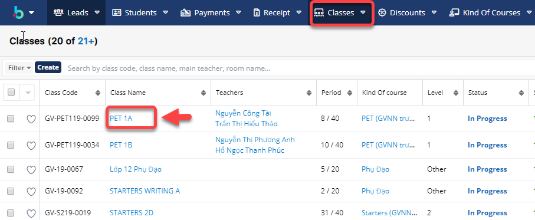
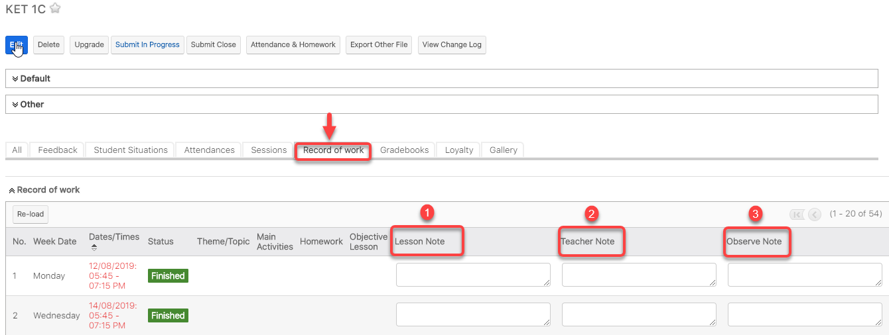
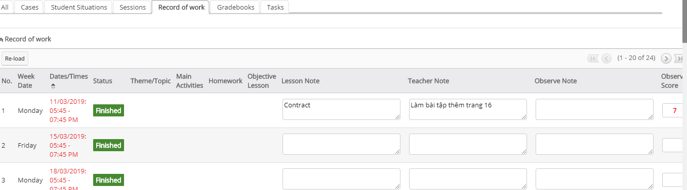

# Ghi nhận nội dung buổi học

> **Bước 1:** Ở màn hình danh sách của module **Classes,** sau đó nhấn chọn lớp cần ghi nhận nội dung buổi học.

> **Bước 2:** Tại màn hình Lớp, nhấn vào Tab "Record of work" để ghi nhận nội dung buổi học.


****:woman\_gesturing\_ok: **Ghi chú:**

1. Ghi chú nội dung bài học
2. Giáo viên note lại buổi học
3. TA note lại buổi học


> **Bước 3:** Hệ thống hiển thị nội dung buổi học sau khi lưu thành công.

