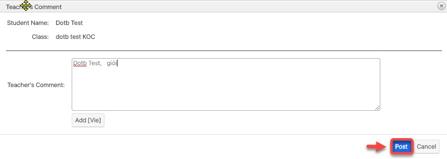

# Nhập điểm

> **Bước 1:** Ở màn hình danh sách của module Class chọn View Class, sau đó chọn lớp muốn xem bảng điểm/chấm điểm học viên.

> **Bước 2:** Tại màn hình Lớp học,click vào Tab “Gradebook” sau đó chọn bảng điểm mà bạn cần xem/chấm điểm hoặc thay đổi cấu trúc bảng điểm.

> **Bước 3:** Tại màn hình quản lý bảng điểm, **** chọn “Input Mark”.

> **Bước 4:** Tiếp theo nhập thông tin điểm số, comment học viên. Người dùng có thể thay đổi cấu trúc bảng điểm hoặc đưa về cấu trúc bảng điểm mặc định,… sau đó chọn “Save Gradebook” để hoàn tất bảng điểm.


****:woman\_gesturing\_ok: **Ghi chú:**

1. Clear (chọn lại bảng điểm mới để nhập vào).
2. Đưa bảng điểm về phiên bản mới (bảng điểm còn ở cấu trúc củ khi click vào (2) hệ thống sẽ đưa về cấu trúc bạn thay đổi mới).
3. Sửa cấu trúc bảng điểm.
4. Sau khi Lưu bảng điểm, bạn có thể Export bảng điểm ra Excel

Nhập điểm học viên (Màu trắng bạn nhập, màu đậm hơn bạn không được nhập)&#x20;

Click vào comment, giáo viên nhập comment cho học viên sau đó click Post để lưu lên hệ thống &#x20;

&#x20;


> **Bước 5:** Sau khi input bảng điểm, chọn **Export to Exce**l để xuất kết quả cuối kì/giữa kì.

