# Quản lí sự vụ

## Quản lí phí Delay

### Xem danh sách học viên delay hoc phí

> Bước 1: 
Click chuột vào module Payments, tại Menu Action Filter click chọn **Create**.

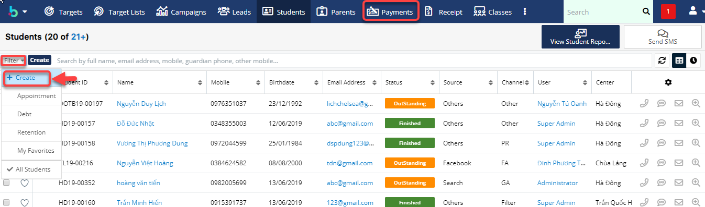

> Bước 2: Tiếp theo click Payment Type.

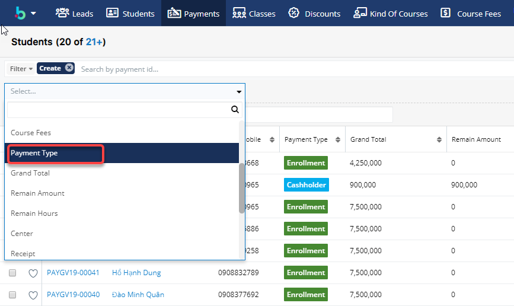

> Bước 3: Chọn Type Payment là Delay Fee.

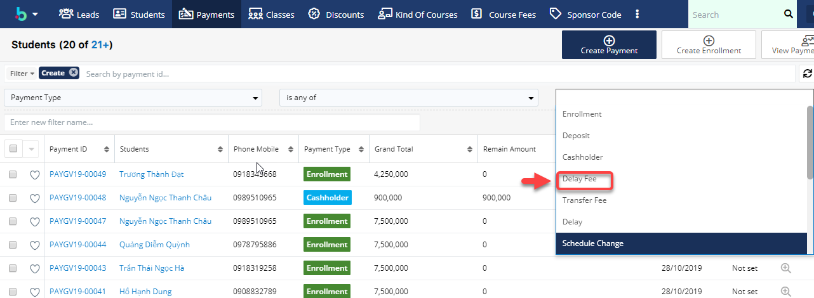

> Bước 4: Hệ thống sẽ load danh sách những học viên nào đang Delay học phí.

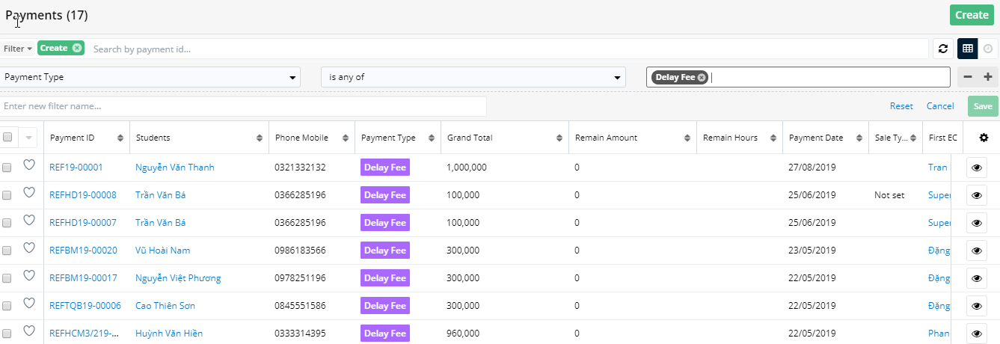

### Tạo phí Delay

> Bước 1: Đưa chuột vào Menu Payment chọn Create Payment.

> Bước 2: Tại màn hình tạo mới thanh toán, nhập đầy đủ các thông tin mà học viên đặt **Delay Fee**. Click **Save** để hoàn tất.

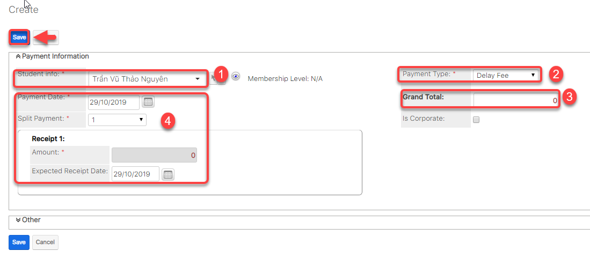


**Ghi chú:**

1: Lựa chọn Student. Các phương pháp lựa chọn Student:

Cách 1: Nhập tên vào ô Textbox sau đó Enter

 


Cách 2: Click vào biểu tượng  , 1 Popup xuất hiện, Tìm kiếm và lựa chọn Học sinh tương ứng.

2: Lựa chọn loại Payment là: **Delay Fee**

3: Nhập số tiền delay fee

4: Ngày thanh toán, Số lần thanh toán và Thông tin thanh toán


### Học viên Delay khỏi lớp

> Bước 1: Đưa chuột vào module Classes , click chọn lớp mà học viên muốn delay.

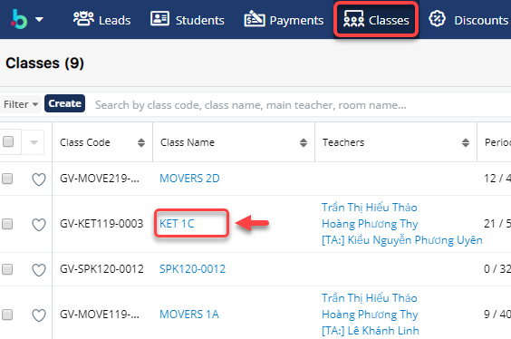

> Bước 2: Tại màn hình chi tiết Classes, Click tab Subpanel “Student Situations”.

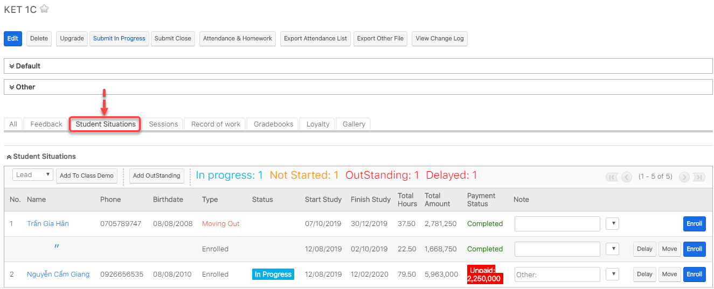

> Bước 3: Click Delay.

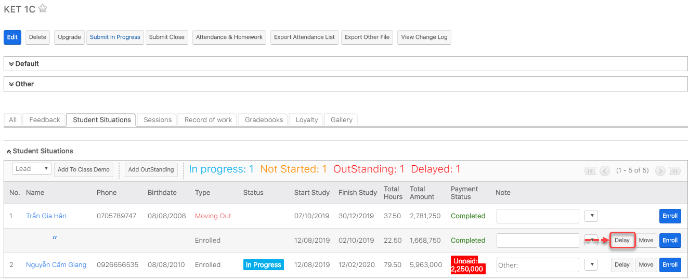

> Bước 4: Tại màn hình Delay fee, nhập đầy đủ thông tin. Sau đó click Save để hoàn tất.


**Ghi chú**:

1: Thông tin học viên delay lớp.

2: Khoảng thời gian delay

3: Số dư của học viên.

4: Lý do delay.


> Bước 5: Kết quả.

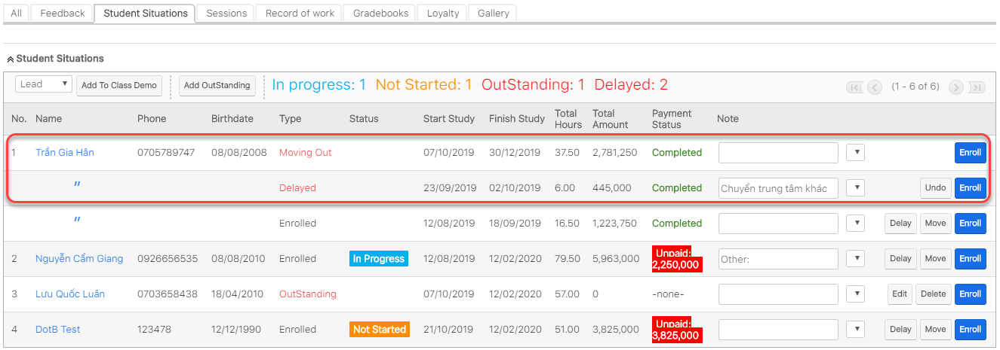

### Re-enroll học viên vào lớp mới dùng tiền Delay

> Bước 1: Tại màn hình chi tiết Classes, tại tab Subpanel “Student Situations”,học viên đang có type là “Delayed” click enroll để Re-enroll học viên vào lớp.

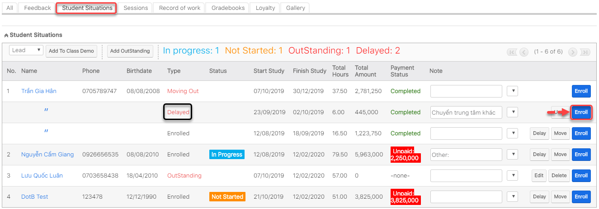

> Bước 2: Tại màn hình tạo mới, chọn Payment đã có trước đó.

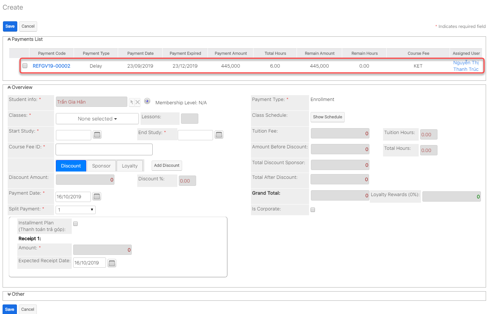

> Bước 3: Tại màn hình chi tiết Payment, nhập đầy đủ các thông tin cần thiết. Click Save để hoàn tất.

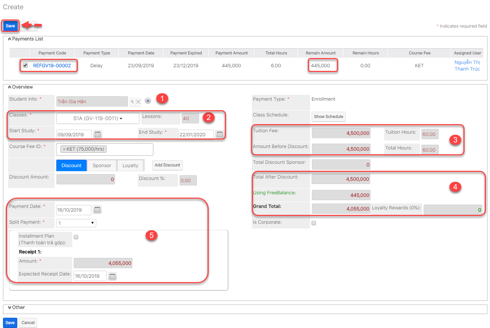


**Ghi chú:**

**1**: Lựa chọn Student. Các phương pháp lựa chọn Student:

Cách 1: Nhập tên vào ô Textbox sau đó Enter

 


Cách 2: Click vào biểu tượng  , 1 Popup xuất hiện, Tìm kiếm và lựa chọn Học sinh tương ứng.

**2**: Lựa chọn Classes. Có thể nhập tên Class hoặc lựa chọn Class trong danh sách và thời gian bắt đầu và kết thúc của Lớp học.

 

3: Học phí cho khóa học trước khi chưa có Discount hoặc tiền đặt cọc/Delay fee trước đó.

4: Học phí cho khóa học sau khi chưa có Discount hoặc tiền đặt cọc/Delay fee trước đó.

5: Thông tin về số lần thanh toán: Ngày thanh toán, tổng số tiền cần thanh toán cho lần enrollment này.


> Bước 4: Kết quả.

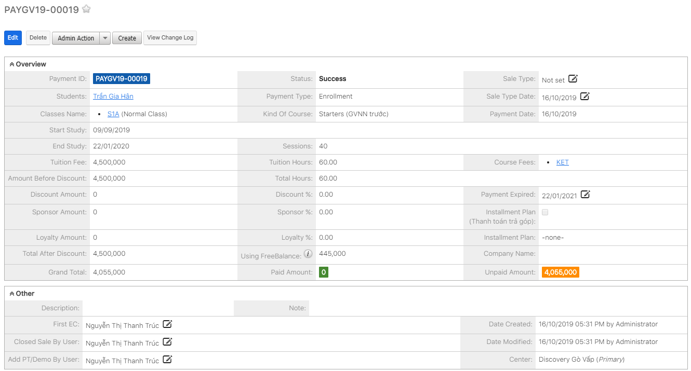

## Quản lí phiếu thu

> Bước 1: Đưa chuột vào module Payment, click chọn Payment muốn thức hiện việc xuất phiếu thu.

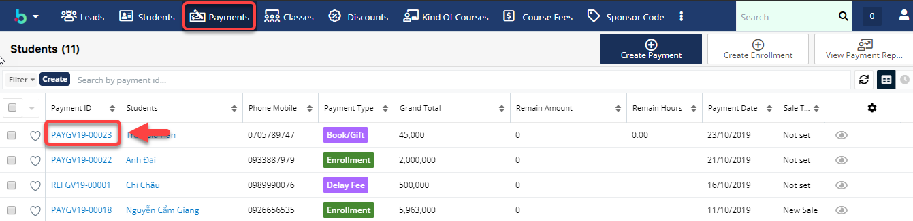

> Bước 2: Tại màn hình chi tiết của Payment, Click Tab Subpanel “Receipt”, sau đó click Export ” để tiến hành xuất phiếu thu cho học viên.

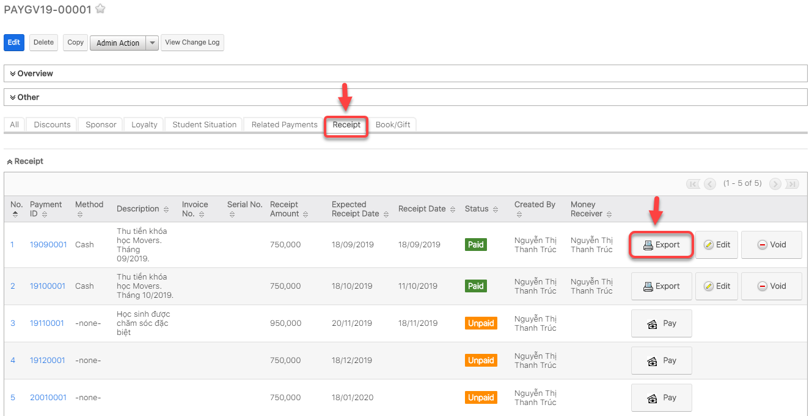

> Bước 3: Kết quả sau khi thực hiện việc xuất phiếu thu cho học viên.

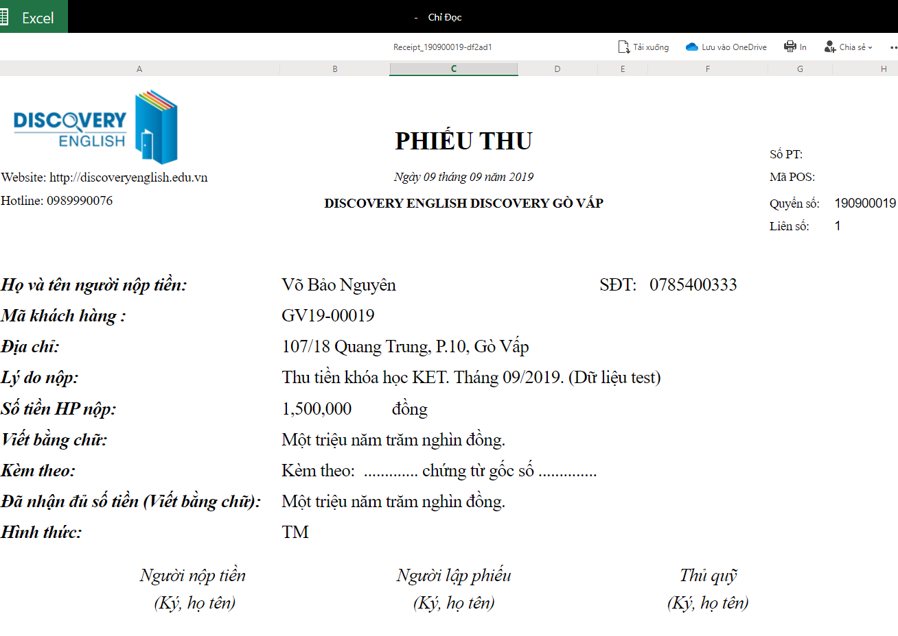

## Quản lí chiết khấu\(Discount\)

> Bước 1: Click chuột vào module Discount chọn Create Discount.

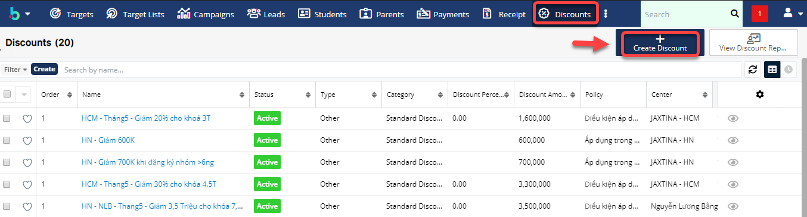

> Bước 2: Tại màn hình tạo mới chiết khấu, nhập đầy đủ các thông tin cần thiết, Sau đó click Save để hoàn tất.

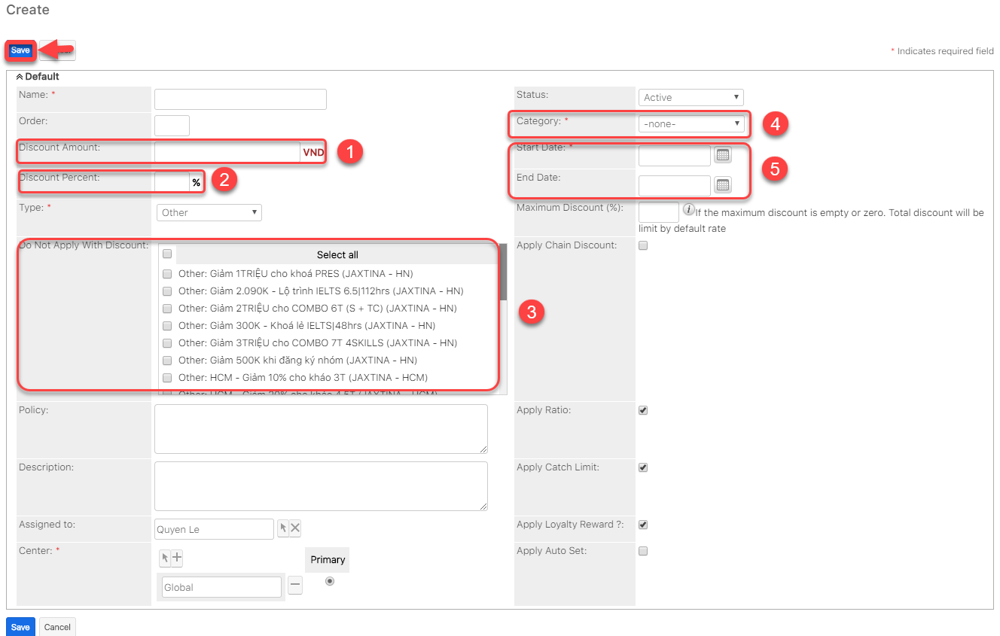


Ghi chú:

1:Số tiền discount.

2:Phần trăm discount

3: Discount không áp dụng với một số trung tâm hoặc giới thiệu học viên,….

4: Loại giảm giá

5: Ngày bắt đầu,ngày kết thúc discount.

**Lưu ý**: Có thể chỉ nhập số tiền hoặc phần trăm Discount


> Bước 3: Hệ thống hiển thị thông tin chi tiết của chiết khấu sau khi tạo thành công.

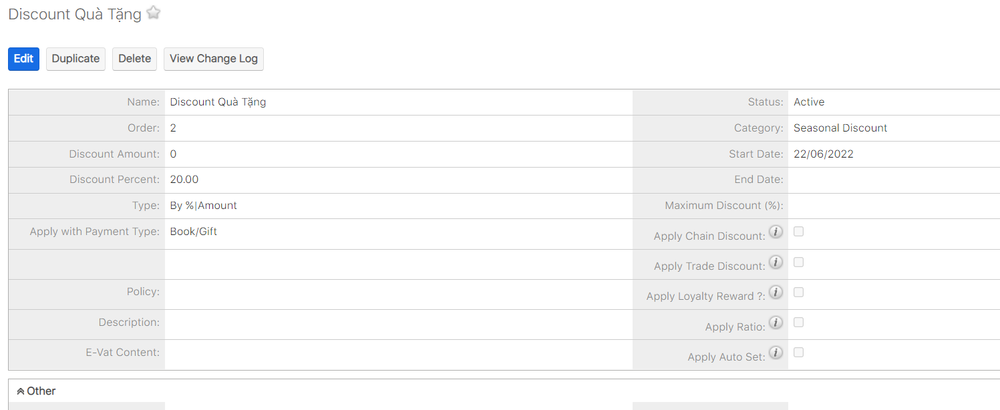

## Quản lí Voucher

> Bước 1: Đưa chuột vào module Sponsors Code chọn **Create Voucher**.

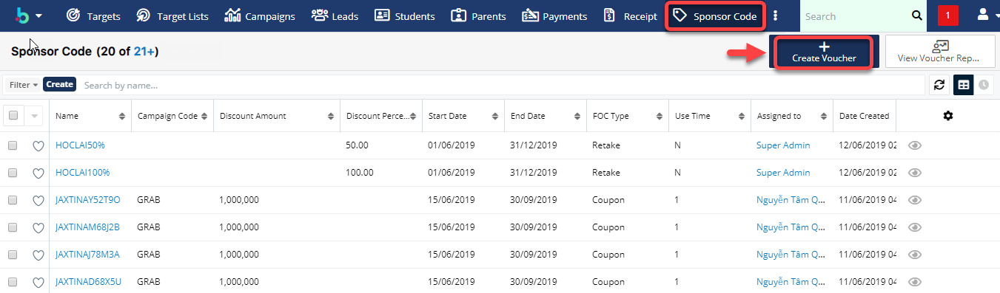

> Bước 2: Tại màn hình tạo mới Voucher, nhập đầy đủ các thông tin cần thiết, Sau đó Click Save để hoàn tất.

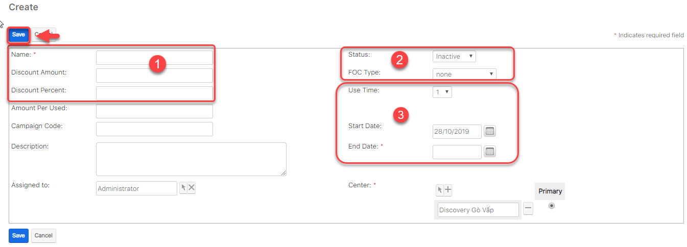



**Ghi chú:**

1: Tên Voucher \(có thể nhập chữ hoặc số\),Số tiền, phần trăm giảm giá

2: Trạng thái của Voucher và loại áp dụng 

3: Số lần sử dụng Voucher và ngày bắt đầu,kết thúc lượt sử dụng Voucher


> Bước 3: Hệ thống hiển thị thông tin chi tiết của Voucher sau khi tạo thành công.

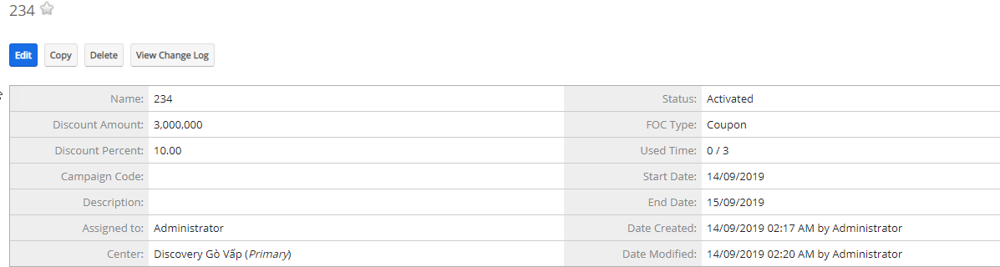

## Quản lí Loyalty

> Bước 1: Đưa chuột vào Menu Loyalty chọn Create Loyalty.

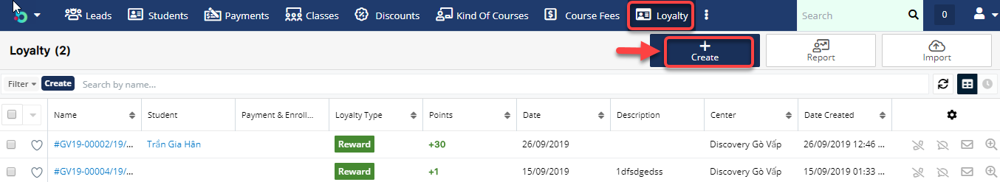

> Bước 2: Tại màn hình tạo mới Loyalty, nhập đầy đủ các thông tin cần thiết, Sau đó click Save để hoàn tất .

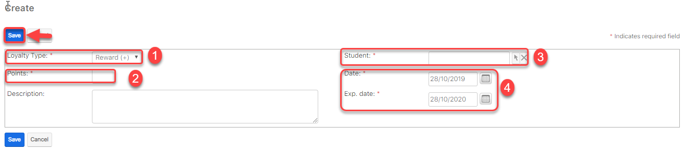


**Ghi chú:**

1:Loại Loyalty \(Điểm giới thiệu,điểm thưởng,điểm trừ\).

2:Số điểm cộng/trừ

3: Chọn học viên cộng/trừ điểm 4: Ngày cộng/trừ điểm


> Bước 3: Hệ thống hiển thị thông tin chi tiết của Loyalty sau khi tạo thành công.

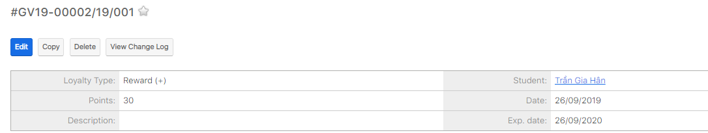

## Chính sách quản lí thu tiền

### Chuyển trung tâm

> Bước 1:Đưa chuột vào module Student ,click vào học viên có nhu cầu chuyển trung tâm hoặc có thể search tên học viên,số điện thoại,… trên thanh công cụ search.

> Bước 2: Tại màn hình Student, click vào Menu Edit chọn Moving Center.

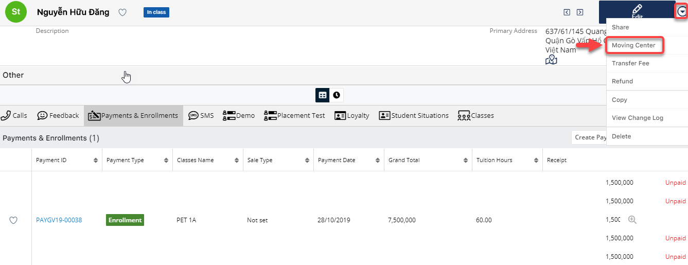

> Bước 3: Tại màn hình chuyển trung tâm, nhập trung tâm học viên muốn chuyển và những thông tin liên quan.Sau đó click Save.


**Ghi chú:**

1:Thông tin gói học trước đó mà học viên đã mua và đã thanh toán, và số tiền còn dư từ gói học đó.

2:Thông tin học viên chuyển trung tâm.

3: Thông tin trung tâm mới mà học viên lựa chọn chuyển tới..

4:Thông tin số giờ học viên còn lại tại trung tâm hiện tại dùng để quy đổi số giờ tương đương tại trung tâm sắp chuyển đến.

5:Thông tin số tiền học viên còn lại tại trung tâm hiện tại dùng để quy đổi số tiền đóng vào cho trung tâm sắp chuyển đến.

6:Ngày chuyển đi tại trung tâm cũ

7:Ngày chuyển tới trung tâm mới

8:Nội dung mô tả thêm.


> Bước 4: Hệ thống hiển thị thông tin chuyển trung tâm của học viên sau khi Save thành công.

### Chuyển nhượng học phí

> Bước 1: Đưa chuột vào module Student ,click vào học viên có nhu cầu chuyển nhượng học phí hoặc có thể search tên học viên,số điện thoại,… trên thanh công cụ search.

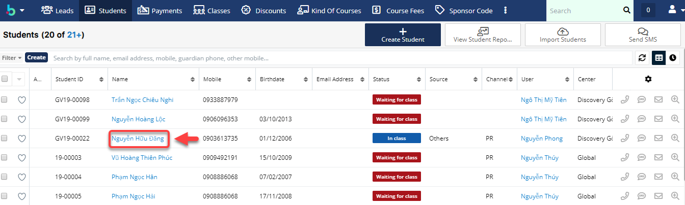

> Bước 2: Tại màn hình Student, click vào Menu Edit chọn Transfer Fee.

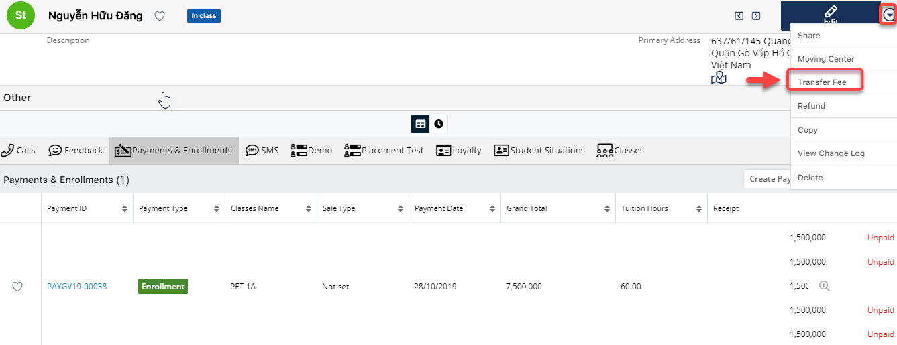

> Bước 3: Tại màn hình chuyển nhượng học phí, chọn học viên được nhận học phí ,sau đó click Save để hoàn tất.


**Ghi chú:**

1:Thông tin gói học trước đó mà học viên đã mua và đã thanh toán, số tiền còn lại có thể chuyển đổi cho học viên khác.

2: Thông tin học viên chuyển học phí của mình cho học viên khác.

3:Thông tin học viên được nhận học phí chuyển đổi.

4:Số giờ được quy đổi tương đương để chuyển cho học viên khác.

5:Sô tiền dùng để chuyển đổi sang cho học viên khác.

6:Ngày chuyển đổi học phí cho học viên khác.

7:Ngày học viên khác nhận được học phí chuyển đổi.

8:Nội dung mô tả thêm.


> Bước 4: Hệ thống hiển thị thông tin chuyển chuyển nhượng học phí của học viên sau khi Save thành công.

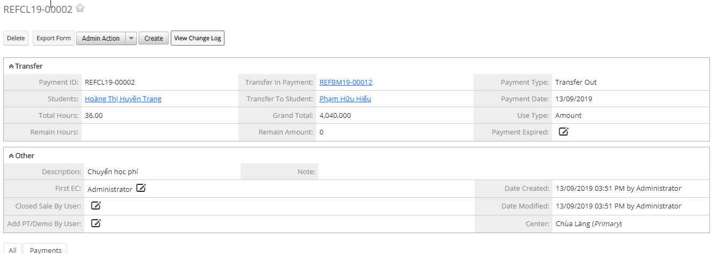

### Hoàn tiền

> Bước 1: Đưa chuột vào module Student ,click vào học viên có nhu cầu hoàn tiền hoặc có thể search tên học viên,số điện thoại,… trên thanh công cụ search.

> Bước 2: Tại màn hình Student, click vào Menu Edit chọn Refund.

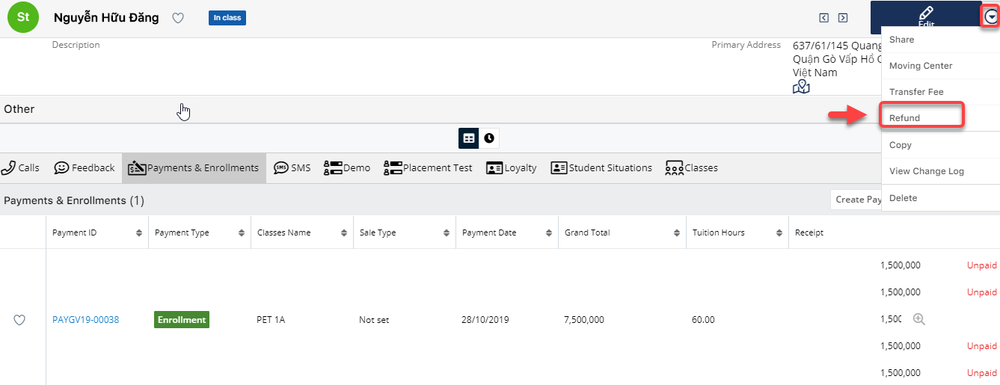

> Bước 3: Tại màn hình hoàn học phí, nhập số tiền hoàn cho học viên và chi phí phát sinh\(nếu có\).Sau đó click save để hoàn tất.


**Ghi chú**:

1:Thông tin gói học trước đó mà học viên đã mua và đã thanh toán, số tiền còn lại có thể refund.

2:Thông tin học viên nhận hoàn tiền.

3:Thông tin số tiền hoàn trả.

4:Phí chuyển đổi giao dịch cho admin\(nếu có\).

5:Ngày hoàn tiền.

6: Nội dung mô tả thêm.


> Bước 4: Hệ thống hiển thị thông tin hoàn tiền của học viên sau khi Save thành công.

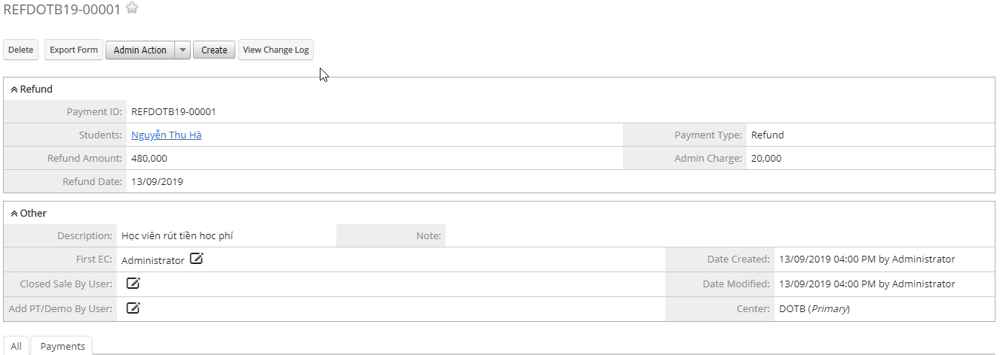

