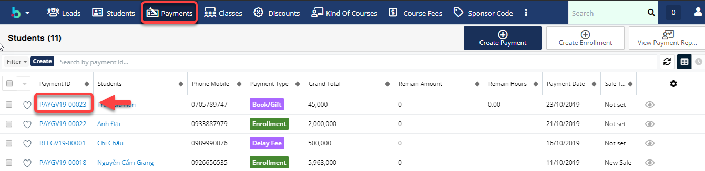
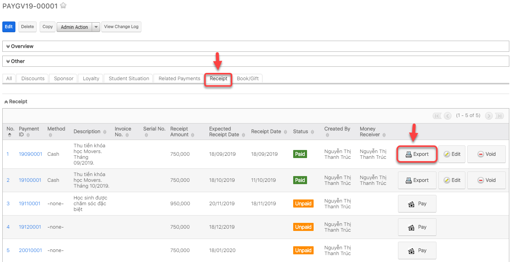
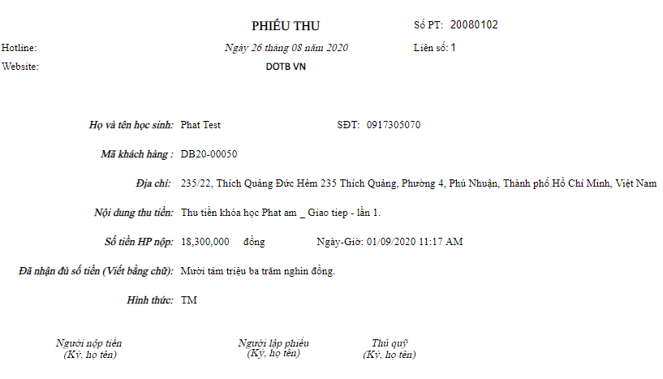
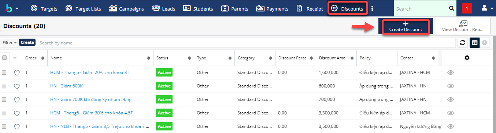
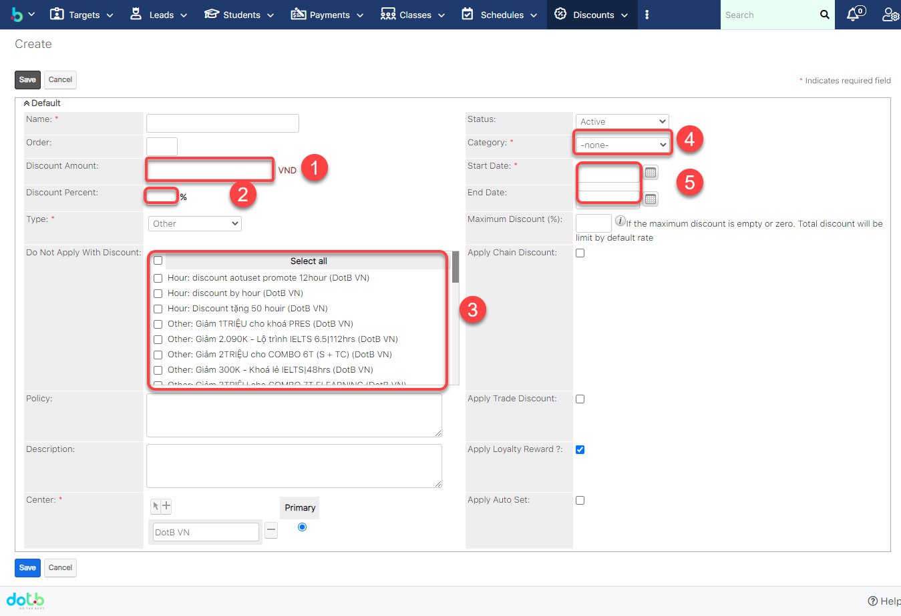
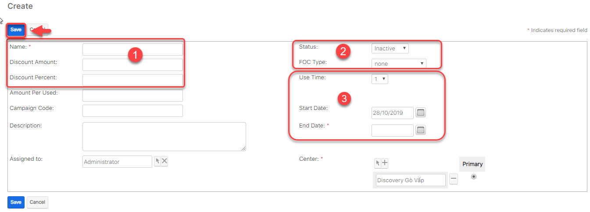
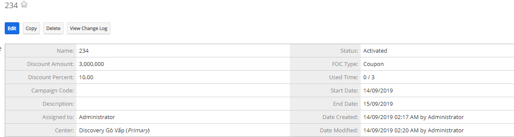
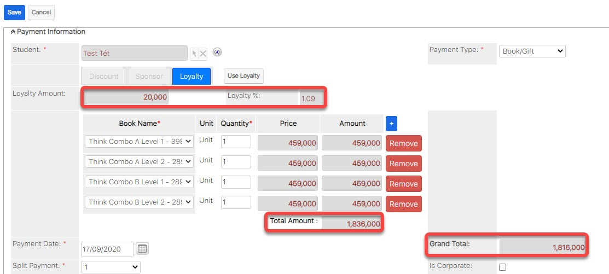

# Quản lí sự vụ

## Quản lí phiếu thu

> Bước 1: Đưa chuột vào module Payment, click chọn Payment muốn thức hiện việc xuất phiếu thu.

> Bước 2: Tại màn hình chi tiết của Payment, Click tab subpanel “Receipt”, sau đó click Export ” để tiến hành xuất phiếu thu cho học viên.

> Bước 3: Kết quả sau khi thực hiện việc xuất phiếu thu cho học viên.

## Quản lí chiết khấu(Discount)

> Bước 1: Click chuột vào module Discount chọn Create Discount.

> Bước 2: Tại màn hình tạo mới chiết khấu, nhập đầy đủ các thông tin cần thiết, Sau đó click Save để hoàn tất.


:woman\_gesturing\_ok: **Ghi chú:**

1:Số tiền discount.

2:Phần trăm discount

3: Discount không áp dụng với một số trung tâm hoặc giới thiệu học viên,….

4: Loại giảm giá

5: Ngày bắt đầu,ngày kết thúc discount.

****:man\_raising\_hand: **Lưu ý**: Có thể chỉ nhập số tiền hoặc phần trăm Discount


> Bước 3: Hệ thống hiển thị thông tin chi tiết của chiết khấu sau khi tạo thành công.

## Quản lí Voucher

> Bước 1: Đưa chuột vào module Sponsors Code chọn **Create Voucher**.

> Bước 2: Tại màn hình tạo mới Voucher, nhập đầy đủ các thông tin cần thiết, Sau đó Click Save để hoàn tất.



&#x20;:woman\_gesturing\_ok: **Ghi chú:**

1: Tên Voucher (có thể nhập chữ hoặc số),Số tiền, phần trăm giảm giá

2: Trạng thái của Voucher và loại áp dụng&#x20;

3: Số lần sử dụng Voucher và ngày bắt đầu,kết thúc lượt sử dụng Voucher


> Bước 3: Hệ thống hiển thị thông tin chi tiết của Voucher sau khi tạo thành công.

## Quản lí Loyalty


Tính năng tích điểm này cho phép học viên sử dụng để trừ vào tiền mua sách hoặc học phí cho khóa học.


### Tích điểm Loyalty


:woman\_gesturing\_ok: Có 2 cách tích điểm Loyalty cho học viên

**Cách 1** : Học viên đi học, điểm danh mỗi buổi sẽ tích điểm cho học viên trong màn hình điểm danh cột **"Loyalty Point "**

**Cách 2:** Tích điểm khi học viên mua gói học hoặc Enroll vào lớp.

**Cách 3**: User tạo điểm thưởng/trừ điểm học viên


#### Cách 1

> Tích điểm dựa vào quá trình học làm bài tập về nhà, điểm danh cho học viên trong màn hình Attendance and Homework

#### Cách 2

> Bước 1 : Với những chương trình học có đơn giá học phí áp dụng chính sách tích điểm cho học viên, user chỉ cần tích vào box "**Apply Loyalty Reward ?**"

Bước 2 : Môi học viên nếu mua gói học (cashholder) với chương trình học có áp dụng tích điểm thì sẽ được tích 3% điểm dựa trên tổng số tiền  (gross) mà học viên đóng.

#### Cách 3

> Bước 1: Đưa chuột vào Menu Loyalty chọn Create Loyalty.

> Bước 2: Tại màn hình tạo mới Loyalty, nhập đầy đủ các thông tin cần thiết, Sau đó click Save để hoàn tất .


****:woman\_gesturing\_ok: **Ghi chú:**

1:Loại Loyalty (Điểm giới thiệu,điểm thưởng,điểm trừ).

2:Số điểm cộng/trừ

3: Chọn học viên cộng/trừ điểm&#x20;

4: Ngày cộng/trừ điểm


> Bước 3: Hệ thống hiển thị thông tin chi tiết của Loyalty sau khi tạo thành công.

### Sử dụng điểm Loyalty


:woman\_gesturing\_ok: Mỗi điểm học viên tích được sẽ được đổi thành tiền và trừ ra cho payment học viên thanh toán, **1 Điểm** sẽ tương đương với **1000 VNĐ**


> Bước 1: Tại màn hình thanh toán ví dụ với thanh toán Book/Gift, chọn **Loyalty** sau đó click vào button **Use Loyalty**, nhập số điểm mà học viên muốn sử dụng.

.jpg>)

> Bước 2: Màn hình input số điểm Loyalty học viên hiện lên, user chỉ cần nhập số điểm mà học viên muốn sử dụng.

.jpg>)

> Bước 3: Hệ thống sẽ tự động trừ số tiền học viên sau thanh toán.

> Bước 4: Hệ thống hiển thị thông tin chuyển trung tâm của học viên sau khi Save thành công.

