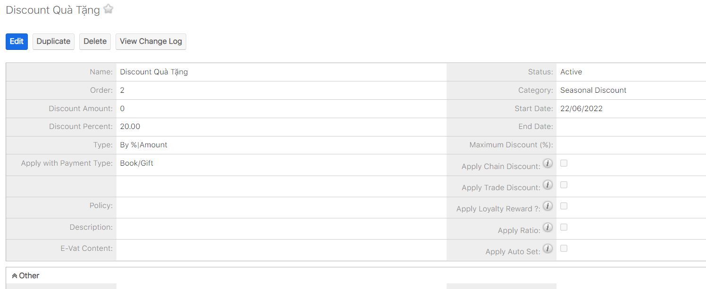

# Quản lí sự vụ

## Quản lí phiếu thu

> Bước 1: Đưa chuột vào module Payment, click chọn Payment muốn thức hiện việc xuất phiếu thu.

> Bước 2: Tại màn hình chi tiết của Payment, Click Tab Subpanel “Receipt”, sau đó click Export ” để tiến hành xuất phiếu thu cho học viên.

> Bước 3: Kết quả sau khi thực hiện việc xuất phiếu thu cho học viên.

## Quản lí chiết khấu\(Discount\)

> Bước 1: Click chuột vào module Discount chọn Create Discount.

> Bước 2: Tại màn hình tạo mới chiết khấu, nhập đầy đủ các thông tin cần thiết, Sau đó click Save để hoàn tất.


Ghi chú:

1:Số tiền discount.

2:Phần trăm discount

3: Discount không áp dụng với một số trung tâm hoặc giới thiệu học viên,….

4: Loại giảm giá

5: Ngày bắt đầu,ngày kết thúc discount.

**Lưu ý**: Có thể chỉ nhập số tiền hoặc phần trăm Discount


> Bước 3: Hệ thống hiển thị thông tin chi tiết của chiết khấu sau khi tạo thành công.

## Quản lí Voucher

> Bước 1: Đưa chuột vào module Sponsors Code chọn **Create Voucher**.

> Bước 2: Tại màn hình tạo mới Voucher, nhập đầy đủ các thông tin cần thiết, Sau đó Click Save để hoàn tất.



**Ghi chú:**

1: Tên Voucher \(có thể nhập chữ hoặc số\),Số tiền, phần trăm giảm giá

2: Trạng thái của Voucher và loại áp dụng 

3: Số lần sử dụng Voucher và ngày bắt đầu,kết thúc lượt sử dụng Voucher


> Bước 3: Hệ thống hiển thị thông tin chi tiết của Voucher sau khi tạo thành công.

## Quản lí Loyalty


Tính năng tích điểm này cho phép học viên sử dụng để trừ vào tiền mua sách hoặc học phí cho khóa học.


### Tích điểm Loyalty


Có 2 cách tích điểm Loyalty cho học viên

**Cách 1** : Học viên đi học, điểm danh mỗi buổi sẽ tích điểm cho học viên trong màn hình điểm danh cột **"Loyalty Point "**

**Cách 2:** Tich điểm khi học viên mua gói học hoặc Enroll vào lớp.

**Cách 3**: User tạo điểm thưởng/trừ điêm học viên


#### Cách 1

> Tích điểm dựa vào quá trình học làm bài tập về nhà, điểm danh cho học viên trong màn hình Attendance and Homework

#### Cách 2

> Bước 1 : Với những chương trình học có đơn giá học phí áp dụng chính sách tích điểm cho học viên, user chỉ cần tích vào box "**Apply Loyalty Reward ?**"

> Bước 2 : Môi học viên nếu mua gói học hoặc đăng kí lớp với chương trình học có áp dụng tích điểm thì sẽ được tích 3% điểm dựa trên tổng số tiền  \(gross\) mà học viên đóng.

#### Cách 3

> Bước 1: Đưa chuột vào Menu Loyalty chọn Create Loyalty.

> Bước 2: Tại màn hình tạo mới Loyalty, nhập đầy đủ các thông tin cần thiết, Sau đó click Save để hoàn tất .


**Ghi chú:**

1:Loại Loyalty \(Điểm giới thiệu,điểm thưởng,điểm trừ\).

2:Số điểm cộng/trừ

3: Chọn học viên cộng/trừ điểm 

4: Ngày cộng/trừ điểm


> Bước 3: Hệ thống hiển thị thông tin chi tiết của Loyalty sau khi tạo thành công.

### Sử dụng điểm Loyalty


Mỗi điểm học viên tích được sẽ được đổi thành tiền và trừ ra cho payment học viên thanh toán, **1 Điểm** sẽ tương đương với **1000 VNĐ**


> Bước 1: Tại màn hình thanh toán, chọn **Loyalty** sau đó click vào button **Use Loyalty**, nhập số điểm mà học viên muốn sử dụng.

> Bước 2: Màn hình input số điểm Loyalty học viên hiện lên, user chỉ cần nhập số điểm mà học viên muốn sử dụng.

> Bước 3: Hệ thống sẽ tự động trừ số tiền học viên sau thanh toán và trừ điểm tích lũy của học viên con lại.

## Chính sách quản lí thu tiền

### Chuyển trung tâm

> Bước 1:Đưa chuột vào module Student ,click vào học viên có nhu cầu chuyển trung tâm hoặc có thể search tên học viên,số điện thoại,… trên thanh công cụ search.

> Bước 2: Tại màn hình Student, click vào Menu Edit chọn Moving Center.

> Bước 3: Tại màn hình chuyển trung tâm, nhập trung tâm học viên muốn chuyển và những thông tin liên quan.Sau đó click Save.


**Ghi chú:**

1:Thông tin gói học trước đó mà học viên đã mua và đã thanh toán, và số tiền còn dư từ gói học đó.

2:Thông tin học viên chuyển trung tâm.

3: Thông tin trung tâm mới mà học viên lựa chọn chuyển tới..

4:Thông tin số giờ học viên còn lại tại trung tâm hiện tại dùng để quy đổi số giờ tương đương tại trung tâm sắp chuyển đến.

5:Thông tin số tiền học viên còn lại tại trung tâm hiện tại dùng để quy đổi số tiền đóng vào cho trung tâm sắp chuyển đến.

6:Ngày chuyển đi tại trung tâm cũ

7:Ngày chuyển tới trung tâm mới

8:Nội dung mô tả thêm.


> Bước 4: Hệ thống hiển thị thông tin chuyển trung tâm của học viên sau khi Save thành công.

### Chuyển nhượng học phí

> Bước 1: Đưa chuột vào module Student ,click vào học viên có nhu cầu chuyển nhượng học phí hoặc có thể search tên học viên,số điện thoại,… trên thanh công cụ search.

> Bước 2: Tại màn hình Student, click vào Menu Edit chọn Transfer Fee.

> Bước 3: Tại màn hình chuyển nhượng học phí, chọn học viên được nhận học phí ,sau đó click Save để hoàn tất.


**Ghi chú:**

1:Thông tin gói học trước đó mà học viên đã mua và đã thanh toán, số tiền còn lại có thể chuyển đổi cho học viên khác.

2: Thông tin học viên chuyển học phí của mình cho học viên khác.

3:Thông tin học viên được nhận học phí chuyển đổi.

4:Số giờ được quy đổi tương đương để chuyển cho học viên khác.

5:Sô tiền dùng để chuyển đổi sang cho học viên khác.

6:Ngày chuyển đổi học phí cho học viên khác.

7:Ngày học viên khác nhận được học phí chuyển đổi.

8:Nội dung mô tả thêm.


> Bước 4: Hệ thống hiển thị thông tin chuyển chuyển nhượng học phí của học viên sau khi Save thành công.

### Hoàn tiền

> Bước 1: Đưa chuột vào module Student ,click vào học viên có nhu cầu hoàn tiền hoặc có thể search tên học viên,số điện thoại,… trên thanh công cụ search.

> Bước 2: Tại màn hình Student, click vào Menu Edit chọn Refund.

> Bước 3: Tại màn hình hoàn học phí, nhập số tiền hoàn cho học viên và chi phí phát sinh\(nếu có\).Sau đó click save để hoàn tất.


**Ghi chú**:

1:Thông tin gói học trước đó mà học viên đã mua và đã thanh toán, số tiền còn lại có thể refund.

2:Thông tin học viên nhận hoàn tiền.

3:Thông tin số tiền hoàn trả.

4:Phí chuyển đổi giao dịch cho admin\(nếu có\).

5:Ngày hoàn tiền.

6: Nội dung mô tả thêm.


> Bước 4: Hệ thống hiển thị thông tin hoàn tiền của học viên sau khi Save thành công.

