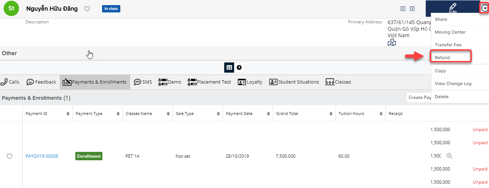

# Quản lí Chuyển trung tâm, học phí, hoàn tiền

### Chuyển trung tâm

> Bước 1:Đưa chuột vào module Student ,click vào học viên có nhu cầu chuyển trung tâm hoặc có thể search tên học viên,số điện thoại,… trên thanh công cụ search.

> Bước 2: Tại màn hình Student, click vào Menu Edit chọn Moving Center.

> Bước 3: Tại màn hình chuyển trung tâm, nhập trung tâm học viên muốn chuyển và những thông tin liên quan.Sau đó click Save.


**Ghi chú:**

1:Thông tin gói học trước đó mà học viên đã mua và đã thanh toán, và số tiền còn dư từ gói học đó.

2:Thông tin học viên chuyển trung tâm.

3: Thông tin trung tâm mới mà học viên lựa chọn chuyển tới..

4:Thông tin số giờ học viên còn lại tại trung tâm hiện tại dùng để quy đổi số giờ tương đương tại trung tâm sắp chuyển đến.

5:Thông tin số tiền học viên còn lại tại trung tâm hiện tại dùng để quy đổi số tiền đóng vào cho trung tâm sắp chuyển đến.

6:Ngày chuyển đi tại trung tâm cũ

7:Ngày chuyển tới trung tâm mới

8:Nội dung mô tả thêm.


> Bước 4: Hệ thống hiển thị thông tin chuyển trung tâm của học viên sau khi Save thành công.

### Chuyển nhượng học phí

> Bước 1: Đưa chuột vào module Student ,click vào học viên có nhu cầu chuyển nhượng học phí hoặc có thể search tên học viên,số điện thoại,… trên thanh công cụ search.

> Bước 2: Tại màn hình Student, click vào Menu Edit chọn Transfer Fee.

> Bước 3: Tại màn hình chuyển nhượng học phí, chọn học viên được nhận học phí ,sau đó click Save để hoàn tất.


**Ghi chú:**

1:Thông tin gói học trước đó mà học viên đã mua và đã thanh toán, số tiền còn lại có thể chuyển đổi cho học viên khác.

2: Thông tin học viên chuyển học phí của mình cho học viên khác.

3:Thông tin học viên được nhận học phí chuyển đổi.

4:Số giờ được quy đổi tương đương để chuyển cho học viên khác.

5:Sô tiền dùng để chuyển đổi sang cho học viên khác.

6:Ngày chuyển đổi học phí cho học viên khác.

7:Ngày học viên khác nhận được học phí chuyển đổi.

8:Nội dung mô tả thêm.


> Bước 4: Hệ thống hiển thị thông tin chuyển chuyển nhượng học phí của học viên sau khi Save thành công.

### 

### Hoàn tiền

> Bước 1: Đưa chuột vào module Student ,click vào học viên có nhu cầu hoàn tiền hoặc có thể search tên học viên,số điện thoại,… trên thanh công cụ search.

> Bước 2: Tại màn hình Student, click vào Menu Edit chọn Refund.

> Bước 3: Tại màn hình hoàn học phí, nhập số tiền hoàn cho học viên và chi phí phát sinh\(nếu có\).Sau đó click save để hoàn tất.

\*\*\*\*


**Ghi chú**:

1:Thông tin gói học trước đó mà học viên đã mua và đã thanh toán, số tiền còn lại có thể refund.

2:Thông tin học viên nhận hoàn tiền.

3:Thông tin số tiền hoàn trả.

4:Phí chuyển đổi giao dịch cho admin\(nếu có\).

5:Ngày hoàn tiền.

6: Nội dung mô tả thêm.


> Bước 4: Hệ thống hiển thị thông tin hoàn tiền của học viên sau khi Save thành công.

